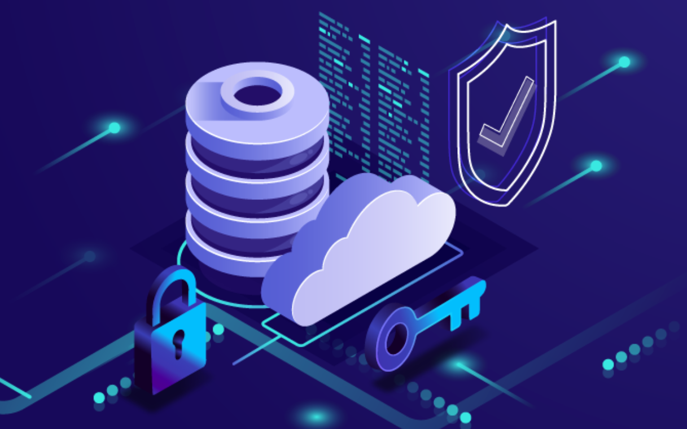
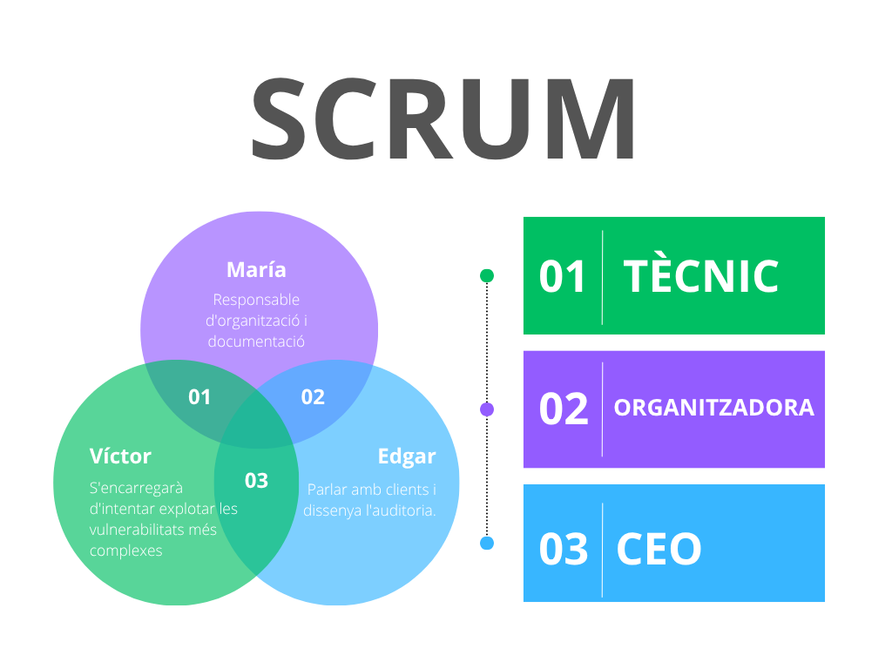
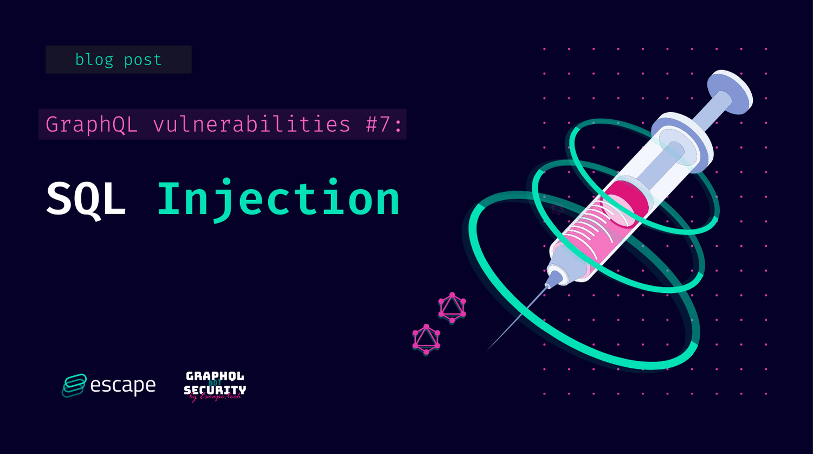
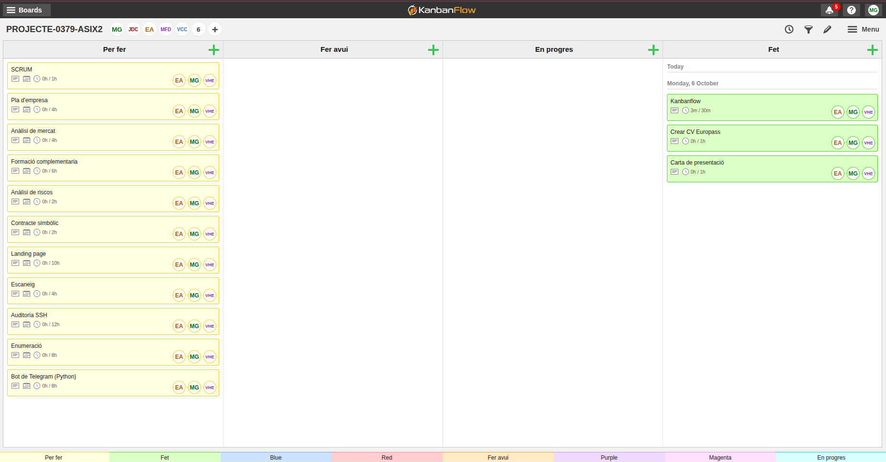
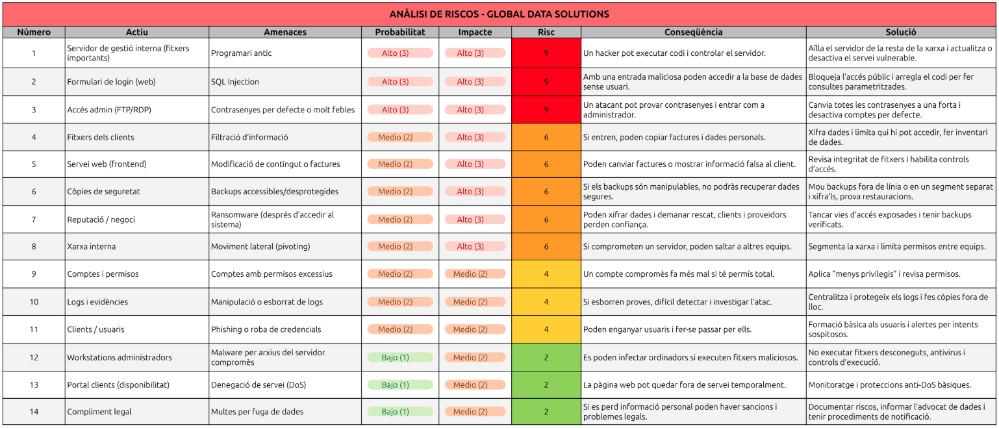
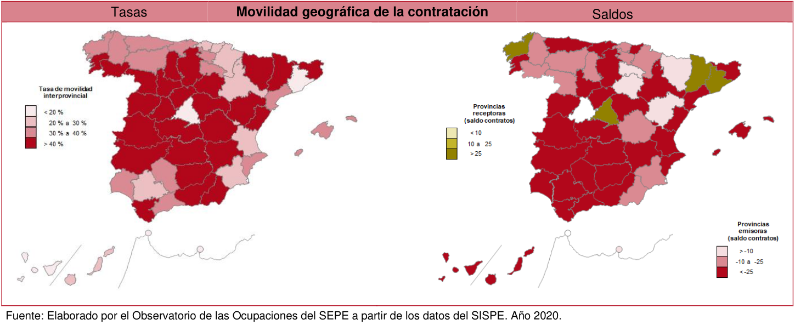

**Autors:** María Gutiérrez, Edgar Alcaraz i Víctor Hernández  
**Grup:** 3  
**Data:** 04/05/2026  
**Lloc:** Institut de l’Ebre  
**Professors:** Joan Pasqual Almudeve, Víctor Cid i Diego Cervellera  
**Cicle formatiu:** 2n de Superior d’Administració de Sistemes Informàtics en Xarxa   

---

## Introducció

Aquest projecte neix directament de la proposta dels professors, on se'ns demana simular un escenari professional molt concret: crear una empresa de ciberseguretat i fer una auditoria a una altra empresa amb problemes reals. L'objectiu final és doble: demostrar que entenem el món dels negocis i que sabem aplicar les tècniques de hacking ètic.

Per fer-ho, hem creat la nostra consultora anomenada Hexon Security, que treballa sota el lema: "Take care of your company with us". La primera part del treball ha consistit a muntar el pla d'empresa, que és el manual de com funciona Hexon Security. Aquí definim els nostres rols, expliquem què vendrem i com ens organitzem. A més de gestionar totes les tasques amb KanbanFlow.

La segona part és l'encàrrec principal: auditar l'empresa GlobalData Solutions (GDS), que hem creat perquè tingui servidors amb forats de seguretat concrets. La nostra feina d'auditors és fer el Pentesting, és a dir, simular un atac extern per trobar aquests punts febles. Ens hem centrat a trobar i aprofitar vulnerabilitats clàssiques i perilloses, com la Injecció SQL en el seu sistema o l'ús de programari antic. Això ens permetrà demostrar que un atacant pot entrar fàcilment.

Un cop hem aconseguit accedir-hi, la feina més important és la de consultor: presentar la solució. El projecte acaba amb l'entrega de l'informe d'auditoria, on no només ensenyem les proves de l'atac, sinó que donem les instruccions exactes perquè GDS pugui tancar els forats de seguretat i protegir-se de veritat.

---

## Gestió i planificació

### Hexon Security - Empresa ciberseguretat

La nostra empresa, Hexon Security, es dedica a fer pentesting o, dit d'una manera senzilla, a fer de "hacker ètic" per a altres empreses. El nostre objectiu és entrar als sistemes del client abans que ho faci un hacker, per trobar les portes obertes i tancar-les. El nostre lema és: "Take care of your company with us" (Cuida la teva empresa amb nosaltres).

---

### Pla econòmic-financer

Aquesta part explica els diners d'Hexon Security per demostrar que el nostre negoci pot aguantar-se per si mateix.

Per començar, sabem que hem de fer una inversió inicial per tenir el material bàsic, com ara els tres ordinadors potents per fer les auditories i els diners per posar l'empresa legalment. En total, posem que la inversió inicial es mou al voltant dels 6.300 €, que assumim que posem els tres socis. Després, cada mes tenim unes despeses fixes d'uns 440 € (la quota d'autònoms i despeses petites com la internet), que hem de pagar sí o sí.

Però el més important són els nostres serveis. Per fer l'empresa més creïble, no venem només un tipus d'auditoria. Hexon Security té tres tipus de serveis:

- L'Auditoria integral (el servei complet), que val 2.500 €.  
- L'Anàlisi bàsica de vulnerabilitats (una revisió ràpida) que venem per 800 €.  
- La formació al personal (tallers sobre seguretat), que val 500 € cada sessió.  

Per ser rendibles i pagar-nos un sou net d'uns 1.200 € a cadascú, hem de guanyar uns 4.040 € al mes. Aconseguir aquesta xifra és molt més fàcil amb la barreja de serveis. Per exemple, amb una sola Auditoria Integral i dues Anàlisis Bàsiques al mes, ja superem l'objectiu (4.100 €). Això vol dir que la nostra empresa és molt estable i creïble, ja que no depèn d'un únic ingrés gran, i demostra que Hexon Security és un negoci viable.

---

### L'Equip darrere d'Hexon Security - SCRUM

Som tres persones, cadascuna amb un paper clau:

- **Edgar serà el cap (CEO):** Ell s'encarrega de parlar amb els clients, entendre què necessiten i de dissenyar el pla general de l'auditoria. A més, liderarà la part més de xarxes i servidors.  
- **Víctor serà el tècnic:** Ell té el coneixement profund de com funcionen les aplicacions web (les pàgines i els sistemes que usen els clients). Ell s'encarregarà d'intentar explotar les vulnerabilitats més complexes, com les de codi o les bases de dades.  
- **María serà la responsable d'organització i documentació:** És la persona que posa ordre al caos. Ella s'assegura que seguim els procediments correctes, gestiona el temps i, el més important, escriu l'informe final que li donarem al client, detallant els problemes i les solucions.

---

### Per què Hexon Security triomfarà?

Hem detectat que moltes empreses petites i mitjanes (PyMEs) inverteixen molts diners en publicitat o nous ordinadors, però gairebé res en seguretat. Nosaltres venim a omplir aquest buit oferint auditories professionals a un preu accessible. El nostre valor afegit és que no només diem "això està malament", sinó que demostrem que podem entrar-hi i expliquem pas a pas com ho han d'arreglar.

---

## Global Data Solutions - Empresa auditada

La nostra empresa client fictícia es diu GlobalData Solutions (GDS). És una empresa de gestió de dades que té un sistema online perquè els seus clients puguin consultar informació i factures. Aquesta empresa té dos tipus de servidors que auditaran:

- **El servidor web (Frontend):** És on els usuaris de GDS entren amb un usuari i contrasenya. Aquest servidor executa l'aplicació.  
- **El servidor de gestió Interna:** És el cor de l'empresa, on guarden els fitxers importants. Aquest servidor hauria d'estar molt protegit, però no ho està.

---

### Els servidors tenen vulnerabilitats reals

Perquè el nostre projecte sigui pràctic i real, els servidors de GDS tenen tres grans errors o "vulnerabilitats" que nosaltres podrem explotar:

- **Error de configuració (sistemes antics):** El seu servidor de gestió interna utilitza un programa antic (per exemple, una versió vella d'un servei web o un sistema d'arxius) que ja té un defecte de seguretat conegut. Aquest defecte permet, per exemple, que un atacant executi ordres a l'ordinador sense permís (això es diu RCE o Execució Remota de Codi). Aquesta serà la feina: trobar la versió del programa i aplicar l'atac conegut.  
- **Injecció SQL (SQL Injection):** El formulari de login de la seva pàgina web (on poses usuari i contrasenya) està mal fet. El sistema agafa el que escrius i ho envia directament a la base de dades sense comprovar si és una ordre perillosa. L’empresa de ciberseguretat podrà escriure un codi especial a la casella de la contrasenya que enganyi la base de dades i li digui: "No et preocupis per la contrasenya, deixa'm passar". Això permetrà a Hexon Security entrar a l'aplicació sense tenir cap usuari vàlid.  
- **Contrasenyes de fàbrica o molt dèbils:** El seu servidor de gestió interna té un accés (per exemple, per FTP o RDP) amb un usuari que és "admin" i una contrasenya molt simple com "12345". Hexon Security provarà les contrasenyes més comunes (un atac de "força bruta" molt ràpid) i aconseguirà accés als fitxers interns de l'empresa.

---

### Planificació de l’auditoria

La nostra feina es divideix en fases, com en qualsevol projecte.

- **Fase de reconeixement:** Comencem investigant GDS sense tocar els seus sistemes. Busquem a internet les seves adreces, quins programes fan servir o quines versions de programari.  
- **Fase d'exploració:** Ara sí, utilitzem eines com escàners per veure quins "ports" tenen oberts i quins serveis estan actius. Això ens dirà on hem de buscar problemes.  
- **Fase d'explotació:** Aquí és on s’utilitzen les eines (com Kali Linux) per explotar les tres vulnerabilitats que hem comentat abans (l'SQL Injection, l'RCE i la contrasenya feble). L'objectiu és demostrar que podem prendre el control o robar dades.  
- **Fase d'informe i solució:** Un cop hem demostrat que hem pogut entrar, es documenta tot el procés. Fem una llista de problemes, els hi posem una nota (de "crític" a "baix") i, el més important, escrivim la solució exacta per a cada problema (ex. "Actualitzeu el programari a la versió 2.5" o "Sanejar les entrades d'usuari al formulari de login").

---

### Metodologia i organització

#### Eines de gestió de tasques (Kanban Flow)

Per garantir l'eficiència i la transparència en el projecte, Hexon Security utilitza la metodologia Kanban, implementada mitjançant l'eina digital KanbanFlow. Aquesta metodologia ens permet visualitzar tot el treball pendent, el que està en marxa i el que ja s'ha acabat.

Tal com es veu a la imatge, el nostre tauler es divideix en quatre columnes principals:

- **Per fer:** Les tasques pendents que hem de començar. Aquí tenim tant la part administrativa (pla d'empresa, CVs) com les tasques tècniques (auditoria SSH, enumeració).  
- **Fer avui:** Les tasques prioritàries que ens hem compromès a començar o acabar avui (actualment, el nostre tauler mostra que estan buides, indicant que ja s'han mogut o completat els objectius del dia).  
- **En progrés:** Les tasques que un membre de l'equip està fent activament en aquest moment.  
- **Fet** Les tasques finalitzades. L'objectiu és tenir totes les tasques en aquesta columna al final del projecte.  

A més, cada tasca té assignat un responsable (EA - Edgar, MG - Maria, VC - Víctor) i una estimació de temps (per exemple, 4h per al 'Pla d'empresa'), la qual cosa ens ajuda a gestionar la càrrega de treball i els terminis.

---

## Gestió de riscos i incidències

### Anàlisi de riscos

Durant l’auditoria de l’empresa Global Data Solutions, hem fet un estudi per detectar quins elements i processos de l’empresa podrien estar exposats a possibles riscos o problemes. L’objectiu d’aquest estudi és saber quins riscos són més probables i quins podrien tenir un impacte més gran, per així decidir quines accions cal prendre primer.

Hem revisat diferents parts de la infraestructura, com els servidors interns, els formularis de la web, els accessos dels administradors i la informació dels clients. Cada risc s’ha analitzat segons la seva probabilitat i les conseqüències que podria causar, obtenint un resultat que ens indica quines coses cal arreglar de manera urgent i quines es poden gestionar amb mesures preventives més senzilles.

A més, hem proposat solucions pràctiques com actualitzar el programari, reforçar les contrasenyes, separar parts de la xarxa per protegir-les millor o formar els usuaris perquè reconeguin intents de phishing.

---

## Acords i abast del servei

### Anàlisi de mercat

L’objectiu d’aquest apartat és analitzar com està el mercat laboral a les Terres de l’Ebre en el sector de la ciberseguretat i la informàtica. També volem veure quines oportunitats hi ha per a persones joves amb ganes d’aprendre i formar-se.

#### Ocupacions principals

En aquest sector hi ha diversos perfils importants:

- **Tècnics i tècniques en ciberseguretat:** protegeixen xarxes i sistemes informàtics.  
- **Analistes i consultors:** estudien vulnerabilitats i ajuden les empreses a millorar la seguretat.  
- **Auditors o ethical hackers:** fan proves per detectar problemes abans que els hackers els puguin aprofitar.  
- **Administradors de sistemes i xarxes:** mantenen servidors i serveis funcionant correctament.  
- **Enginyers de seguretat:** dissenyen sistemes segurs des del principi dels projectes.  

#### Perfils i competències

Segons el SEPE, la demanda d’aquests professionals ha crescut molt. Les empreses busquen persones amb titulació en informàtica, telecomunicacions o FP superior, experiència en administració de sistemes i xarxes, i certificacions com **CompTIA Security+**, **CEH** o **OSCP**. També valoren que sàpigues analitzar problemes, treballar sota pressió i comunicar-te bé amb l’equip. Els llocs solen ser a jornada completa, tot i que alguns poden requerir estar disponibles per incidències.

#### Tendències i oportunitats

Els perfils amb més sortida ara mateix són **administradors de sistemes**, **programadors** i **analistes TIC**. Però els especialistes en ciberseguretat, els enginyers de sistemes amb coneixements de seguretat i els professionals de **Big Data** estan creixent molt ràpidament. Aquest creixement és a causa de la digitalització i l’augment d’incidents de seguretat.  

Altres ocupacions amb potencial inclouen tècnics de suport informàtic, administradors de xarxes, consultors de seguretat i desenvolupadors de software segur.

#### Empreses a les Terres de l’Ebre

Hi ha diverses empreses i institucions on aquests perfils poden treballar i créixer professionalment. L’Hospital Verge de la Cinta, el Consell Comarcal del Baix Ebre i l’Ajuntament de Tortosa ofereixen oportunitats al sector públic. Entre les empreses privades, DISI Serveis Informàtics, REHAU, Pentrilo, EbreSoft i iTebre ofereixen feina relacionada amb informàtica, seguretat i desenvolupament de software.         

---

### Formació complementaria

#### Ofertes de feina i requisits principals
Per preparar-nos millor pel mercat laboral, hem fet una ullada a les ofertes publicades al portal de [Feina Activa](https://feinaactiva.gencat.cat/web/guest/home) dins de l’àmbit informàtic i TIC. Podeu veure totes les ofertes que vam consultar en aquest enllaç: [Ofertes tècnics informàtics a Tarragona i Reus](https://feinaactiva.gencat.cat/es/search/offers/list?type=province&province=43&i=0&keywords=TECNIC%20INFORMATIC).

A Tortosa no hi havia cap oferta disponible, així que vam ampliar la cerca a Tarragona i Reus. A la taula següent hem resumit les oportunitats més rellevants, indicant la formació imprescindible, la formació valorada i altres característiques importants de cada lloc de treball. Aquesta informació ens ajuda a veure en quines competències hem de reforçar-nos per tenir més opcions de feina.

| Empresa | Localitat | Oferta de feina | Formació imprescindible | Formació valorada | Altres característiques |
|---------|-----------|----------------|------------------------|-----------------|------------------------|
| Institut Pere Mata, S.A. | Reus | Enginyer/a informàtic/a: desenvolupament d’aplicatius sanitaris, integració de dades, helpdesk | Grau/Llicenciatura en Informàtica, 2 anys experiència | Power BI, Pentaho, Mirth, Visual Studio, Intersystems Caché, experiència sanitària | Contracte indefinit, jornada completa, 2.500–2.590 €/mes, nivell C1 català/espanyol/anglès, vehicle propi |
| Aula Magna | Tarragona | Tècnic/a informàtic/a: manteniment equips, xarxes, Moodle, suport a usuaris | FP Grau Mitjà/Superior en Informàtica | Moodle, Linux, seguretat informàtica | Contracte 4 mesos (substitució), jornada completa, 1.565–1.830 €/mes, possibilitat continuïtat mitja jornada |
| Ajuntament de Tarragona | Tarragona | Cap de Servei TIC: direcció i coordinació TIC municipals | Grau Enginyeria Informàtica/Telecomunicacions | Experiència en administració pública i gestió d’equips TIC | Concurs públic, nivell C1 català, jornada completa |
| Empresa informàtica - Tècnic/a de camp | Tarragona | Suport tècnic in situ: TPVs, xarxes, videovigilància, manteniment servidors | Experiència mínima 2 anys en hardware i xarxes | TPV, electrònica, manteniment en farmàcies, CCTV | Contracte variable, jornada flexible, vehicle propi, presencial |
| Ajuntament de Reus | Reus | Tècnic/a de sistemes: administració i manteniment de sistemes i xarxes municipals | CFGS en Sistemes, DAW/DAM o equivalent | Ciberseguretat, bases de dades, virtualització | Concurs-oposició, jornada completa, convocatòria pública |

#### Formació complementària segons el SEPE

Hem consultat l’informe del [SEPE](https://www.sepe.es/HomeSepe/que-es-observatorio/deteccion-necesidades-formativas.html) sobre les necessitats formatives del sector informàtic. Hem vist quina formació valoren les empreses. Per a programadors i enginyers informàtics cal coneixements avançats en Java, Python, .NET, bases de dades, Power BI, Pentaho, Agile/DevOps i Cloud. Per a tècnics de sistemes i xarxes és important dominar xarxes, Windows i Linux, virtualització i seguretat. I per a tècnics de suport cal formació en resolució d’incidències, atenció a usuaris i eines com Jira o GLPI. Aquesta informació ens ajuda a saber exactament en què cal formar-nos per tenir més opcions de feina.            

#### Com completar la nostra formació

Per preparar-nos per treballar en llocs com l’Institut Pere Mata o els ajuntaments de Reus i Tarragona, hem vist que cal reforçar la nostra formació en programació (Java, SQL, PHP), anàlisi de dades (Power BI, Pentaho), ciberseguretat, administració de sistemes i gestió de projectes amb Agile o DevOps. La bona notícia és que no cal començar de zero, ja que tenim la base del CFGS d’ASIX. Ara només hem de fer cursos complementaris, que podem trobar a entitats com Multimèdia Tarragona, Fundació Esplai, COETIC, UOC, UAB, Aula Magna o plataformes com SOC, Conforcat i Fundesplai. Hem planificat un calendari amb cursos de programació, dades, Cloud/DevOps, ciberseguretat i Moodle, així podem actualitzar-nos, aprendre coses noves i tenir més opcions de feina sense tornar a fer un cicle complet.             

---

### Elaboració del contracte simbòlic

En aquesta part del projecte hem elaborat un contracte simbòlic d’auditoria de seguretat entre una empresa auditora i un client. L’objectiu ha estat definir un marc professional i legal per a la realització d’un pentesting, simulant una situació real dins del sector de la ciberseguretat.         

S’ha definit l’abast de l’auditoria, indicant quins sistemes s’analitzen i quins queden fora, així com les accions permeses i les limitacions per garantir que les proves es facin de forma controlada i sense causar danys. Finalment, s’ha establert el lliurament d’un informe amb els resultats i recomanacions de millora en seguretat.

---

## Execució tècnica i resultats

### Disseny de l'entorn vulnerable
Per a aquest projecte, hem dissenyat un entorn que simula una infraestructura empresarial real d'Alta Disponibilitat (HA). El nostre objectiu ha estat crear un escenari on la prioritat sigui la continuïtat del servei, cosa que ens permet analitzar com la redundància pot arribar a ser, alhora, un punt feble si no es gestiona correctament.

Com es veu en el diagrama, l'arquitectura es basa en dos nodes principals (Servidor 1 i Servidor 2) configurats per treballar en paral·lel. Hem establert una connexió constant entre ells per a la sincronització i replicació de dades. Això vol dir que qualsevol canvi o fitxer es replica automàticament; una característica que, des de l'òptica de la seguretat, ens resulta molt interessant, ja que un atac amb èxit al node principal es podria propagar de forma transparent al secundari.

Dins de cada servidor, hem desplegat els quatre serveis clau que volem posar a prova:

* DHCP i DNS: Són els pilars de la xarxa. Els hem inclòs per veure com podem manipular l'assignació d'IPs o la resolució de noms per desviar el trànsit.

* Servei Web: És la part més exposada de l'entorn, on buscarem vulnerabilitats en les aplicacions allotjades.

* Servei FTP: L'hem configurat com a punt de transferència de fitxers per auditar la seguretat de les dades en trànsit i el control d'accessos.

Finalment, hem definit un accés unificat per als clients de la xarxa. Amb aquesta estructura, el nostre pla és simular com interactuen els usuaris amb els serveis mentre intentem comprometre el sistema o forçar una fallada en els mecanismes de failover. En definitiva, hem buscat un equilibri entre un sistema robust i un laboratori ple de vectors d'atac per explorar.          

### Configuració de infraestructura d'alta disponibilitat amb Ubuntu 24

1. Per a realitzar aquesta infraestructura necessitem tres màquines virtuals amb Ubuntu 24, connectades en xarxa interna o adaptador pont a VirtualBox. Les IPs planificades són: servidor MASTER (192.168.56.10), servidor SLAVE (192.168.56.11) i un client que rebrà IP per DHCP.

2. La IP virtual flotant que configurarem serà la 192.168.56.100, i serà l'adreça que utilitzaran els clients per a connectar-se als serveis DNS, FTP i WEB. D'aquesta manera, si un servidor cau, l'altre assumirà automàticament la IP virtual i els serveis continuaran funcionant.

3. Cal assegurar-se que ambdues màquines servidores tenen connectivitat entre si i poden resoldre noms mútuament. Verificarem la connectivitat amb un simple ping entre elles abans de començar qualsevol configuració.

4. En aquesta primera fase configurarem Keepalived per a crear una IP virtual flotant que saltarà automàticament entre els dos servidors en cas de fallada. Primerament, instal·lem el paquet keepalived a ambdós servidors.      

5. Tot seguit, configurem l'arxiu de keepalived al servidor MASTER. En aquest arxiu especificarem que el servidor actuarà com a MASTER amb prioritat 150, autenticació amb contrasenya iesebreHA i definint la IP virtual 192.168.56.100.        

6. A continuació, configurem l'arxiu equivalent al servidor SLAVE, establint l'estat BACKUP i prioritat 100. La contrasenya d'autenticació ha de ser idèntica a la del MASTER per a que ambdós servidors puguin comunicar-se correctament.        

7. Seguidament, habilitem i iniciem el servei keepalived al MASTER. Repetim el mateix procés al servidor SLAVE per a que quedi en espera i preparat per a prendre la IP virtual si el MASTER falla.      

8. Un cop iniciat el servei al SLAVE, verifiquem que no té la IP virtual assignada, ja que aquesta només ha d'aparèixer al MASTER mentre estigui actiu. La comanda no ha de mostrar cap sortida.          

9. Finalment, verifiquem que la IP virtual 192.168.56.100 està activa al servidor MASTER. La sortida ha de mostrar inet 192.168.56.100/24 scope global secondary enp0s3, confirmant que la IP virtual està assignada correctament.

10. En aquesta fase configurarem el servei DNS utilitzant Bind9, on el servidor MASTER actuarà com a primari i el SLAVE replicarà les zones automàticament. Instal·lem els paquets necessaris a ambdós servidors.        

11. Tot seguit, al servidor MASTER configurem l'arxiu named.conf.local declarant les zones directa i inversa. És fonamental afegir les directives allow-transfer i also-notify cap al SLAVE (192.168.56.11) per a permetre la replicació de zones.          

12. A continuació, creem l'arxiu de zona directa db.iesebre.lan al MASTER. En aquesta zona definim els registres NS per a ambdós servidors (ns1 i ns2), i fem que els serveis www i ftp apuntin a la IP virtual 192.168.56.100.        

13. Seguidament, creem l'arxiu de zona inversa db.192.168.56 per a resoldre IPs a noms. Configurem els registres PTR per a les IPs .10 (ns1), .11 (ns2) i .100 (www i ftp), assegurant la coherència amb la zona directa.            

14. Després de crear ambdues zones, verifiquem la sintaxi amb named-checkconf i named-checkzone. Ambdues comprovacions han de mostrar OK, confirmant que la configuració del servidor DNS mestre és correcta i no conté errors.          

15. Tot seguit, al servidor SLAVE configurem les opcions generals editant named.conf.options. Establim que el servei escolti a la IP 192.168.56.11, permetem consultes des de qualsevol origen i configurem reenviadors a DNS públics.          

16. A continuació, declarem les zones al SLAVE editant named.conf.local. Utilitzem type slave i especifiquem masters { 192.168.56.10; } per a que el servidor descarregui les zones directament del MASTER.        

17. Seguidament, reiniciem i verifiquem el servei named al SLAVE. El servei ha d'aparèixer com a active (running) i, si tot funciona, les zones es descarregaran automàticament des del MASTER.          

18. Finalment, des del client verifiquem la resolució DNS consultant ambdós servidors. Les consultes a www.iesebre.lan i ftp.iesebre.lan han de resoldre a la IP virtual 192.168.56.100 independentment del servidor DNS consultat.

19. En aquesta fase configurarem el servei DHCP amb failover natiu per a que ambdós servidors es sincronitzin i ofereixin alta disponibilitat en l'assignació d'adreces IP. Instal·lem el servei a ambdós servidors.          

20. Tot seguit, configurem la interfície de xarxa per on el DHCP servirà les peticions, editant /etc/default/isc-dhcp-server a ambdues màquines. Establim la variable INTERFACESv4="enp0s3" per a que el servei escolti exclusivament en aquesta interfície.        

21. A continuació, al servidor MASTER configurem l'arxiu dhcpd.conf definint el bloc failover peer "dhcp-ha" com a primari. Especifiquem la IP 192.168.56.10, el peer a 192.168.56.11, i paràmetres com mclt 3600 i split 128 per al balanceig de càrrega.        

22. Seguidament, al servidor SLAVE configurem l'arxiu dhcpd.conf amb el bloc failover com a secundari. Les IPs s'inverteixen (address .11, peer .10) i s'ometen els paràmetres mclt i split, ja que només els defineix el primari.          

23. A continuació, reiniciem i verifiquem el servei DHCP al MASTER. El servei ha d'aparèixer actiu i als logs es pot observar l'estat de la comunicació amb el peer de failover.        

24. Tot seguit, des del client verifiquem la configuració de xarxa per terminal. L'adreça IP ha d'estar dins del rang 192.168.56.50-200, confirmant que el servei DHCP està assignant adreces correctament.        

25. Finalment, verifiquem la configuració de xarxa del client per interfície gràfica. La ruta per defecte ha de ser 192.168.56.100 i el servidor DNS també ha d'apuntar a la IP virtual, assegurant alta disponibilitat en tots els serveis.

26. En aquesta fase configurarem el servei FTP amb vsftpd i sincronitzarem els arxius entre ambdós servidors utilitzant rsync. Instal·lem els paquets necessaris a ambdues màquines.      

27. Tot seguit, fem una còpia de seguretat de la configuració original i editem vsftpd.conf a ambdós servidors. Habilitem l'accés anònim i local, l'escriptura, i establim el directori arrel a /srv/ftp per a tots els usuaris.        

28. A continuació, creem l'estructura de directoris FTP i reiniciem el servei al MASTER. Verifiquem que el servei apareix com a active (running), confirmant que està preparat per a servir connexions FTP.        

29. Seguidament, repetim el mateix procés al servidor SLAVE. Ambdós servidors han d'estar actius i funcionant per a garantir l'alta disponibilitat del servei FTP.        

30. Tot seguit, instal·lem i activem el servei SSH al SLAVE per a permetre la sincronització remota. Generem una clau SSH al MASTER i la copiem al SLAVE per a que la connexió no requereixi contrasenya.        

31. A continuació, verifiquem que la connexió SSH funciona correctament des del MASTER al SLAVE sense necessitat d'introduir contrasenya. La comunicació ha de ser fluida per a garantir la sincronització automàtica.        

32. Seguidament, creem l'script de sincronització sync-ftp.sh al MASTER amb la comanda rsync. Li donem permisos d'execució per a que pugui ser executat automàticament pel cron.        

33. Tot seguit, configurem una tasca programada editant el crontab de root. Afegim una línia per a executar l'script de sincronització cada minut, redirigint la sortida a un arxiu de log per a monitorització.      

34. A continuació, des del client provem la connexió FTP utilitzant el nom DNS ftp.iesebre.lan. Això verifica que tant el DNS com el servei FTP funcionen correctament a través de la IP virtual.        

35. Finalment, provem les operacions bàsiques FTP: llistar directoris amb ls, canviar al directori de pujades amb cd upload, pujar un arxiu amb put i descarregar-lo amb get. Totes les operacions han de completar-se correctament.

36. En aquesta darrera fase configurarem el servidor web amb Apache i sincronitzarem el contingut entre ambdós servidors. Instal·lem Apache a ambdues màquines.      

37. Tot seguit, creem la pàgina web principal al MASTER editant index.html. La pàgina inclou JavaScript per a mostrar dinàmicament el nom del servidor i la IP, permetent identificar quin servidor està servint el contingut en cada moment.        

38. A continuació, configurem els ports d'escolta d'Apache al MASTER editant ports.conf. Afegim Listen 192.168.56.10:80 i Listen 192.168.56.100:80 per a que el servidor respongui tant a la IP física com a la virtual.          

39. Seguidament, configurem els ports al SLAVE de manera similar, però utilitzant la seva IP física 192.168.56.11. La IP virtual 192.168.56.100 apareix a ambdós, ja que qualsevol dels dos la pot tenir activa.      

40. Tot seguit, configurem el VirtualHost per al nostre domini al MASTER. Establim el ServerName com a iesebre.lan, el ServerAlias com a www.iesebre.lan i el DocumentRoot a /var/www/html.          

41. A continuació, configurem el VirtualHost al SLAVE amb la mateixa configuració. El DocumentRoot ha de ser idèntic per a que el contingut sincronitzat es mostri correctament.        

42. Seguidament, sincronitzem el contingut web del MASTER al SLAVE executant manualment rsync. Verifiquem que l'arxiu index.html es transfereix correctament i queda disponible al servidor secundari.        

43. Tot seguit, afegim la tasca de sincronització web al crontab de root. Afegim una línia per a que el contingut de /var/www/html/ es sincronitzi cada minut, de manera similar a la configuració FTP.        

44. Finalment, reiniciem i verifiquem el servei Apache al MASTER. El servei ha d'aparèixer com a active (running), confirmant que el servidor web està preparat per a rebre peticions HTTP a través de la IP virtual.

45. Un cop completada tota la configuració, realitzem una verificació global des del client. Comprovem la resolució DNS consultant ambdós servidors, verifiquem que el client té IP del rang DHCP, i accedim al FTP i al WEB a través de la IP virtual.

46. Per a comprovar l'alta disponibilitat, podem simular una caiguda del servidor MASTER aturant el servei keepalived. En pocs segons, el SLAVE ha d'assumir la IP virtual i tots els serveis (DNS, FTP, WEB) han de continuar funcionant sense interrupció perceptible per al client.

47. El sistema complet queda documentat i preparat per a ser replicat. Recordeu que els canvis en zones DNS s'han de fer sempre al MASTER incrementant el número de sèrie, i que la sincronització d'arxius FTP i WEB es realitza automàticament cada minut.

### Aplicació d'auditoria i ús d'eines

### Disseny i desenvolupament de l'aplicació Python

#### Documentació de l’arquitectura i funcionament del projecte

En aquest apartat explico el meu projecte d’auditoria de ciberseguretat. L’objectiu és que qualsevol persona pugui comprendre què fa cada fitxer i com es relacionen entre ells, independentment del seu nivell tècnic.

---

#### 1. Interfície i control de l’aplicació

##### main_enterprise.py
Aquest és el fitxer principal i el punt d’entrada de tota l’aplicació. Aquí és on creo la interfície gràfica utilitzant *CustomTkinter*, amb un estil més modern i professional. També gestiono les animacions, els panells de resultats i tota la lògica que permet que l’usuari interactuï amb l’aplicació sense que es quedi bloquejada.  
Per aconseguir-ho, els escanejos s’executen en paral·lel o de forma asíncrona.        

##### estils_enterprise.py
En aquest fitxer centralitzo tots els colors, tipografies i estils visuals. Això em permet mantenir el codi més net i facilita molt canviar el tema visual en el futur.        

---

#### 2. Mòduls d’escaneig i auditoria

Aquests mòduls són els encarregats de fer les diferents parts de l’auditoria. Cada un té una funció específica i treballen de manera independent.

##### port_scanner.py
Realitza escanejos de ports per detectar quins serveis estan oberts en un objectiu. Pot utilitzar *nmap* o sockets propis, i està optimitzat perquè funcioni ràpid gràcies al paral·lelisme.      

##### ssh_audit_module.py
Analitza serveis SSH oberts i comprova si tenen configuracions insegures, algoritmes febles o banners exposats.      

##### enum4linux_scan.py
Automatitza l’eina *enum4linux* per obtenir informació de serveis SMB/Samba. A més, interpreta els resultats perquè siguin més fàcils d’entendre.        

##### theharvester_osint.py
Integra *theHarvester* per fer recollida d’informació OSINT: dominis, subdominis, correus electrònics i altres dades públiques relacionades amb un objectiu.      

##### web_scanner.py
Analitza serveis web i revisa aspectes com capçaleres de seguretat, directoris exposats o configuracions potencialment vulnerables.

> Les carpetes `theHarvester/` i `enum4linux/` contenen el codi i les dependències necessàries per fer funcionar aquests mòduls externs.      

---

#### 3. Utilitats, processament i notificacions

##### utils.py
Inclou funcions de suport que utilitzo en diferents parts del projecte: classificació de vulnerabilitats, neteja de textos, gestió de rutes d’exportació i altres tasques auxiliars.        

##### pdf_generator.py
Genera els informes finals utilitzant *reportlab*. He creat dos formats diferents:
- **Client**: més senzill i fàcil d’entendre.
- **Professional**: molt més detallat i pensat per auditors o equips tècnics.        

##### telegram_api.py
Permet enviar notificacions automàtiques a través d’un bot de Telegram. El token del bot es guarda al fitxer `.env` per seguretat.        

---

#### 4. Execució, contenidors i entorn

##### executar_enterprise.sh
Script que facilita l’execució del projecte en un entorn local. Prepara les dependències i llança l’aplicació.        

##### executar_docker.sh
Permet executar el projecte dins d’un contenidor Docker, ideal per evitar problemes de compatibilitat i mantenir totes les eines encapsulades.      

##### Dockerfile i .dockerignore
Defineixen com es construeix la imatge Docker: sistema base, eines necessàries (com *nmap*), dependències Python i configuració d’execució.      

##### requirements.txt
Llista totes les llibreries Python necessàries per fer funcionar el projecte.        

##### Documentació addicional
Inclou fitxers com:
- `README.md`
- `README_TELEGRAM.md`
- `DOCKER_GUIA.md`
- `LICENSE`

Aquests expliquen com utilitzar el projecte, com configurar Docker i com funciona el bot de Telegram.

---

#### 5. Esquema general del sistema

Així és com es relacionen totes les parts del projecte:

### Resultats

### Informe de vulnerabilitats trobades

---

## Incidències

Durant el desenvolupament i les proves del projecte hem tingut algunes incidències que hem anat resolent a mesura que apareixien. Aquestes són les més destacades:

### 1. Problemes amb els escaneigs en rangs CIDR
Alguns mòduls, com **SSH Audit** i **Enum4Linux**, no acceptaven rangs de xarxa (ex: `192.168.0.0/24`) i mostraven errors de resolució.
**Solució:** limitar aquests mòduls perquè només funcionin amb IPs individuals i avisar l’usuari.

### 2. Falta de permisos en alguns escaneigs
Quan l’eina s’executava sense permisos d’administrador, alguns escaneigs (ports i vulnerabilitats) no retornaven resultats correctes.
**Solució:** afegir un avís recomanant executar l’aplicació amb *sudo*.

### 3. API keys no configurades al mòdul OSINT
Les funcionalitats de SecurityScorecard i BuiltWith no funcionaven per falta d’API keys.
**Solució:** documentar on s’han d’afegir i mostrar un missatge d’error clar.

### 4. Retards en l’escaneig de vulnerabilitats
En xarxes amb molts hosts, el procés trigava més del previst i semblava que l’aplicació s’havia quedat bloquejada.
**Solució:** afegir un indicador de progrés i missatges d’estat.

### 5. Informació incompleta en la detecció de serveis
En alguns dispositius antics, Nmap retornava dades incompletes o versions incorrectes.
**Solució:** mostrar “N/A” quan la informació no és fiable i evitar errors al panell de resultats.

---

## Conclusió

Aquest projecte ens ha servit per aprendre de veritat com funciona una auditoria de seguretat i tot el que implica treballar en equip. Hem creat una empresa fictícia, hem organitzat les tasques, hem desenvolupat una eina pròpia i hem fet una auditoria completa com si fos un cas real.

A nivell tècnic hem après a utilitzar eines de ciberseguretat, a detectar vulnerabilitats i a entendre millor com funcionen les xarxes i els serveis. També hem vist la importància de documentar bé el que fem i d’explicar-ho de manera clara perquè qualsevol persona ho pugui entendre.

En general, aquest projecte ens ha ajudat a posar en pràctica tot el que hem estudiat i a veure que som capaços de treballar com un equip professional. Ens quedem amb l’experiència, els coneixements i la sensació d’haver fet una feina completa i útil.

---

## Webgrafia

### 1. Fonts de Ciberseguretat i Pentesting
- **OWASP Foundation.** (2024). *OWASP Top 10 – Vulnerabilities and Security Guidelines*.  
  https://owasp.org

- **MITRE Corporation.** (2024). *MITRE ATT&CK Framework*.  
  https://attack.mitre.org

- **NIST.** (2024). *Cybersecurity Framework (CSF)*.  
  https://www.nist.gov/cyberframework

- **CVE Details.** (2024). *Common Vulnerabilities and Exposures Database*.  
  https://www.cvedetails.com

### 2. Eines utilitzades en l’auditoria
- **Nmap Project.** (2024). *Nmap Security Scanner*.  
  https://nmap.org

- **Cisco CX Security.** (2024). *Enum4linux – SMB Enumeration Tool*.  
  https://github.com/CiscoCXSecurity/enum4linux

- **Laramies, C.** (2024). *theHarvester – OSINT Gathering Tool*.  
  https://github.com/laramies/theHarvester

- **Offensive Security.** (2024). *Kali Linux Documentation*.  
  https://www.kali.org

- **ReportLab Developers.** (2024). *ReportLab PDF Toolkit Documentation*.  
  https://www.reportlab.com/dev/docs

### 3. Desenvolupament de l’aplicació Python
- **Python Software Foundation.** (2024). *Python 3 Documentation*.  
  https://docs.python.org/3

- **Schimansky, T.** (2024). *CustomTkinter – Modern UI for Tkinter*.  
  https://github.com/TomSchimansky/CustomTkinter

- **Docker Inc.** (2024). *Docker Documentation*.  
  https://docs.docker.com

- **GitHub.** (2024). *Repositori i bones pràctiques de desenvolupament*.  
  https://github.com

### 4. Gestió del projecte i metodologia SCRUM
- **Atlassian.** (2024). *Scrum Guide & Agile Methodologies*.  
  https://www.atlassian.com/agile/scrum

- **KanbanFlow.** (2024). *KanbanFlow – Task Management Tool*.  
  https://kanbanflow.com

### 5. Anàlisi de mercat i formació professional
- **SEPE.** (2024). *Informe de necessitats formatives del sector TIC*.  
  https://www.sepe.es

- **Feina Activa.** (2024). *Ofertes TIC a Catalunya*.  
  https://feinaactiva.gencat.cat

- **Servei d’Ocupació de Catalunya (SOC).** (2024). *Formació i certificacions professionals*.  
  https://serveiocupacio.gencat.cat

### 6. Recursos generals de desenvolupament i xarxes
- **W3Schools.** (2024). *Web Development Tutorials*.  
  https://www.w3schools.com

- **Mozilla Foundation.** (2024). *MDN Web Docs*.  
  https://developer.mozilla.org

- **Cisco Networking Academy.** (2024). *Networking & Cybersecurity Learning Platform*.  
  https://www.netacad.com

---

## Annexos

### Annex - 1 Altres documents de suport

A continuació es mostren tots els documents externs utilitzats o generats durant el projecte. Tots estan allotjats a Google Drive i disponibles per a consulta.

### Document 1 – Informe anàlisi de mercat
[Accedir al document](https://drive.google.com/file/d/1GY8h2x8DUa1mmJFDsqSDdBc80n_MMZkC/view?usp=sharing)

### Document 2 – Document anàlisi de mercat a la zona
[Accedir al document](https://drive.google.com/file/d/12n2_zfU1OhRE_dLl1p2wxlH_1EGmc49m/view?usp=sharing)

### Document 3 – Full de càlcul anàlisi de riscos(Google Sheets) 
[Accedir al full de càlcul](https://docs.google.com/spreadsheets/d/1ZOqm3yH9TqcVv-uMncqEnoJv5SiRxy1y/edit?usp=sharing&ouid=107386172793702573921&rtpof=true&sd=true)

### Document 4 – Document contracte simbòlic
[Accedir al document](https://drive.google.com/file/d/1MjqqdDcT6AqqtutKnLbIIkG96ZJiXLCC/view?usp=sharing)

### Document 5 – Document formació complementària
[Accedir al document](https://drive.google.com/file/d/1H88PxxbeFa39Jw9obiI3Kb8C4HxL1yvw/view?usp=sharing)

### Video – Infraestructura de VMs
[Accedir al video](https://drive.google.com/file/d/1H88PxxbeFa39Jw9obiI3Kb8C4HxL1yvw/view?usp=sharing](https://drive.google.com/file/d/1FhNCALw40mjEUHP0pDUBLphgjkYivdql/view?usp=sharing )

### Presentació – Projecte Intermodular
[Accedir a la presentació](https://drive.google.com/file/d/1H88PxxbeFa39Jw9obiI3Kb8C4HxL1yvw/view?usp=sharing](https://canva.link/nx7up6zvzf23c5o )

---
