# Instal·lació i configuració

Per a la documentació completa visita [mkdocs.org](https://www.mkdocs.org).

---
## Introducció

Començarem amb la instal·lació d'Ubuntu Linux en una màquina virtual, assegurant una configuració adequada per a un ús general. Això inclou la personalització de gestors d'arrencada, la gestió de llicències i la configuració de punts de restauració per a la recuperació del sistema.

Després de la instal·lació, configurarem el programari bàsic necessari, com eines de gestió, seguretat i virtualització, i implementarem còpies de seguretat automàtiques. Finalment, es duran a terme proves per garantir el correcte funcionament i es documentarà tot el procés amb captures de pantalla i detalls clau de la configuració.


---
## Instal·lació d'Ubuntu Desktop 24.0

1. El primer pas que farem és crear una màquina nova a partir d’una ISO d’un Ubuntu 24. Aquesta ha de tindre les següents característiques: disc de 50 GB, Xarxa NAT i la ISO Ubuntu 24 (RAM i Processadors al gust de l’usuari). Per poder tindre l’opció de Xarxa NAT disponible haurem de crear primer un nom, aquest pas consisteix a anar a “Fitxer”, “Eines”, “Network Manager” i aquí crear una nova “Nat Network”. Tot seguit anirem a “Xarxa” i seleccionarem la nova Nat Network. Seguidament, faré un petit incís en els diferents tipus de xarxa que tenim al VirtualBox i les seves funcions:  


    - La primera xarxa que VirtualBox posa predeterminadament a qualsevol màquina virtual és NAT. Aquesta és una opció bona, ja que, simula que és l’ordinador real, agafant la ip. D’aquesta manera tenim sortida a internet i el DHCP s’encarrega d'assignar-nos la ip.

    - La segona opció de xarxa que hi ha és l'Adaptador Pont, aquesta consisteix a tindre una altra ip diferent que de l'ordinador real. Amb aquesta opció també tenim sortida a internet.

    - La tercera opció és la Xarxa Interna, aquesta és molt utilitzada per fer LAN virtuals amb diferents màquines. En aquesta opció no tens sortida a internet i crees tu el rang de ip que vols utilitzar. 

    - Per últim, tenim la Xarxa NAT, aquesta és l'opció òptima si volem poder tindre ip pròpia amb sortida a internet i LAN. Per a fer-ho més senzill seria com si antigament habilitessis dos adaptadors de xarxa, el primer amb xarxa interna per tindre la LAN i el segon a NAT o Adaptador pont per tindre sortida a internet.

    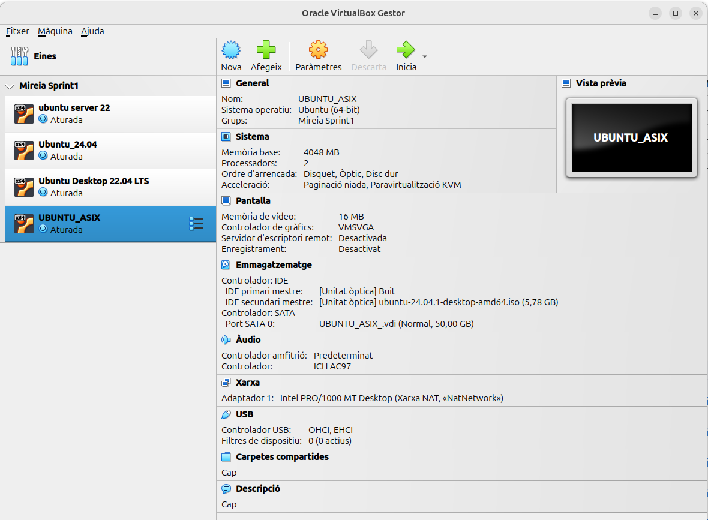
    
    

2. Una vegada, ja tenim tota aquesta part prèvia feta, haurem d'iniciar la instal·lació. Aquí només seguirem els passos com a les captures, fins que comencéssim les particions del disc dur.

    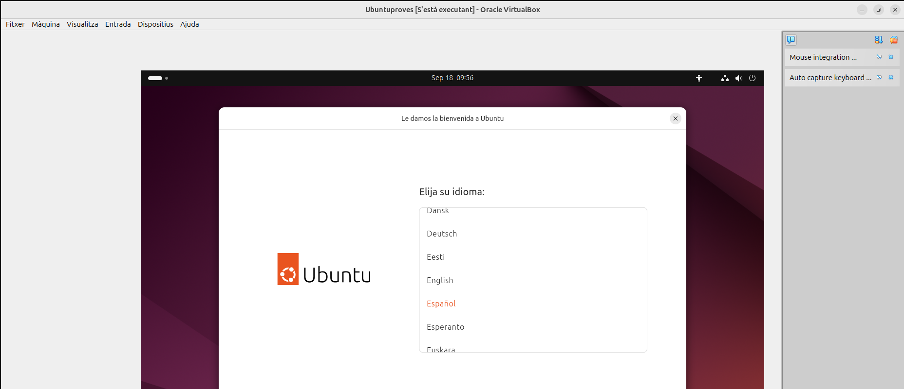
    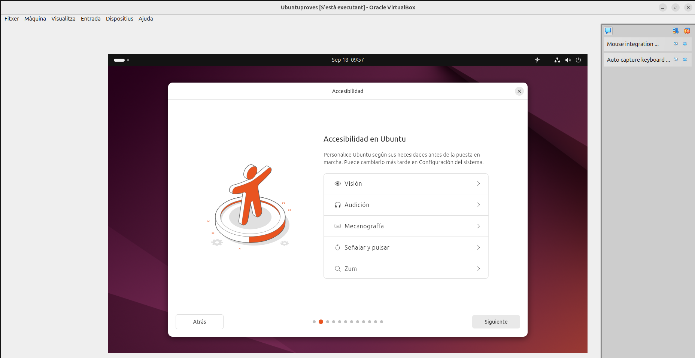
    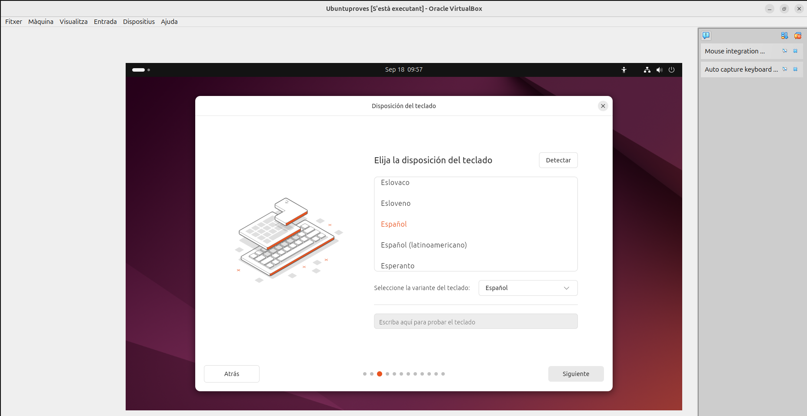
    
    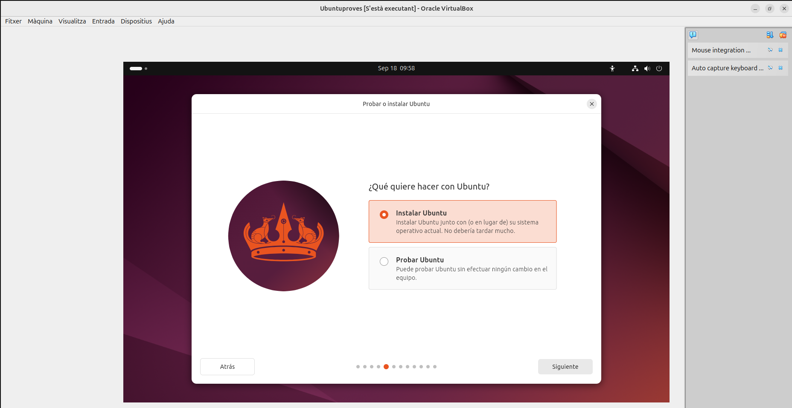
    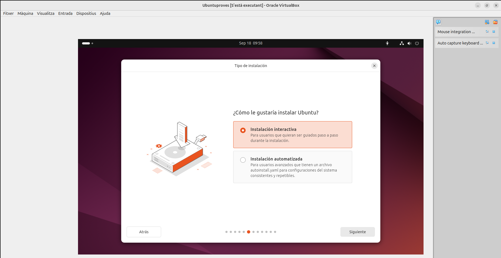
    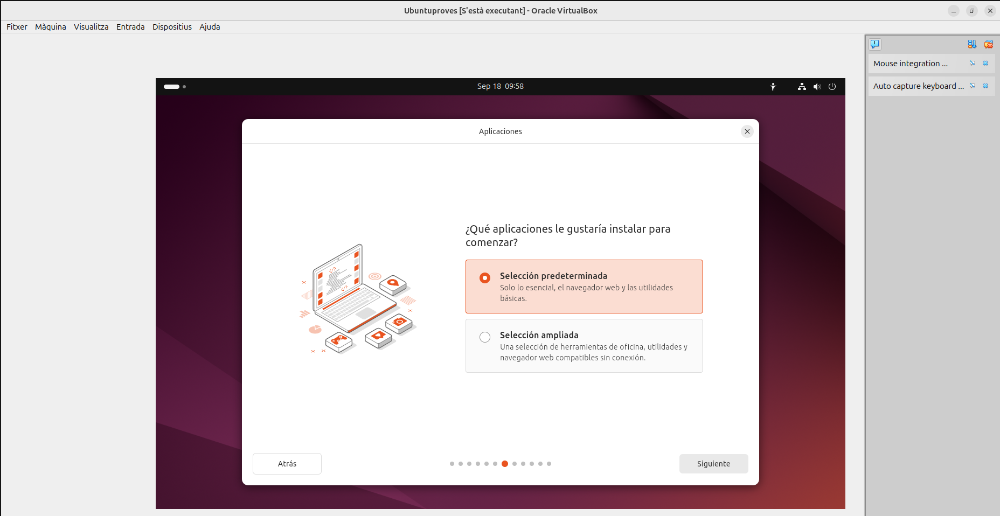
    
    

3. El disc dur té una capacitat de 50 GB, la primera partició que farem serà destinada al swap, a la qual li assignarem 5 GB. Seguidament, per al home de l’usuari utilitzarem 30 GB, ja que, normalment és el que més utilitzarem en aquest cas. Per últim, farem una partició amb la resta d’espai la qual estarà assignada a l’arrel.

    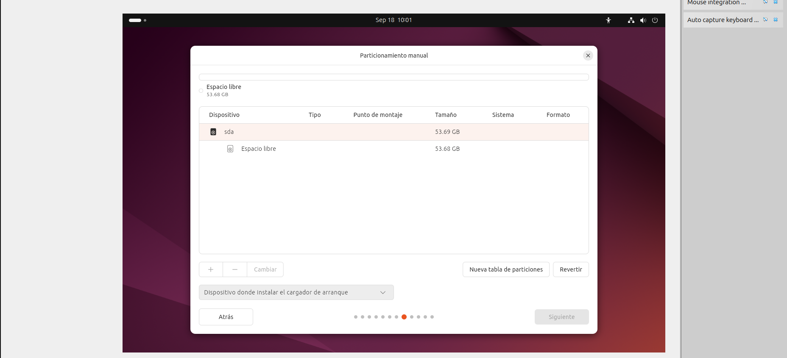
    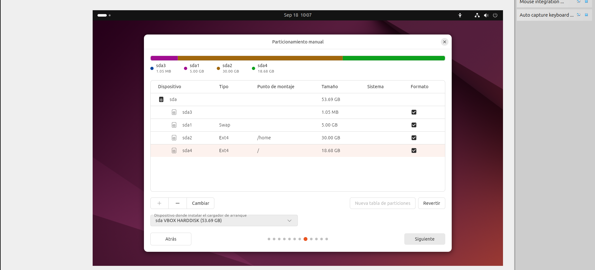
    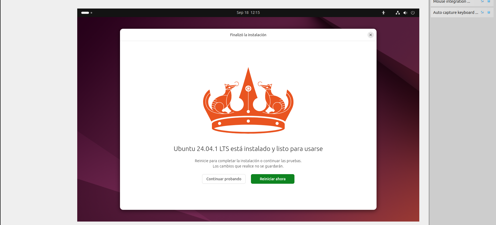

---
## Punts de restauració

### Què són?

Els punts de restauració són com fotos del teu ordinador en un moment concret. Si alguna cosa va malament, com un programa que no funciona o un error, pots tornar a una d'aquestes "fotos" per recuperar el sistema.

### Diferències entre sistemes operatius

Ubuntu i Windows fan servir punts de restauració de maneres diferents. Seguidament explicaré les principals diferències:

Windows crea punts de restauració automàticament abans d'instal·lar programes o actualitzacions, i també els pots fer manualment quan vulguis. En canvi, Ubuntu no crea punts de restauració automàticament, has de fer-ho tu mateix amb eines com Timeshift. En referent a què es guarda, els punts de restauració de Windows només guarden configuracions del sistema, sense incloure els teus fitxers personals. D'altra banda, amb Timeshift, pots decidir si vols incloure només les configuracions o també els fitxers personals. A més, la facilitat d'ús és un altre punt a considerar: Windows és més senzill, ja que pots gestionar-ho des del "Panell de control" amb uns clics, mentre que Ubuntu requereix un coneixement una mica més tècnic.


### A escala de carpetes o sistema

Quan parlem de cuidar les nostres dades i fer còpies de seguretat, és important tenir les eines adequades. Hi ha moltes opcions que ens ajuden a protegir la informació i a recuperar-la si alguna cosa va malament. En aquest apartat, veurem tres eines molt útils: BTRFS, Timeshift i Clonezilla, cadascuna amb les seves pròpies característiques que fan que la gestió de les dades sigui més senzilla i segura.

#### BTRFS

BTRFS és un sistema de fitxers que ajuda a gestionar les dades. Permet fer còpies de seguretat automàtiques i crear "instantànies" del sistema, que són com punts de restauració.

#### Timeshift

Timeshift és una eina que et permet fer còpies de seguretat del sistema. És útil perquè si alguna cosa va malament, pots tornar a un moment anterior sense perdre els teus fitxers personals.

#### Clonezilla

Clonezilla és un programa que fa còpies completes del teu disc dur. En comptes de només guardar fitxers, fa una imatge del disc sencer. Això és genial si vols transferir dades a un nou ordinador.

---
### Fent instantànies en Timeshift

1. Primer, començarem actualitzant el repositori de paquets del sistema per assegurar-nos que tenim la darrera versió de Timeshift disponible.  
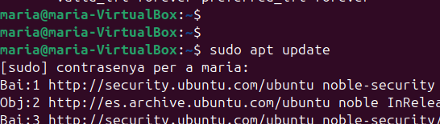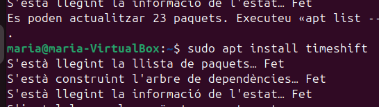

2. A continuació, iniciarem Timeshift i introduirem les nostres credencials d'usuari per accedir a l'aplicació. Un cop dins, veurem una interfície que ens guiarà a través dels diferents passos.   
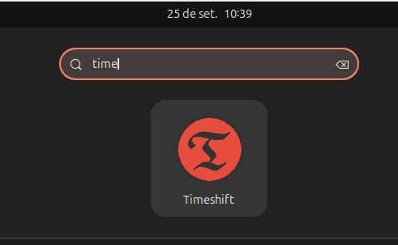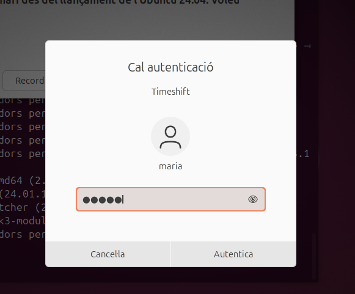

3. Un cop a l'aplicació, escollirem l'opció RSYNC com a mètode per a la creació d'instantànies, ja que aquest mètode és molt eficient per gestionar còpies de seguretat. Després, seleccionarem la partició sda2, que és d'on volem les instantànies.   
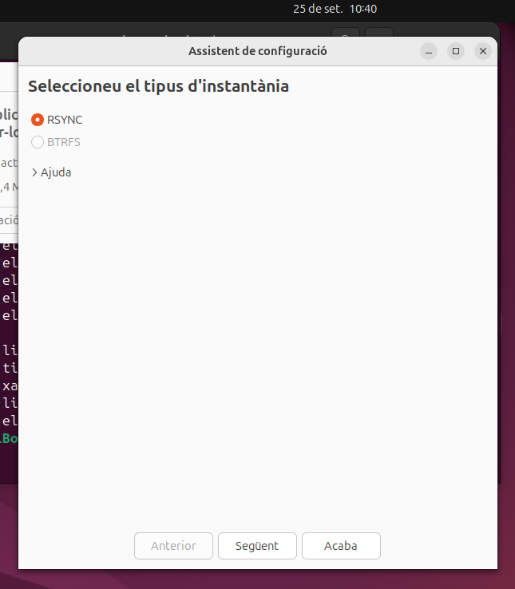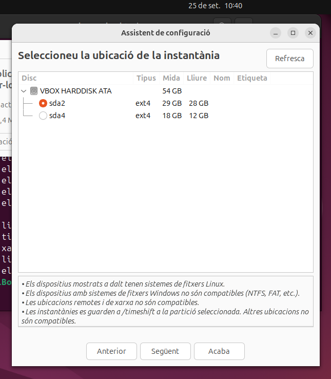

4. A l'etapa següent, mantindrem la configuració predeterminada dels nivells d'instantànies. Aquesta configuració habitual permetrà que el programa gestioni automàticament les còpies de seguretat, eliminant les més antigues quan l'espai sigui limitat.    
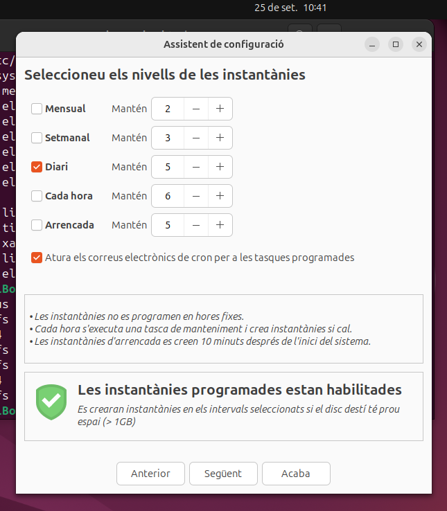

5. Després, farem una revisió dels fitxers que volem incloure o excloure de les còpies de seguretat. Exclourem els fitxers de root per evitar qualsevol conflicte amb el sistema i afegirem tots els fitxers de l'usuari maria perquè volem assegurar-nos que la seva informació estigui protegida.     
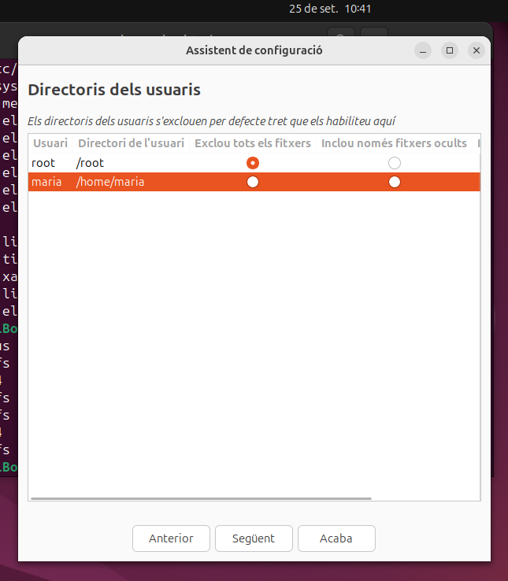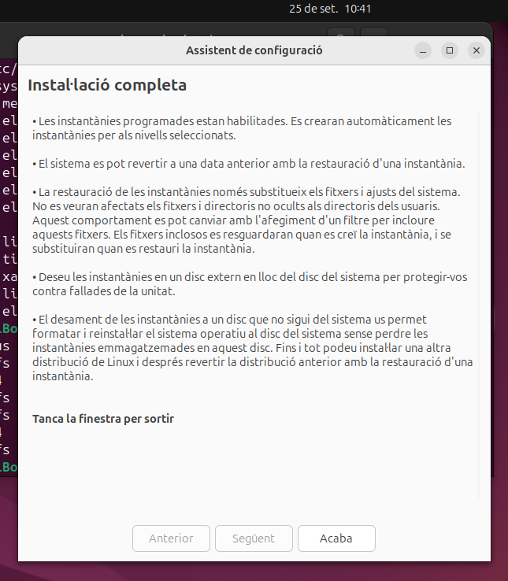

6. Seguidament, mirarem les particions disponibles al sistema i afegirem un nou fitxer al directori home/maria. Aquest fitxer és important perquè el volem incloure en la pròxima instantània.  
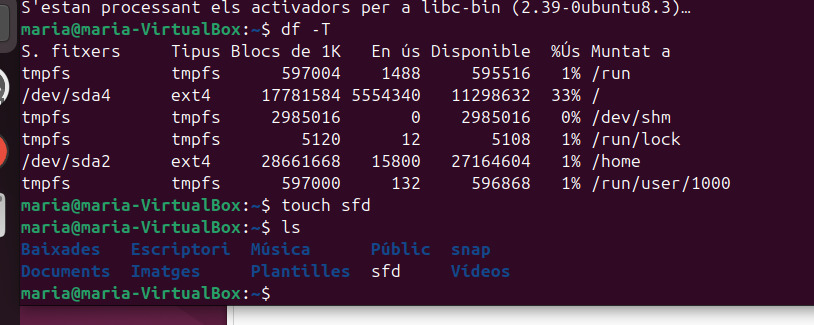

7. Ara, arribem al moment crucial: començarem a crear la instantània. Timeshift iniciarà el procés de còpia de seguretat, i podrà trigar uns minuts, depenent de la quantitat de dades a copiar.    
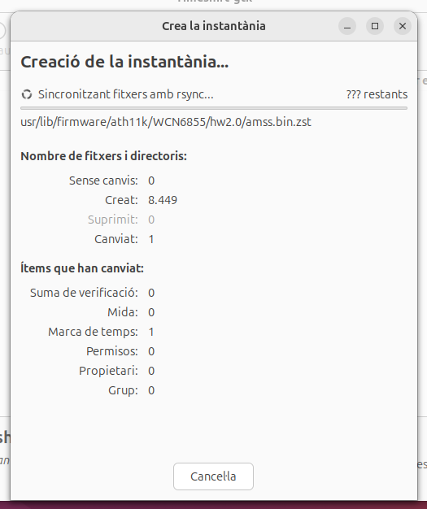

8. Un cop creada la instantània, eliminarem el fitxer que hem afegit anteriorment per comprovar que el sistema pot restaurar-lo correctament. A continuació, restaurarem la instantània que acabem de crear. Aquesta acció ens permetrà veure si Timeshift funciona com ha de ser.   
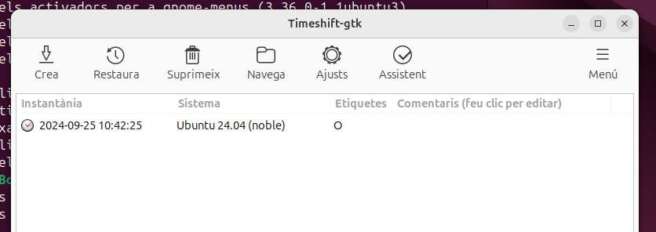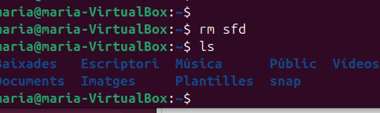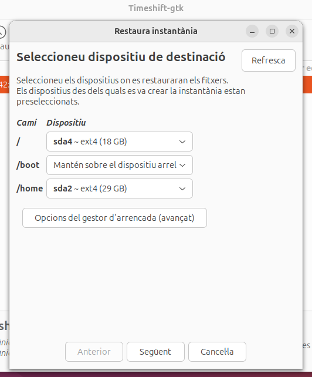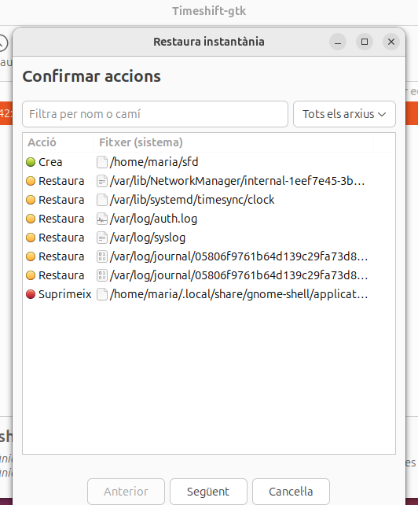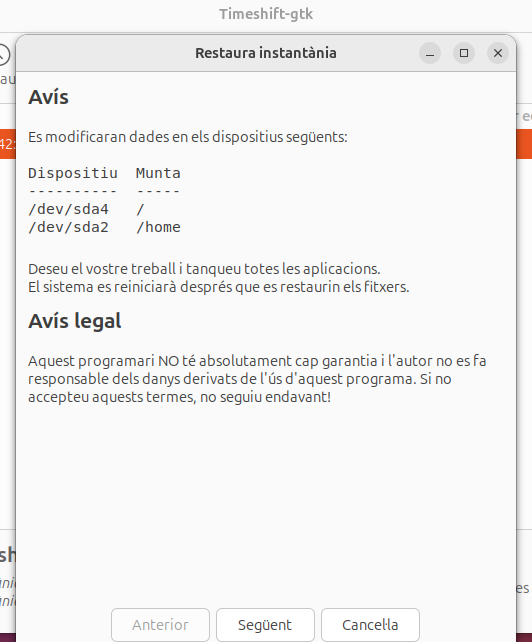

9. Finalment, després de completar la restauració, comprovarem que el fitxer ha tornat a aparèixer al directori home/maria. Si és així, podrem estar segurs que la restauració s'ha realitzat amb èxit i que Timeshift està funcionant correctament.     
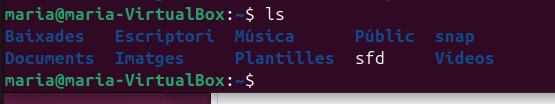

---
## Llicències

### Public License (PL)

PL o Llicència Pública, és un tipus de llicència legal que permet l'ús, la modificació i la distribució d'un producte, generalment programari, de manera oberta, amb determinades llibertats garantides a l'usuari.

---
### Les quatre llibertats del programari lliure

Dins del Programari Lliure o PL, hi ha diferents condicions o llibertats que s’han de complir. La primera llibertat consisteix en el fet que s’ha utilitzat sense condicions. Seguidament, la segona dictamina que es pot estudiar i adaptar a les mateixes necessitats. La tercera permet que sigui distribuïble. Per últim, la quarta fa referència al fet que és possible de millorar i distribuir les modificacions. 

---
### Llicències robustes i permissives

Hi ha dues grans categories de llicències de software, les llicències robustes (GPL) i les permissives (BSD). 

Les GPL són també conegudes com a llicències “copyleft”. Aquestes requereixen que qualsevol software derivat porti també el mateix tipus de llicència, de mode que es preserva la filosofia de “compartir”. Seguidament, tampoc és lícit treure aquesta llicència d’un software derivat i distribuir-ho com a software propietari.

Les BSD o llicències permissives, són menys estrictes. Aquestes no requereixen que el software derivat preservi el mateix tipus de llicència, això vol dir que es pot arribar a vendre com a software propietari.

---
### Llicència d’Ubuntu

El sistema operatiu d’Ubuntu és un software lliure. Aquest està fet a partir de la base de GNU/Linux que aquest segueix aquests mateixos principis. De forma que la major part del software en Ubuntu porta llicències de GPL o General Public License, entre altres.

---
### Llicència de VirtualBox

Actualment, VirtualBox utilitza la llicència GNU General Public License, en versió 3.

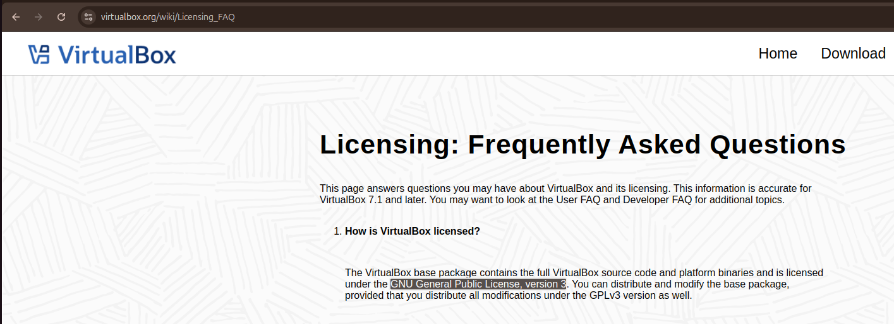

---
### Opinió personal sobre programari lliure

Des del meu punt de vista, el programari lliure és una filosofia fantàstica, perquè ens permet aprendre de moltes maneres diferents i, a més, ens impulsa a ser creatius. El fet de poder modificar els programes segons les nostres necessitats i després compartir aquestes modificacions amb altres persones és molt enriquidor. Ara bé, personalment prefereixo les llicències GPL perquè, tot i que continuen promovent la idea de "compartir", són una mica més restrictives i eviten que altres persones es puguin aprofitar econòmicament del nostre treball sense respectar aquesta filosofia.

---
### Creative Common

Les llicències Creative Commons permeten als creadors compartir l'obra de manera més flexible, decidint quins drets volen conservar i quins cedeixen. Aquestes poden permetre que altres utilitzin, modifiquin o distribueixin la seva obra, sempre amb algunes condicions com el reconeixement de l’autor o la prohibició d’ús comercial.

Una vegada ja tenim clar el funcionament, hem de saber que hi ha diferents tipus de llicències. Algunes permeten més llibertat i altres són més restrictives, depenent de l’autor. Els tipus de llicència contenen restriccions com el reconeixement de l’autor (BY), l'ús no comercial (NC), compartir amb la mateixa llicència (SA) o no permetre modificacions (ND).


---
### Llicència de GitHub

La llicència que utilitzo per a allotjar la pàgina web en GitHub és la següent: GNU general public license v3.0. Aquesta no forma part de les llicències Creative Commons. Seguidament explicaré les diferències:

La GNU GPL és per a programari i es centra a assegurar que el codi font sigui accessible i que qualsevol modificació mantingui les mateixes condicions de llibertat. En canvi, les llicències Creative Commons estan dissenyades per a obres creatives com textos, imatges o música. GPL obliga a compartir el codi font i manté les llibertats per a les obres derivades, sempre que es mantingui la mateixa llicència. (És molt estricta en aquest aspecte)


La llicència Creative Commons que més s’assembla és la CC BY-SA, que permet modificar i compartir obres si es reconeix l’autor i es manté la mateixa llicència.


---
## Configuració de xarxa

1. El primer que haurem de fer és entrar dins del directori /etc/netplan i seguidament entrarem en el fitxer de 01-network-manager-all.yaml, per editar-lo.


2. Una vegada dins, veurem la configuració predeterminada, aquesta la canviarem a la configuració de la captura de pantalla. Aquesta configuració determina que se li assigni ip automàtica per DHCP. Per això, afegim la interfície de xarxa enp0s3 i seguidament dhcp4: yes.


3. Tot seguit, si el que volem és configurar una ip estàtica, haurem de determinar els següents paràmetres:


4. Després de decidir si volem una ip automàtica o estàtica, sortirem del fitxer guardant el canvis. Per aplicar realment la configuració haurem de escriure "netplan apply".


5. Una altra forma de poder canviar la ip és per interfície gràfica. Aquí, editarem l'entrada que ja és existent i canviarem la ip.
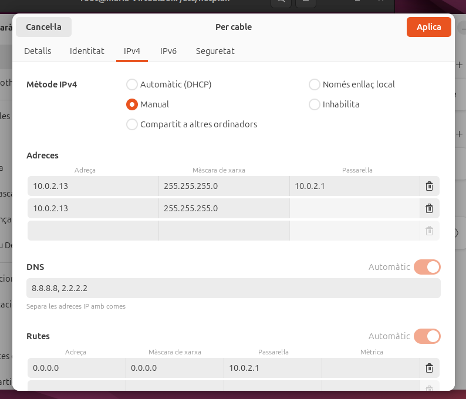

6. Per comprovar quin és l'ordre de importància al configurar una ip, haurem de eliminar o comentar les línies de codi del fitxer "90-NM-...", això és degut al fet que l'Ubuntu 24.04 el crea i fa interferència amb el fitxer configurat prèviament.
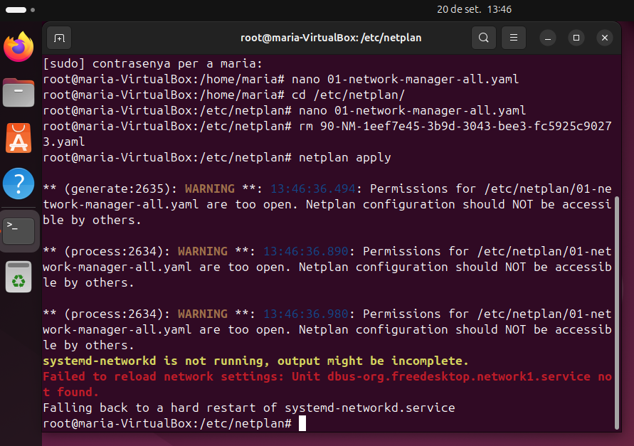

7. Com podem comprovar, al fer un "ip a" al terminal, ens sortirà la ip que li hem assignat pel fitxer de configuració del netplan, això és degut al fet que aquest fitxer té prioritat abans que la configuració que fem per interfície gràfica.
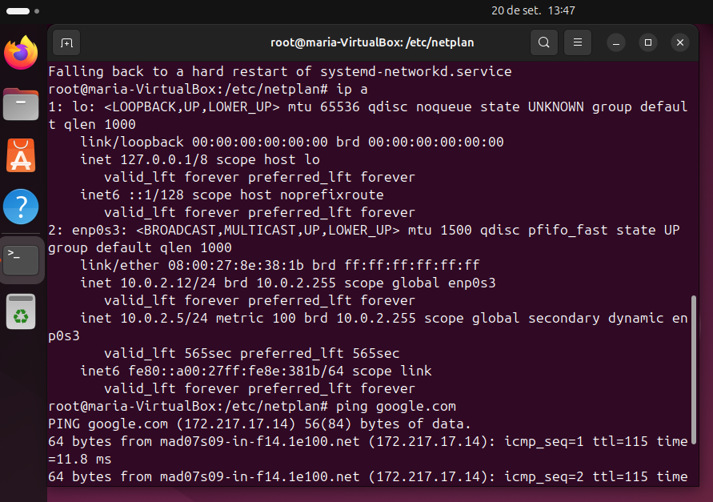


---
## Programari

### Introducció

El programari és tot allò que instal·lem perquè el nostre ordinador funcioni com cal, des d'aplicacions fins a eines del sistema. En Linux, hi ha diverses formes de gestionar el programari, sigui amb eines gràfiques o per línia de comandes.

---
### Centre de programari

El centre de programari és una aplicació gràfica, com una botiga d’apps, que permet instal·lar i eliminar programes de manera fàcil i visual. És molt útil trobar i posar aplicacions sense tocar la línia de comandes, només cercant i fent clic.

1. Per instal·lar un programa a través del Ubuntu software haurem de cercar el nom del programa primer i clicar "Install". En aquest cas l'exemple és el programa GIMP. 
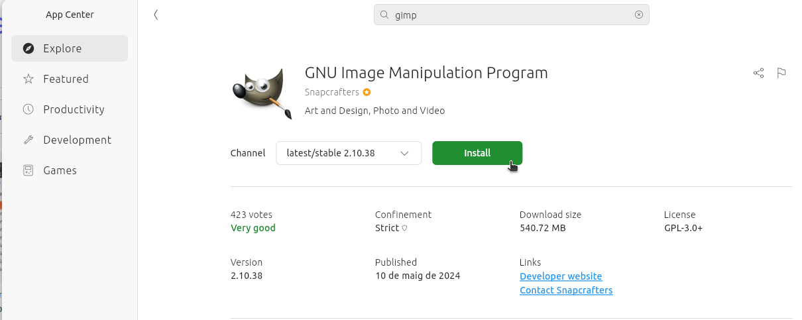

2. Per desinstal·lar haurem de clicar en "Uninstall".   
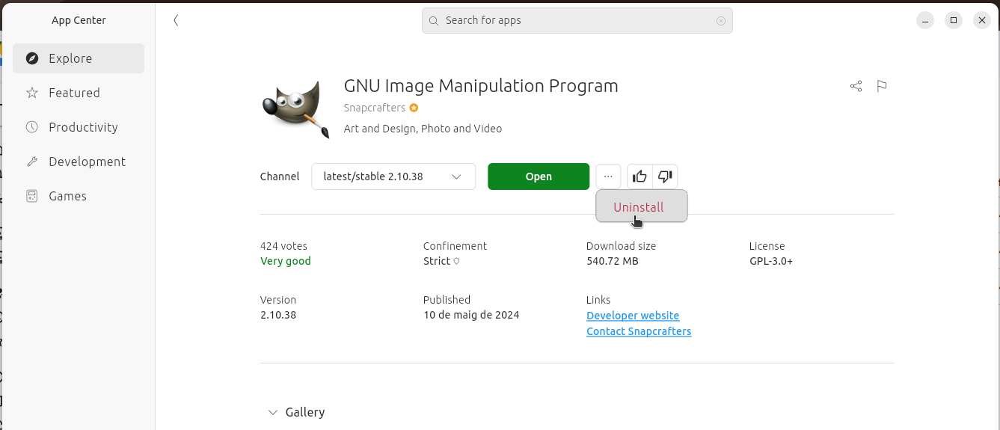

---
### APT

L'eina APT et permet instal·lar i eliminar programes des de la línia de comandes. És com el centre de programari, però en format text, on pots buscar, posar i treure aplicacions escrivint unes poques instruccions. 

Seguidament, he afegit diferents comandes bastant interessants, que normalment no són molt conegudes.

* La comanda `apt dist-upgrade` actualitza el sistema, instal·lant noves versions en cas que existeixin, també instal·larà nous paquets en cas que existeixin.

* La comanda `apt build-dep paquet` instal·la dependències d'un paquet, però **no** el paquet.

* La comanda `apt-cache depends paquet` mostra dependències d'un paquet.

* La comanda `apt -f install` arregla instal·lacions a mitges, paquets trencats, etc.

```
apt dist-upgrade
```
```
apt build-dep paquet
```
```
apt-cache depends paquet
```
```
apt -f install
```

---
1. Primer haurem de actualitzar el repositori de paquets.   
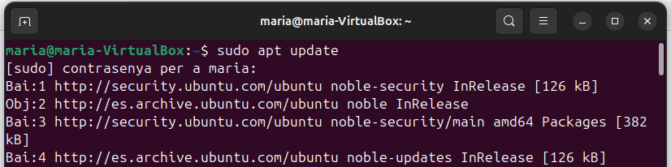

2. Seguidament, instal·larem el programa GIMP. 
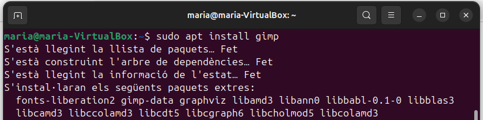

3. Després, executarem el programa.


4. Una vegada, executat ja podrem utilitzar-lo.


5. Per últim, eliminarem GIMP i intentarem executar-lo per comprovar que l'eliminació s'ha realitzat bé.
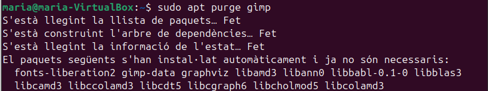


---
### Aptitude

Aptitude és com una versió més potent de APT amb una interfície fàcil per gestionar paquets des de la línia de comandes. Serveix per instal·lar, actualitzar i eliminar paquets amb més control.

Seguidament, he afegit diferents comandes bastant interessants, que normalment no són molt conegudes.

* La comanda `aptitude show paquet` mostra si el paquet està instal·lat o no.
```
aptitude show paquet
```

---
1. El primer que haurem de fer és instal·lar aptitude.  
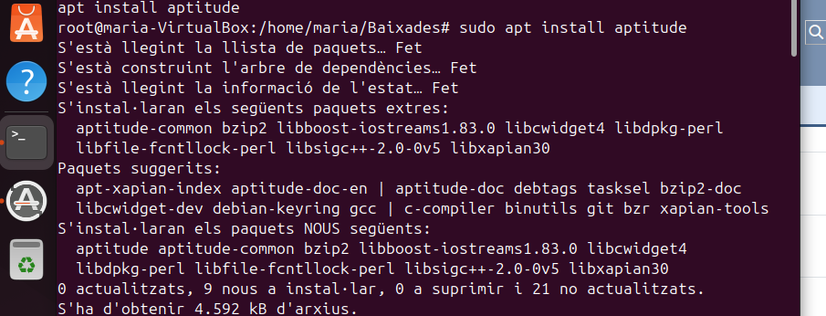

2. Seguidament, instal·larem el programa Geany amb aptitude.    
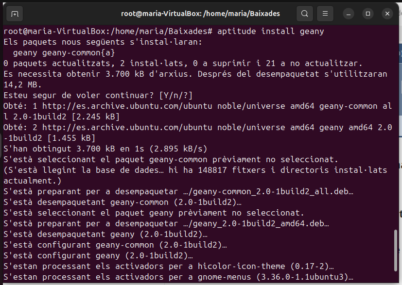

3. Una vegada instal·lat, executarem el programa amb la comanda "geany".    


4. Per últim, desinstal·larem el programa amb "aptitude remove".    


---
### DPKG

DPKG és l'eina bàsica per gestionar paquets en sistemes com Debian o Ubuntu. És útil per instal·lar i gestionar paquets .deb de manera manual, sense utilitzar repositoris.

Seguidament, he afegit diferents comandes bastant interessants, que normalment no són molt conegudes.

* La comanda `dpkg -s paquet` mostra la priority del paquet (required, important, standard, optional, extra)

* La comanda `dpkg –get-selections | grep paquet` funciona per **comprovar** si un paquet està instal·lat, però **no** el mostra si no està instal·lat.

```
dpkg -s paquet
```
```
dpkg –get-selections | grep paquet
```
---
1. Per començar, descarregarem un paquet .deb d'internet i l'instal·larem amb dpkg. Com podem observar a la captura per poder instal·lar el programa haurem de triar la versió amd, en aquest cas inicialment vaig provar-ho amb arm i efectivament, no va funcionar.    
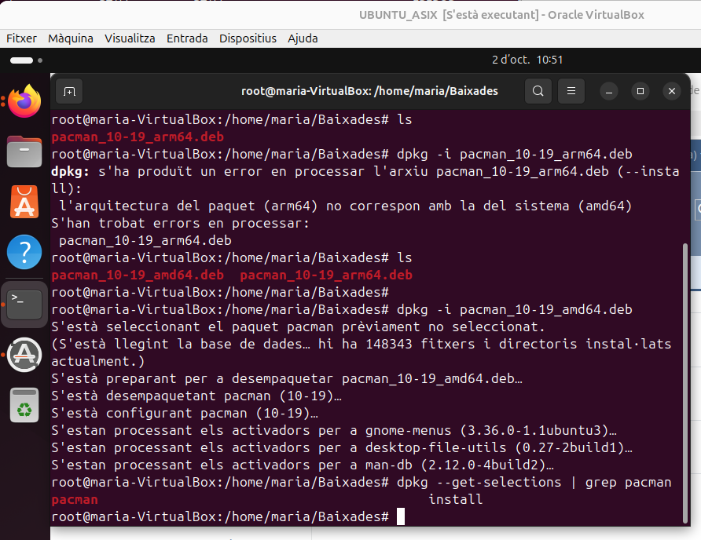


2. Seguidament, executarem programa amb la comanda "pacman" i començarà a funcionar el videojoc. 


3. Per desinstal·lar-lo haurem de executar la següent comanda "dpkg -P pacman", per comprovar que ha funcionat intentem executar el programa.   
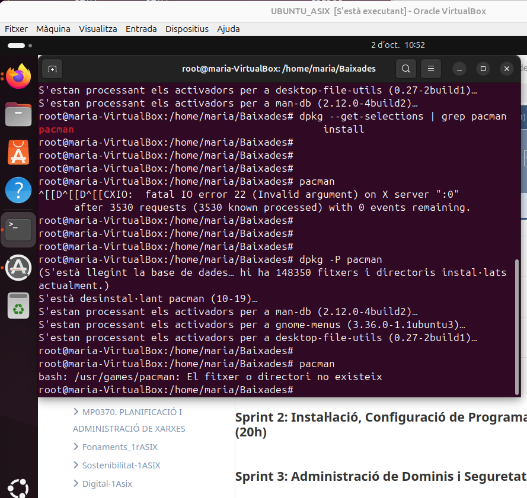

---
### Repositoris

Els repositoris són llocs d’on el sistema descarrega i actualitza el programari de forma segura i automàtica. Hi ha repositoris oficials, PPAs (creats per altres usuaris) i també de tercers.

1. Per instal·lar un programa en repositori, escollirem com a exemple Google Chrome. El primer pas és descarregar i instal·lar la clau. Seguidament instal·larem el repositori i després el Chrome.
```
wget -q -O - https://dl-ssl.google.com/linux/linux_signing_key.pub | sudo apt-key add - 
```
```
sudo sh -c 'echo "deb [arch=amd64] http://dl.google.com/linux/chrome/deb/ stable main" >> /etc/apt/sources.list.d/google.list'
```
```
sudo apt update && sudo apt install google-chrome-stable
```
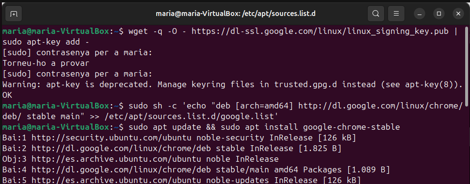

2. Per últim, revisarem que tenim el repositori a la carpeta de repositoris i mirarem que el programa estigui instal·lat.
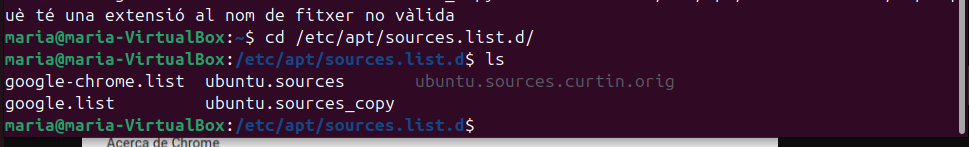
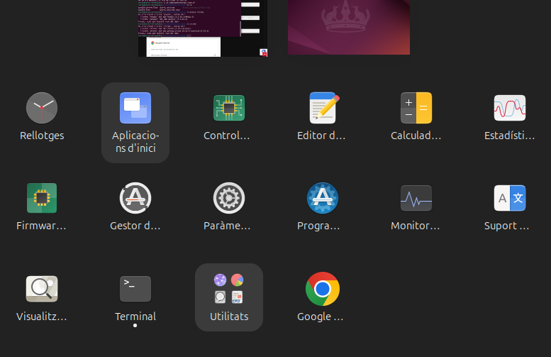

---
### Compilar a través de codi font

Compilar programari significa convertir el codi font d’un programa en un executable. És útil quan vols versions personalitzades o quan el programa no està als repositoris, ja que pots controlar les opcions d'instal·lació.

Seguidament, he afegit diferents comandes bastant interessants, per poder descomprimir fitxers en extensions com: tar, gz, tgz, bz2, tar.bz2, zip i rar.

```
tar xvf fitxer.tar
```
```
gunzip fitxer.gz o gzip -d fitxer.gz
```
```
tar xvzf fitxer.tar.gz
```
```
bunzip2 fitxer.bz2 o bzip2 -d fitxer.bz2
```
```
tar xvjf fitxer.tar.bz2
```
```
unzip fitxer.zip
```
```
rar -x fitxer.rar
```

---
1. Per començar, descarregarem el fitxer tar.gz de myman (un programa paregut al videojoc pacman), i el descomprimirem. 
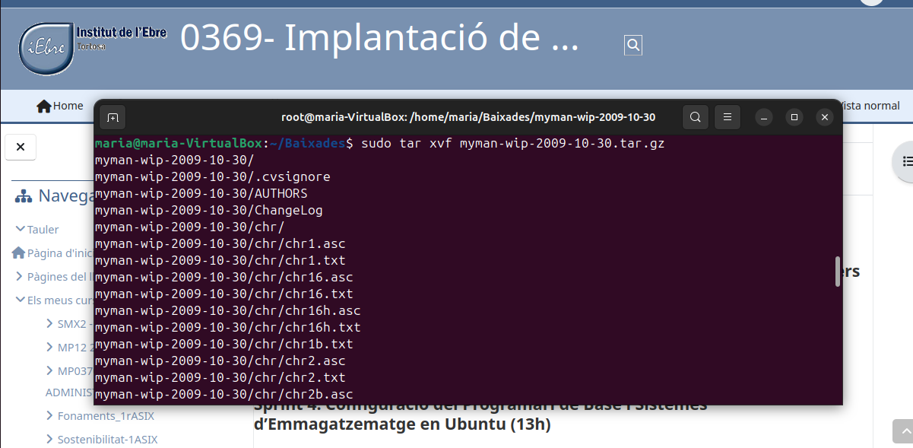

2. Tot seguit, entrarem dins de la carpeta i visualitzarem el contingut. 
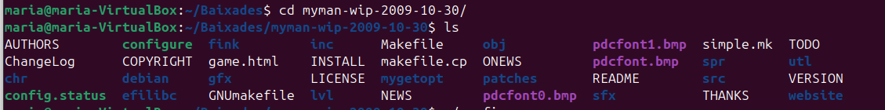

3. Després en "sudo" executarem la comanda "./configure".
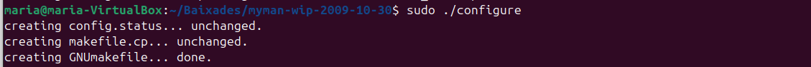

4. A continuació, instal·larem el paquet build-essential i verificarem la versió del "gcc". Aquest pas és important, ja que, sinó salten errors a les següents comandes.  
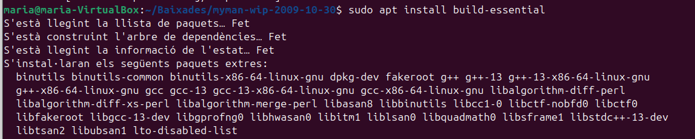
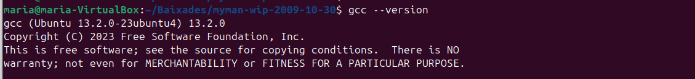

5. Seguidament, en "sudo" executarem les següents comandes.
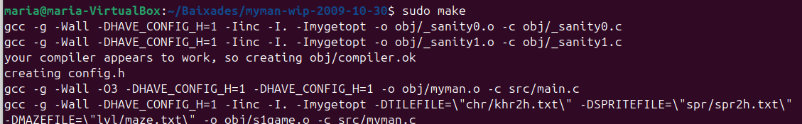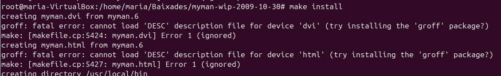

6. Una vegada instal·lat executarem el programa amb "myman"
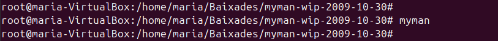
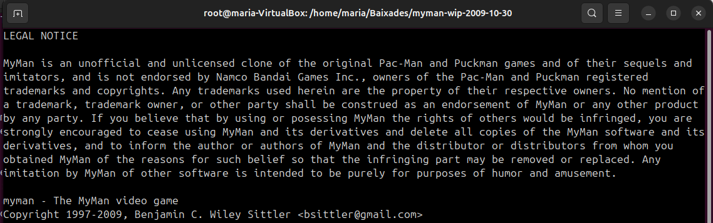
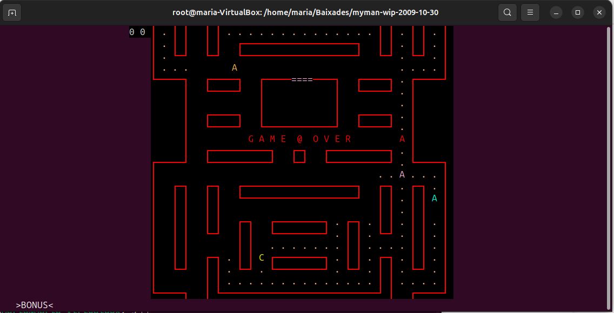

7. Per últim, eliminarem el programa i ho comprovarem.
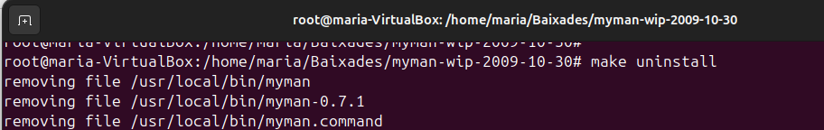
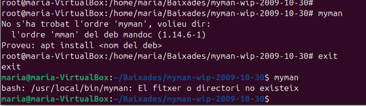

### Pinning packet
El pinning de paquets és una tècnica que permet controlar quina versió d'un paquet es vol instal·lar o actualitzar en un sistema operatiu. Aquesta estratègia és útil per mantenir versions específiques d'aplicacions, evitar actualitzacions no desitjades i gestionar la compatibilitat amb altres programes.

---
1. El primer pas és ficar permissos de **sudo** amb la comanda **sudo su**.
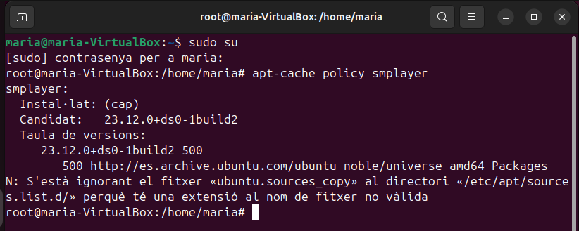

2. Seguidament, entrarem dins de la pagina web <https://www.smplayer.info/es/download-linux> i executarem la primera comanda, aquesta és per afegir el repositori.
```
add-apt-repository ppa:rvm/smplayer
```

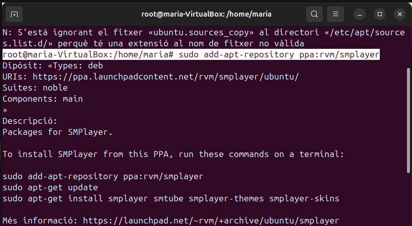

3. Després ficarem la següent comanda de la pàgina mencionada en el punt anterior, aquesta serveix per actualitzar.
```
apt-get update
```
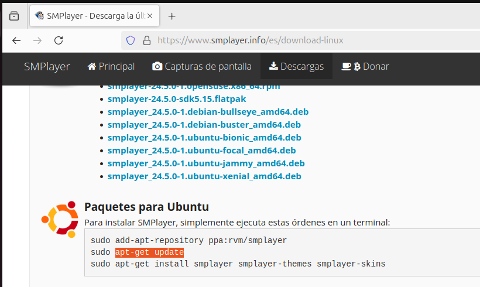
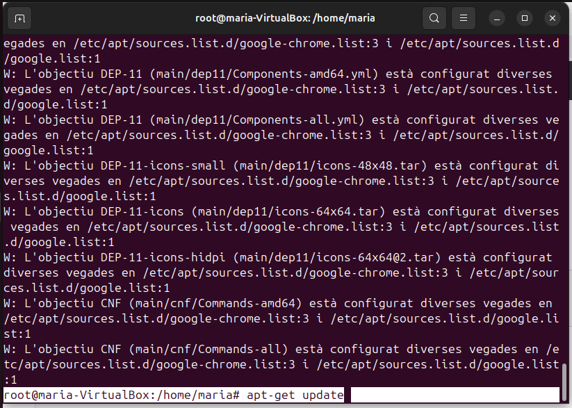

4. Una vegada feta la actualització si executem la comanda `apt-cache policy smplayer`, per poder veure la versió del candidat. El candidat determina quina serà la versió que s'instal·arà si el programa s'instal·la.
```
apt-cache policy smplayer
```
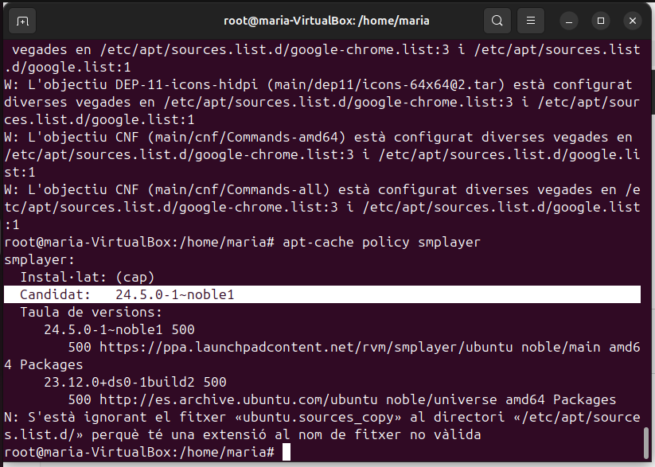

5. Seguidament, entrarem dins de la carpeta **preferences.d** i crearem un fitxer, per poder canviar la versió del candidat.
```
cd /etc/apt/preferences.d
```
```
nano apt_preferences
```
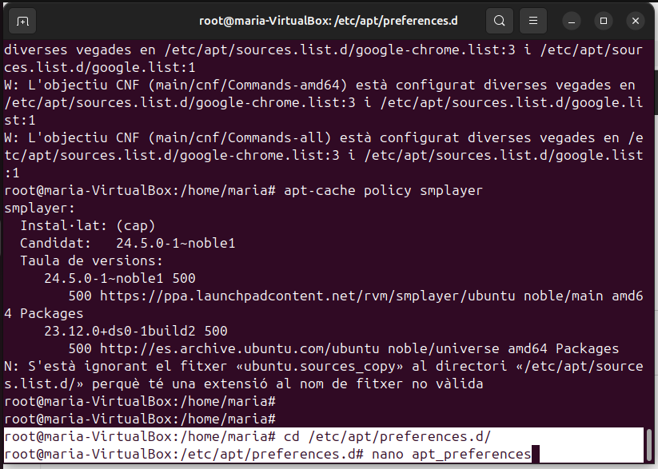

6. Dins del fitxer haurem d'escriure les següents linies. La primera determina el nom del programa, en aquest cas **smplayer**, la segona que no volem que s'instal·li la última versió dinsponible i la tercera la prioritat.
```
Package: smplayer
Pin: release o=LP-PPA-rvm-smplayer
Pin-Priority: 400
```
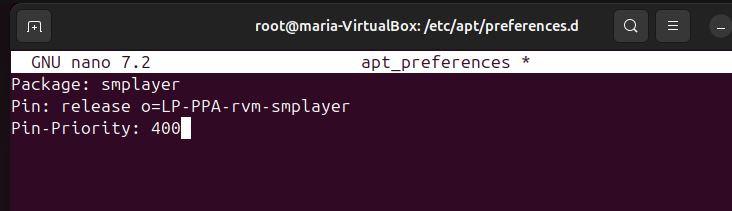

7. Després guardarem el fitxer i actualitzarem, de forma que quan tornessim a comprovar la versió s'ens haurà actualitzat el candidat a una versió anterior.
```
apt-get update
```
```
apt-cache policy smplayer
```
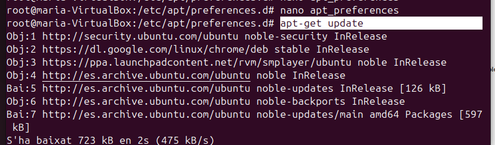
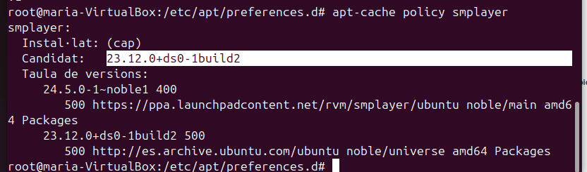

8. Seguidament, instal·larem el programa smplayer.
```
apt-get install smplayer
```
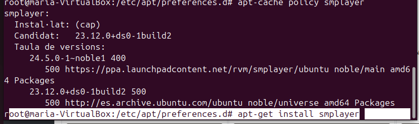

9. Per últim podrem comprovar que la versió instal·lada i el candidat son iguals, d'aquesta forma és com es fan els pinning packets.    
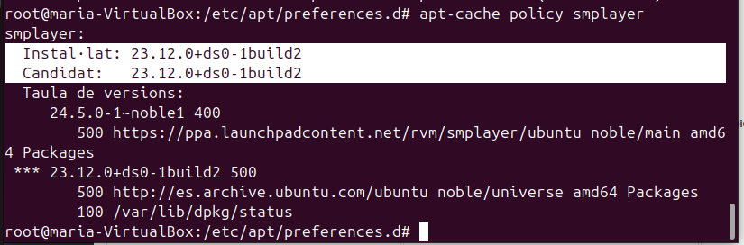


---
## Gestor de arrancada

El gestor d'arrencada és el programa que permet que l'ordinador engegui el sistema operatiu, com Ubuntu, i el més utilitzat és GRUB2, que et deixa escollir entre diferents sistemes si n'hi ha més d'un instal·lat. Per organitzar l'espai del disc dur, existeixen dues opcions: MBR, que és antic i només funciona amb discos de fins a 2 TB, i GPT, que és més modern, admet discos més grans i és més segur. Si apareix l'error "Gestor d'arrencada pendent", vol dir que el sistema no sap com arrencar, però es pot solucionar reinstal·lant el gestor amb un USB o CD.

---
### Bàsics per restaurar grub2

Quan el gestor d'arrencada GRUB2 es danya o no arrenca correctament en Ubuntu o altres sistemes Linux, hi ha diverses eines i mètodes per solucionar el problema. A continuació es presenten dues eines útils per restaurar GRUB2: Boot-Repair i Super Grub2 Disk.

#### Bootrepair

Boot-Repair és una eina molt útil que t'ajuda a solucionar problemes amb el gestor d'arrencada GRUB2. És perfecta per a aquells que no volen complicar-se la vida amb comandos tècnics. Simplement obres l'eina, i ella s'encarrega de buscar i reparar els errors més comuns que impedeixen que l'ordinador arranqui correctament.

#### Super Grub2 

Super Grub2 Disk és una altra eina que et permet arrencar el teu sistema operatiu si GRUB2 no funciona. Aquesta eina és com un "salvador" que et permet accedir al teu ordinador, fins i tot si el gestor d'arrencada s'ha danyat. Amb Super Grub2 Disk, pots iniciar el teu sistema i fer les reparacions necessàries per tornar a posar-ho tot en marxa.

---
### Trencar i reparar grub2 d'Ubuntu 24.04

#### Súper Grub2

1. El primer que haurem de fer és entrar com a administrador a la carpeta /boot utilitzant el terminal. Per accedir-hi, farem servir el següent comandament: `cd /boot`, i un cop dins, eliminarem la subcarpeta grub/ amb la comanda `sudo rm -r grub/`. Aquest pas és crucial, ja que esborrarem el gestor d'arrencada, el qual haurem de restaurar més endavant.   
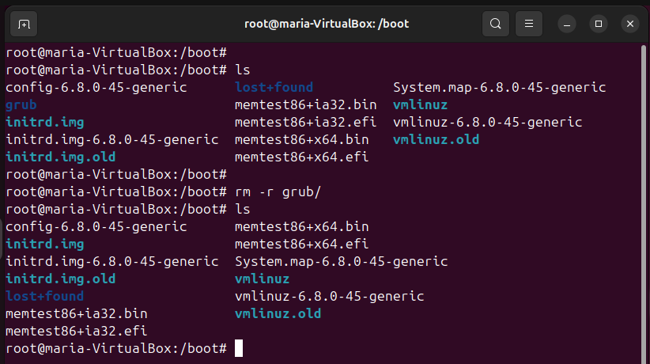

2. Una vegada eliminada la carpeta, reiniciarem l’ordinador. Durant l’arrencada, apareixerà el missatge "grub rescue", indicant que el sistema no pot trobar el gestor d’arrencada. Aquí, el que farem és apagar la màquina virtual, obrir la configuració, i afegir la imatge ISO de Super Grub2 al lector virtual de discs.   
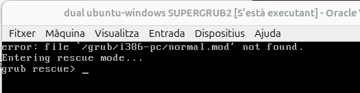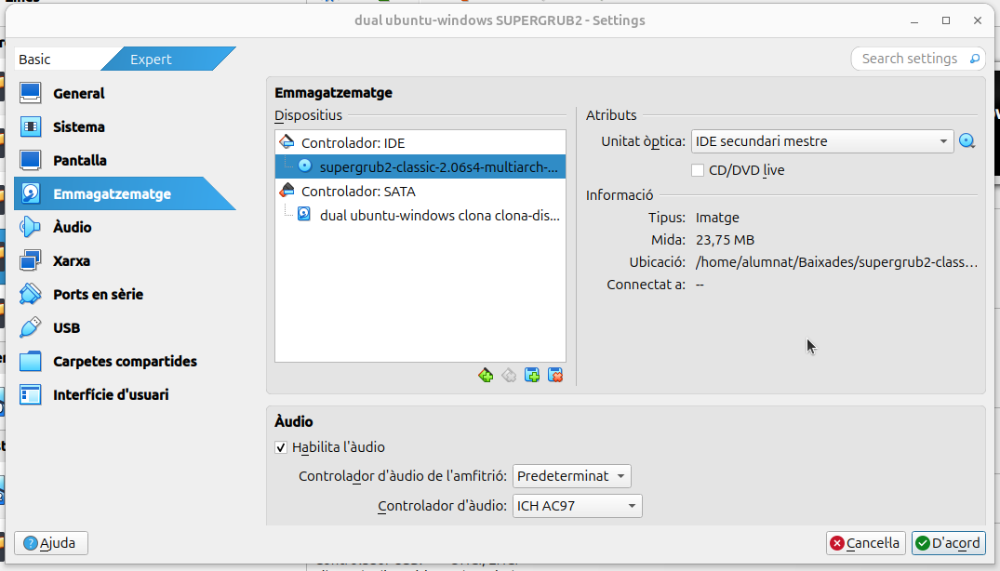

3. Després d’afegir l'ISO de Super Grub2, reiniciarem la màquina i se'ns mostrarà un menú d’opcions d’arrencada. Hem de seleccionar la primera opció que ens permetrà veure les opcions de boot disponibles per al sistema operatiu que volem arrencar.    
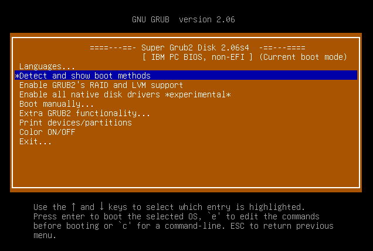

4. Un cop triada l’opció de boot disponible que Super Grub2 ens mostra, prenem "Enter" per iniciar el sistema operatiu de forma temporal. Aquest pas ens permetrà arrencar el sistema sense la necessitat d’un gestor d’arrencada completament funcional.   
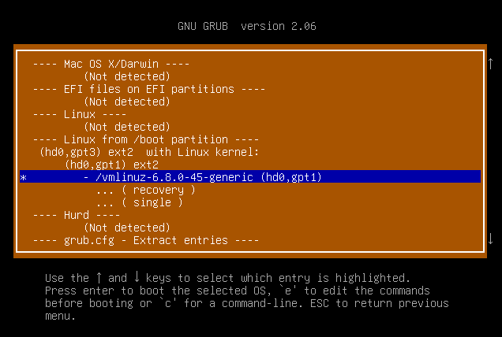

5. Ja dins del sistema operatiu, obrirem un terminal i ens convertirem en superusuari amb la comanda `sudo su`. A continuació, executarem les següents comandes: `grub-install /dev/sda`, que reinstal·larà el gestor d’arrencada a la unitat de disc principal, `update-grub2` per actualitzar la configuració de GRUB, i finalment, `sudo apt-get install grub2` per assegurar-nos que GRUB està instal·lat correctament.  
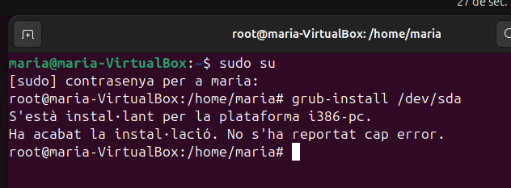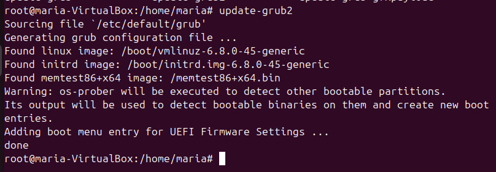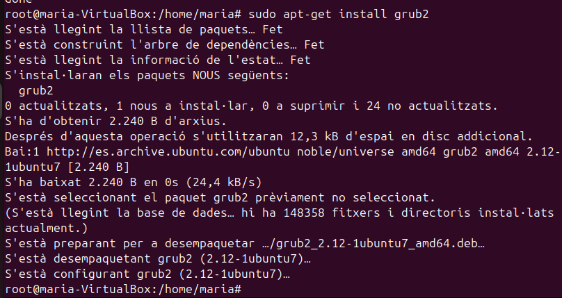


#### Bootrepair

1. Per fer la recuperació amb Boot-Repair, repetirem el mateix procés inicial: accedirem com a administrador a la carpeta /boot i eliminarem la subcarpeta grub/ amb la comanda `sudo rm -r grub/`. Després, reiniciarem l'ordinador i ens apareixerà el missatge "grub rescue", indicant que no hi ha gestor d’arrencada.    


2. Quan aparegui el missatge "grub rescue", apagarem la màquina virtual i afegirem la imatge ISO de Boot-Repair a la configuració de la màquina virtual.    
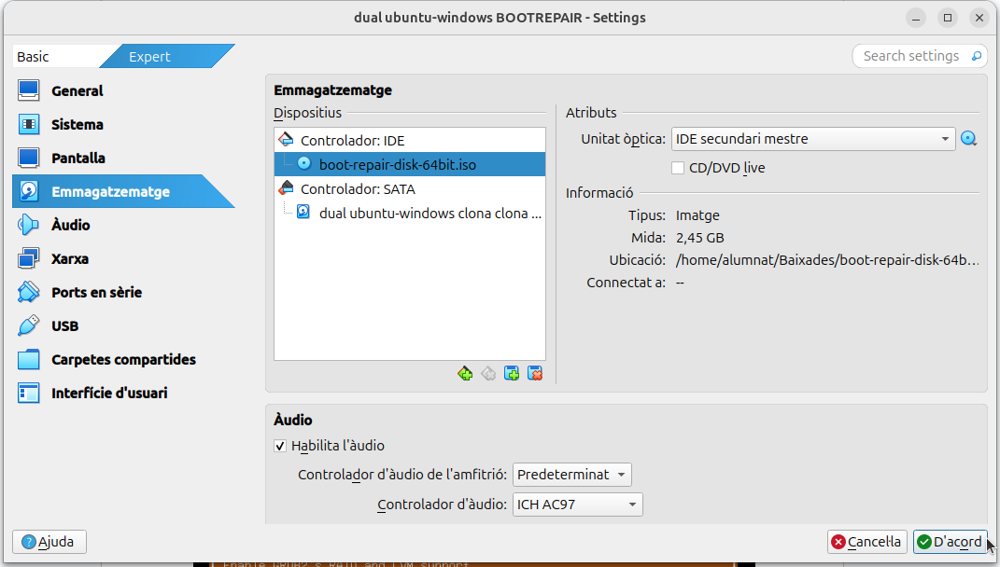

3. Un cop afegida l'ISO, reiniciarem la màquina virtual i aquesta arrencarà directament amb Boot-Repair. Quan Boot-Repair s’iniciï, podrem veure diverses opcions per reparar el sistema.  
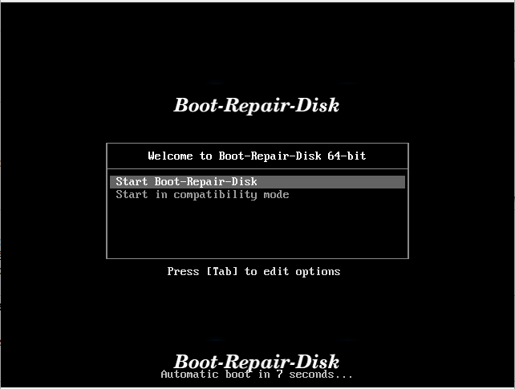

4. En el menú de Boot-Repair, seleccionarem l’opció recomanada per començar el procés automàtic de reparació del gestor d’arrencada. Aquesta opció sol ser suficient per resoldre problemes comuns amb GRUB.    
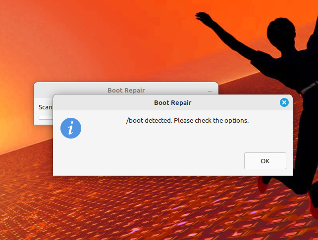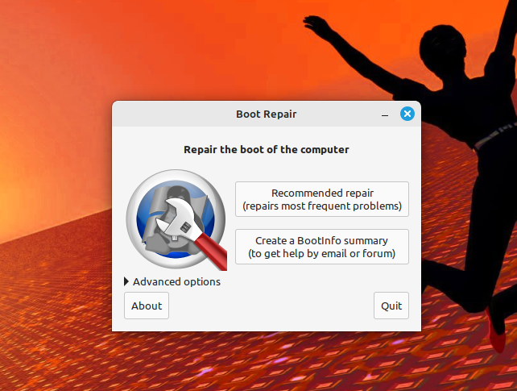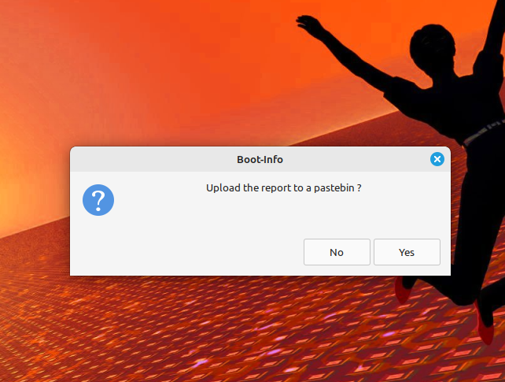

5. Un cop finalitzi el procés, apareixerà un missatge indicant que la reparació ha estat completada. Apagarem la màquina virtual, retirarem la imatge ISO de Boot-Repair des de la configuració de VirtualBox, i tornarem a encendre la màquina. Si tot ha anat correctament, el sistema operatiu hauria d’arrencar de manera normal amb GRUB restaurat.    
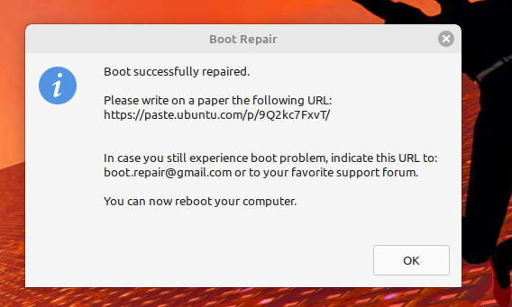

---
## Webgrafia

Molta de la informació extreta està al **Moodle de 0369 - Implantació de Sistemes Operatius**. Seguidament, els següents links són d'internet:

Documentació oficial d'Ubuntu. Instal·la Ubuntu Desktop. Disponible a: <https://ubuntu.com/tutorials/install-ubuntu-desktop>

Ubuntu. Guies d'instal·lació i documentació de diferents versions d'Ubuntu. Disponible a: <https://help.ubuntu.com/>

Oracle VM VirtualBox. Capítol 6. Configuracions de xarxa. Disponible a: <https://www.virtualbox.org/manual/ch06.html>

James Kiarie. Understanding the Network Settings in VirtualBox. Tecmint. Disponible a: <https://www.tecmint.com/virtualbox-networking-settings/>

Abhishek Prakash. Backup and Restore Your Linux System with Timeshift. It's FOSS. Disponible a: <https://itsfoss.com/backup-restore-linux-timeshift/>

Christian Cawley. 5 Tools to Create a Restore Point on Linux. MakeUseOf. Disponible a: <https://www.makeuseof.com/tag/5-tools-restore-linux-system-state-snapshot/>

Free Software Foundation. Llicències de Programari Lliure. Disponible a: <https://www.gnu.org/licenses/licenses.html>

Choose a License. Find a License. Disponible a: <https://choosealicense.com/>

Free Software Foundation. GNU GRUB Manual. Disponible a: <https://www.gnu.org/software/grub/manual/>

Aaron Kili. How to Install and Use Grub Customizer in Ubuntu. Tecmint. Disponible a: <https://www.tecmint.com/install-grub-customizer-in-ubuntu/>

---


