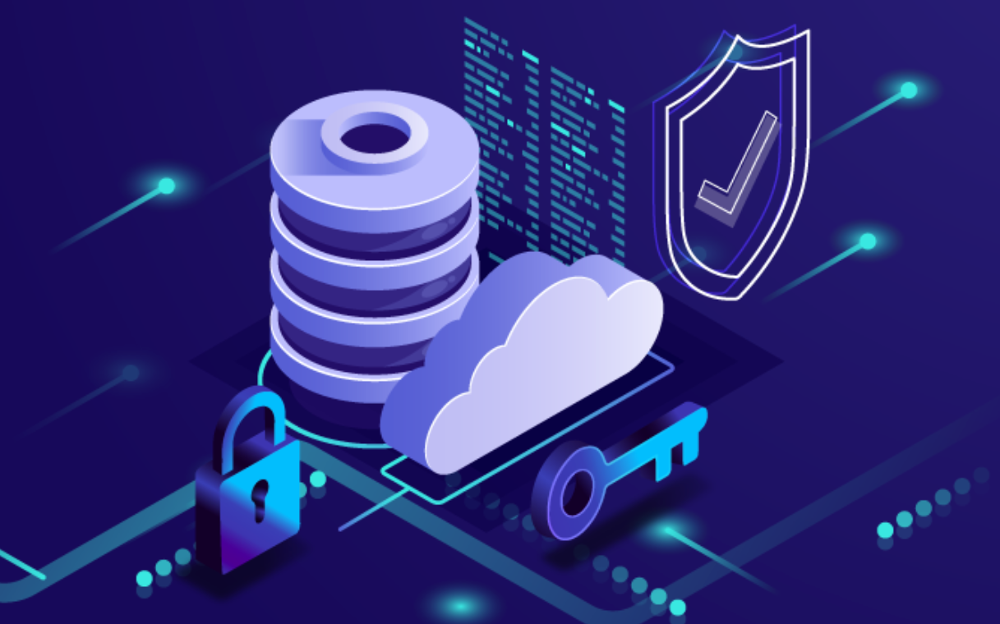
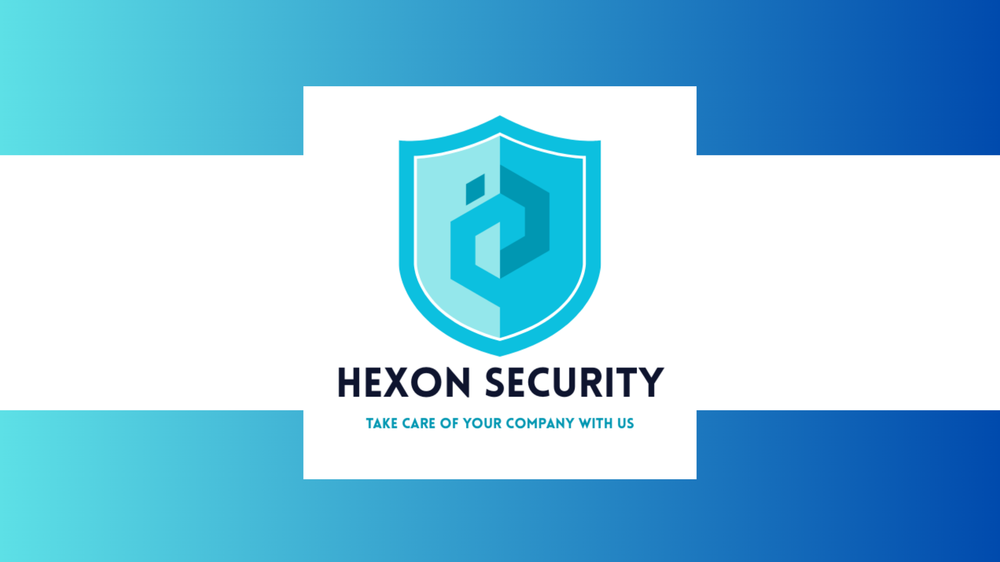
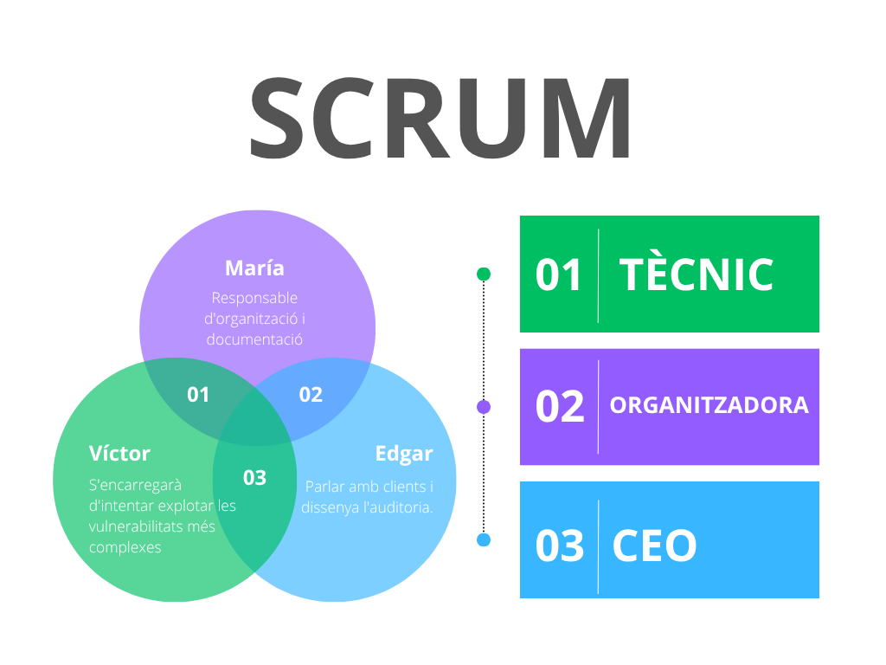
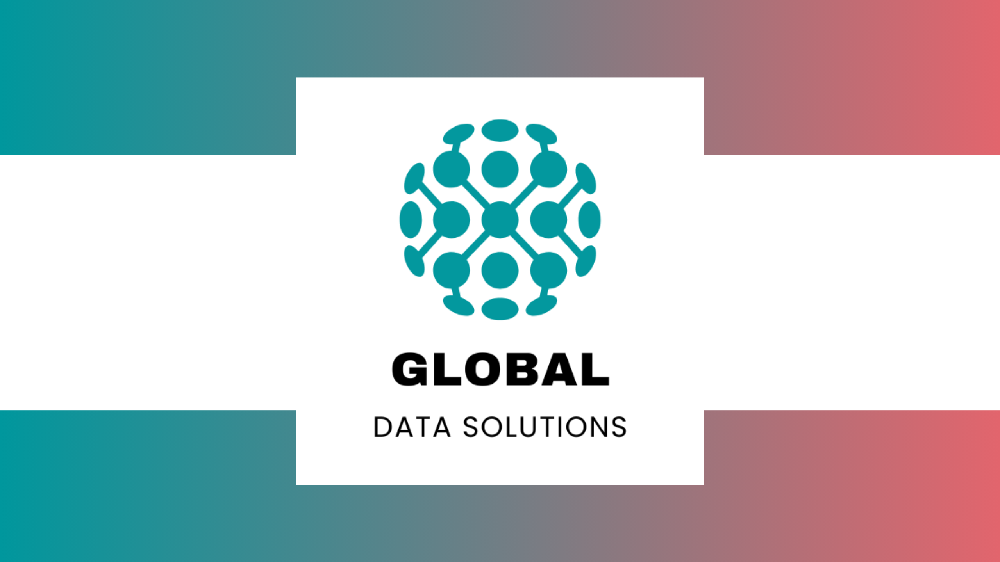
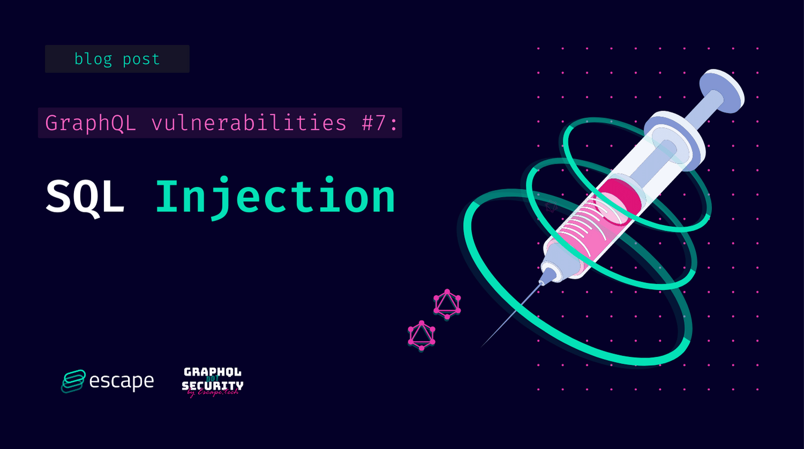
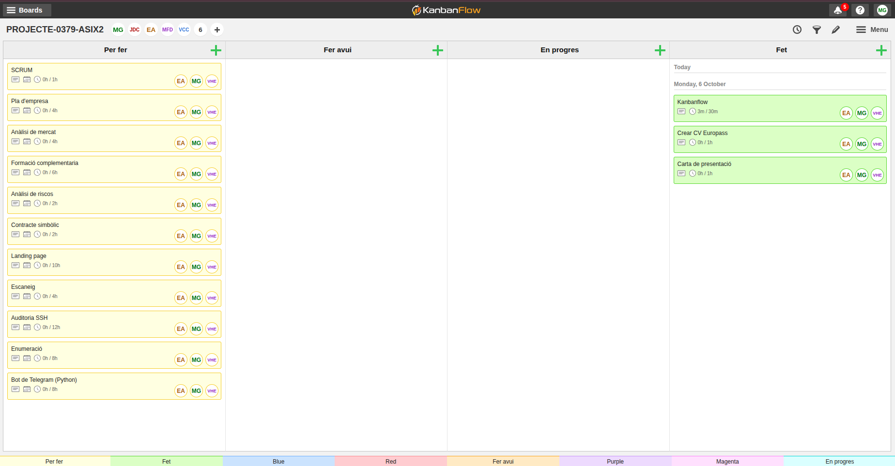
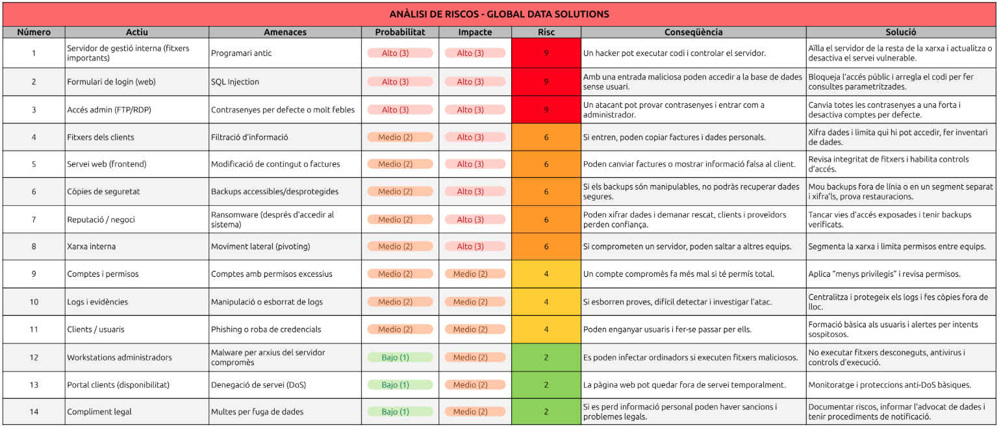
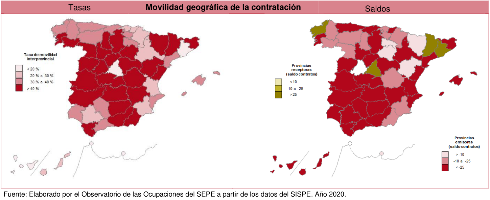
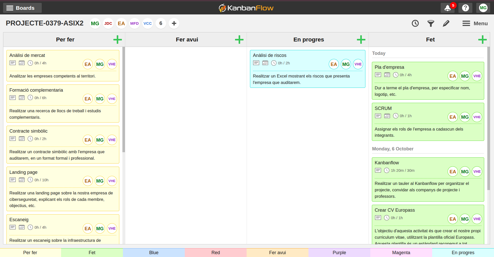
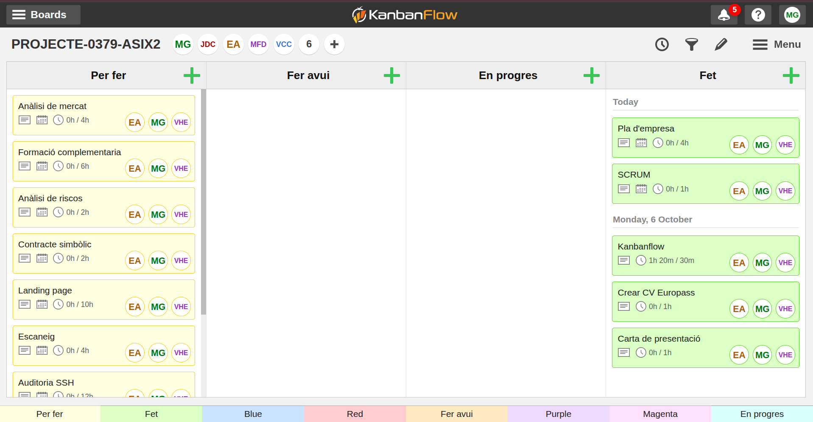

# Projecte Intermodular

**Autors:** María Gutiérrez, Edgar Alcaraz i Víctor Hernández  
**Grup:** 3  
**Data:** 08/10/2025  
**Lloc:** Institut de l’Ebre  
**Professors:** Marc Fuertes, Víctor Cid i Diego Cervellera  
**Cicle formatiu:** 2n de Superior d’Administració de Sistemes Informàtics en Xarxa   

---

## Introducció

Aquest projecte neix directament de la proposta dels professors, on se'ns demana simular un escenari professional molt concret: crear una empresa de ciberseguretat i fer una auditoria a una altra empresa amb problemes reals. L'objectiu final és doble: demostrar que entenem el món dels negocis i que sabem aplicar les tècniques de hacking ètic.

Per fer-ho, hem creat la nostra consultora anomenada Hexon Security, que treballa sota el lema: "Take care of your company with us". La primera part del treball ha consistit a muntar el pla d'empresa, que és el manual de com funciona Hexon Security. Aquí definim els nostres rols, expliquem què vendrem i com ens organitzem. A més de gestionar totes les tasques amb KanbanFlow.

La segona part és l'encàrrec principal: auditar l'empresa GlobalData Solutions (GDS), que hem creat perquè tingui servidors amb forats de seguretat concrets. La nostra feina d'auditors és fer el Pentesting, és a dir, simular un atac extern per trobar aquests punts febles. Ens hem centrat a trobar i aprofitar vulnerabilitats clàssiques i perilloses, com la Injecció SQL en el seu sistema o l'ús de programari antic. Això ens permetrà demostrar que un atacant pot entrar fàcilment.

Un cop hem aconseguit accedir-hi, la feina més important és la de consultor: presentar la solució. El projecte acaba amb l'entrega de l'informe d'auditoria, on no només ensenyem les proves de l'atac, sinó que donem les instruccions exactes perquè GDS pugui tancar els forats de seguretat i protegir-se de veritat.

---

## Gestió i planificació

### Hexon Security - Empresa ciberseguretat

La nostra empresa, Hexon Security, es dedica a fer pentesting o, dit d'una manera senzilla, a fer de "hacker ètic" per a altres empreses. El nostre objectiu és entrar als sistemes del client abans que ho faci un hacker, per trobar les portes obertes i tancar-les. El nostre lema és: "Take care of your company with us" (Cuida la teva empresa amb nosaltres).

---

### Pla econòmic-financer

Aquesta part explica els diners d'Hexon Security per demostrar que el nostre negoci pot aguantar-se per si mateix.

Per començar, sabem que hem de fer una inversió inicial per tenir el material bàsic, com ara els tres ordinadors potents per fer les auditories i els diners per posar l'empresa legalment. En total, posem que la inversió inicial es mou al voltant dels 6.300 €, que assumim que posem els tres socis. Després, cada mes tenim unes despeses fixes d'uns 440 € (la quota d'autònoms i despeses petites com la internet), que hem de pagar sí o sí.

Però el més important són els nostres serveis. Per fer l'empresa més creïble, no venem només un tipus d'auditoria. Hexon Security té tres tipus de serveis:

- L'Auditoria integral (el servei complet), que val 2.500 €.  
- L'Anàlisi bàsica de vulnerabilitats (una revisió ràpida) que venem per 800 €.  
- La formació al personal (tallers sobre seguretat), que val 500 € cada sessió.  

Per ser rendibles i pagar-nos un sou net d'uns 1.200 € a cadascú, hem de guanyar uns 4.040 € al mes. Aconseguir aquesta xifra és molt més fàcil amb la barreja de serveis. Per exemple, amb una sola Auditoria Integral i dues Anàlisis Bàsiques al mes, ja superem l'objectiu (4.100 €). Això vol dir que la nostra empresa és molt estable i creïble, ja que no depèn d'un únic ingrés gran, i demostra que Hexon Security és un negoci viable.

---

### L'Equip darrere d'Hexon Security - SCRUM

Som tres persones, cadascuna amb un paper clau:

- **Edgar serà el cap (CEO):** Ell s'encarrega de parlar amb els clients, entendre què necessiten i de dissenyar el pla general de l'auditoria. A més, liderarà la part més de xarxes i servidors.  
- **Víctor serà el tècnic:** Ell té el coneixement profund de com funcionen les aplicacions web (les pàgines i els sistemes que usen els clients). Ell s'encarregarà d'intentar explotar les vulnerabilitats més complexes, com les de codi o les bases de dades.  
- **María serà la responsable d'organització i documentació:** És la persona que posa ordre al caos. Ella s'assegura que seguim els procediments correctes, gestiona el temps i, el més important, escriu l'informe final que li donarem al client, detallant els problemes i les solucions.

---

### Per què Hexon Security triomfarà?

Hem detectat que moltes empreses petites i mitjanes (PyMEs) inverteixen molts diners en publicitat o nous ordinadors, però gairebé res en seguretat. Nosaltres venim a omplir aquest buit oferint auditories professionals a un preu accessible. El nostre valor afegit és que no només diem "això està malament", sinó que demostrem que podem entrar-hi i expliquem pas a pas com ho han d'arreglar.

---

## Global Data Solutions - Empresa auditada

La nostra empresa client fictícia es diu GlobalData Solutions (GDS). És una empresa de gestió de dades que té un sistema online perquè els seus clients puguin consultar informació i factures. Aquesta empresa té dos tipus de servidors que auditaran:

- **El servidor web (Frontend):** És on els usuaris de GDS entren amb un usuari i contrasenya. Aquest servidor executa l'aplicació.  
- **El servidor de gestió Interna:** És el cor de l'empresa, on guarden els fitxers importants. Aquest servidor hauria d'estar molt protegit, però no ho està.

---

### Els servidors tenen vulnerabilitats reals

Perquè el nostre projecte sigui pràctic i real, els servidors de GDS tenen tres grans errors o "vulnerabilitats" que nosaltres podrem explotar:

- **Error de configuració (sistemes antics):** El seu servidor de gestió interna utilitza un programa antic (per exemple, una versió vella d'un servei web o un sistema d'arxius) que ja té un defecte de seguretat conegut. Aquest defecte permet, per exemple, que un atacant executi ordres a l'ordinador sense permís (això es diu RCE o Execució Remota de Codi). Aquesta serà la feina: trobar la versió del programa i aplicar l'atac conegut.  
- **Injecció SQL (SQL Injection):** El formulari de login de la seva pàgina web (on poses usuari i contrasenya) està mal fet. El sistema agafa el que escrius i ho envia directament a la base de dades sense comprovar si és una ordre perillosa. L’empresa de ciberseguretat podrà escriure un codi especial a la casella de la contrasenya que enganyi la base de dades i li digui: "No et preocupis per la contrasenya, deixa'm passar". Això permetrà a Hexon Security entrar a l'aplicació sense tenir cap usuari vàlid.  
- **Contrasenyes de fàbrica o molt dèbils:** El seu servidor de gestió interna té un accés (per exemple, per FTP o RDP) amb un usuari que és "admin" i una contrasenya molt simple com "12345". Hexon Security provarà les contrasenyes més comunes (un atac de "força bruta" molt ràpid) i aconseguirà accés als fitxers interns de l'empresa.

---

### Planificació de l’auditoria

La nostra feina es divideix en fases, com en qualsevol projecte.

- **Fase de reconeixement:** Comencem investigant GDS sense tocar els seus sistemes. Busquem a internet les seves adreces, quins programes fan servir o quines versions de programari.  
- **Fase d'exploració:** Ara sí, utilitzem eines com escàners per veure quins "ports" tenen oberts i quins serveis estan actius. Això ens dirà on hem de buscar problemes.  
- **Fase d'explotació:** Aquí és on s’utilitzen les eines (com Kali Linux) per explotar les tres vulnerabilitats que hem comentat abans (l'SQL Injection, l'RCE i la contrasenya feble). L'objectiu és demostrar que podem prendre el control o robar dades.  
- **Fase d'informe i solució:** Un cop hem demostrat que hem pogut entrar, es documenta tot el procés. Fem una llista de problemes, els hi posem una nota (de "crític" a "baix") i, el més important, escrivim la solució exacta per a cada problema (ex. "Actualitzeu el programari a la versió 2.5" o "Sanejar les entrades d'usuari al formulari de login").

---

### Metodologia i organització

#### Eines de gestió de tasques (Kanban Flow)

Per garantir l'eficiència i la transparència en el projecte, Hexon Security utilitza la metodologia Kanban, implementada mitjançant l'eina digital KanbanFlow. Aquesta metodologia ens permet visualitzar tot el treball pendent, el que està en marxa i el que ja s'ha acabat.

Tal com es veu a la imatge, el nostre tauler es divideix en quatre columnes principals:

- **Per fer:** Les tasques pendents que hem de començar. Aquí tenim tant la part administrativa (pla d'empresa, CVs) com les tasques tècniques (auditoria SSH, enumeració).  
- **Fer avui:** Les tasques prioritàries que ens hem compromès a començar o acabar avui (actualment, el nostre tauler mostra que estan buides, indicant que ja s'han mogut o completat els objectius del dia).  
- **En progrés:** Les tasques que un membre de l'equip està fent activament en aquest moment.  
- **Fet** Les tasques finalitzades. L'objectiu és tenir totes les tasques en aquesta columna al final del projecte.  

A més, cada tasca té assignat un responsable (EA - Edgar, MG - Maria, VC - Víctor) i una estimació de temps (per exemple, 4h per al 'Pla d'empresa'), la qual cosa ens ajuda a gestionar la càrrega de treball i els terminis.

---

## Gestió de riscos i incidències

### Anàlisi de riscos

Durant l’auditoria de l’empresa Global Data Solutions, hem fet un estudi per detectar quins elements i processos de l’empresa podrien estar exposats a possibles riscos o problemes. L’objectiu d’aquest estudi és saber quins riscos són més probables i quins podrien tenir un impacte més gran, per així decidir quines accions cal prendre primer.

Hem revisat diferents parts de la infraestructura, com els servidors interns, els formularis de la web, els accessos dels administradors i la informació dels clients. Cada risc s’ha analitzat segons la seva probabilitat i les conseqüències que podria causar, obtenint un resultat que ens indica quines coses cal arreglar de manera urgent i quines es poden gestionar amb mesures preventives més senzilles.

A més, hem proposat solucions pràctiques com actualitzar el programari, reforçar les contrasenyes, separar parts de la xarxa per protegir-les millor o formar els usuaris perquè reconeguin intents de phishing.

---

## Acords i abast del servei

### Anàlisi de mercat

L’objectiu d’aquest apartat és analitzar com està el mercat laboral a les Terres de l’Ebre en el sector de la ciberseguretat i la informàtica. També volem veure quines oportunitats hi ha per a persones joves amb ganes d’aprendre i formar-se.

#### Ocupacions principals

En aquest sector hi ha diversos perfils importants:

- **Tècnics i tècniques en ciberseguretat:** protegeixen xarxes i sistemes informàtics.  
- **Analistes i consultors:** estudien vulnerabilitats i ajuden les empreses a millorar la seguretat.  
- **Auditors o ethical hackers:** fan proves per detectar problemes abans que els hackers els puguin aprofitar.  
- **Administradors de sistemes i xarxes:** mantenen servidors i serveis funcionant correctament.  
- **Enginyers de seguretat:** dissenyen sistemes segurs des del principi dels projectes.  

#### Perfils i competències

Segons el SEPE, la demanda d’aquests professionals ha crescut molt. Les empreses busquen persones amb titulació en informàtica, telecomunicacions o FP superior, experiència en administració de sistemes i xarxes, i certificacions com **CompTIA Security+**, **CEH** o **OSCP**. També valoren que sàpigues analitzar problemes, treballar sota pressió i comunicar-te bé amb l’equip. Els llocs solen ser a jornada completa, tot i que alguns poden requerir estar disponibles per incidències.

#### Tendències i oportunitats

Els perfils amb més sortida ara mateix són **administradors de sistemes**, **programadors** i **analistes TIC**. Però els especialistes en ciberseguretat, els enginyers de sistemes amb coneixements de seguretat i els professionals de **Big Data** estan creixent molt ràpidament. Aquest creixement és a causa de la digitalització i l’augment d’incidents de seguretat.  

Altres ocupacions amb potencial inclouen tècnics de suport informàtic, administradors de xarxes, consultors de seguretat i desenvolupadors de software segur.

---

### Elaboració del contracte simbòlic

---

### Abast i limitacions de l'auditoria

---

## Execució tècnica i resultats

### Configuració de l'entorn d'auditoria

### Disseny de la infraestructura de xarxa

### Preparació de l'entorn vulnerable

### Aplicació d'auditoria i ús d'eines

### Disseny i desenvolupament de l'aplicació Python

### Resultats

### Informe de vulnerabilitats trobades

---

## Incidències

---

## Conclusió

---

## Webgrafia

---

## Annexos

- Annex - 1 Codi font de l'aplicació Python  
- Annex - 2 Codi font de la pàgina web  
- Annex - 3 Captures del tauler de tasques (Kanban Flow)  
  - Setmana 1 - 2
    
  - Setmana 3 - 4
    
- Annex - 4 Altres documents de suport
