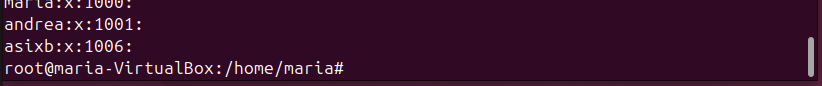

# Gestió d'usuaris i serveis

Per a la documentació completa visita [mkdocs.org](https://www.mkdocs.org).

---
## Introducció

Iniciarem el projecte amb la instal·lació d’Ubuntu Linux en un entorn de màquina virtual, assegurant que el sistema operatiu es configura correctament per gestionar usuaris, grups i polítiques de contrasenyes. En aquesta fase, ens centrarem en la creació i gestió de comptes d'usuari locals, l'assignació de permisos a grups, així com la definició de polítiques de seguretat per a contrasenyes i accessos.

Un cop completada la configuració inicial, avançarem amb la instal·lació i gestió de serveis essencials que són crucials per al funcionament òptim del sistema. Això inclou la configuració de serveis i processos, l'optimització de l'ús de recursos i l'administració de serveis actius d'acord amb les necessitats del sistema.

A continuació, ens ocuparem de la creació i gestió de particions i sistemes de fitxers, garantint una distribució adequada de l'espai, així com l'aplicació de quotes de disc i la implementació de còpies de seguretat automàtiques per assegurar la integritat de les dades.

Finalment, realitzarem proves exhaustives per verificar el correcte funcionament del sistema, incloent la gestió d'usuaris, grups i serveis, així com la integritat dels fitxers, sistemes de particions i quotes de disc. Documentarem detalladament cada pas del procés, que inclourà la creació de comptes d'usuari, la configuració de serveis, l'administració de particions, i el procés de recuperació en cas de desastres, acompanyant-ho de captures de pantalla per il·lustrar les configuracions i ajustaments realitzats durant el procés.

---
## Gestió de processos

---
## Gestió d'usuaris i grups
### Els fitxers més importants
- etc/passwd
- etc/shadow (si al fitxer surt ! es que usuari bloquejat)
- etc/gshadow (la difirencia entre etc/groups es que es veu l’admin)
- etc/groups
---

### Crear i eliminar usuaris
#### USERADD
1. 

#### ADDUSER
#### USERDEL
1. 

---

#### Afegir usuaris per GUI

---

### Log usuari per GUI i terminal

---

### Bloquejar i desbloquejar usuaris

---

### Modificar nom d’un usuari

---

### Crear i eliminar grups
#### GROUPADD

#### ADDGROUP

#### GROUPDEL

#### DELGROUP

---

### Afegir i treure usuaris de grups
#### USERMOD

#### GPASSWD

#### ADDUSER

---

### Modificar grup principal d’un usuari

---
## Gestió de permisos

---
## Sistemas de fitxers i particions

---
## Còpia de seguretat i automatització de tasques

---
## Quotes de disc

---
