# Gestió d'usuaris i serveis


Per a la documentació completa visita [mkdocs.org](https://www.mkdocs.org).


---
## Introducció


Començarem instal·lant Ubuntu Linux en un entorn de màquina virtual. L'objectiu és assegurar-nos que el sistema operatiu estigui ben configurat per gestionar usuaris, grups i polítiques de contrasenyes de manera eficaç. En aquesta primera fase, ens centrarem en la creació i gestió de comptes d'usuari locals, així com en l'assignació de permisos als grups i la definició de polítiques de seguretat per a les contrasenyes i accessos.


Un cop tinguem la configuració inicial a punt, passarem a instal·lar i gestionar serveis essencials que són crucials per al bon funcionament del sistema. Això inclou la configuració de serveis i processos, l'optimització de l'ús dels recursos disponibles, i l'administració dels serveis actius segons les necessitats del sistema.


A continuació, ens ocuparem de la creació i gestió de particions i sistemes de fitxers. Ens assegurarem que l'espai es distribueixi de manera adequada, aplicarem quotes de disc i implementarem còpies de seguretat automàtiques per protegir la integritat de les dades.


Finalment, realitzarem proves exhaustives per verificar que tot funcioni correctament, incloent-hi la gestió d'usuaris, grups i serveis, així com la integritat dels fitxers, sistemes de particions i quotes de disc. Documentarem cada pas del procés de manera detallada, que inclourà la creació de comptes d'usuari, la configuració de serveis, l'administració de particions, i el pla de recuperació en cas de desastres. A més, acompanyarem la documentació amb captures de pantalla que il·lustrin les configuracions i ajustaments realitzats durant el procés.


---
## Gestió de processos


La gestió de processos és una part essencial dels sistemes operatius, ja que s’encarrega de controlar els programes que s’executen al sistema. Cada procés és un programa en funcionament amb els seus propis recursos, com la memòria o l’accés a la CPU. El sistema operatiu gestiona tasques com crear, executar, pausar o acabar processos, assegurant que tots funcionin de manera eficient i sense problemes. Això permet que diversos processos puguin compartir els recursos del sistema de forma equilibrada.


---


1. En aquest apartat executarem múltiples comandes per administrar els processos, però una de les més importants és `pstree` la qual mostra en forma d’arbre jeràrquic tots els processos actius del sistema, organitzats segons les seves relacions de parentiu. Aquesta depenent de en quin usuari l'executes mostra uns processos o uns altres.      
```
pstree
```
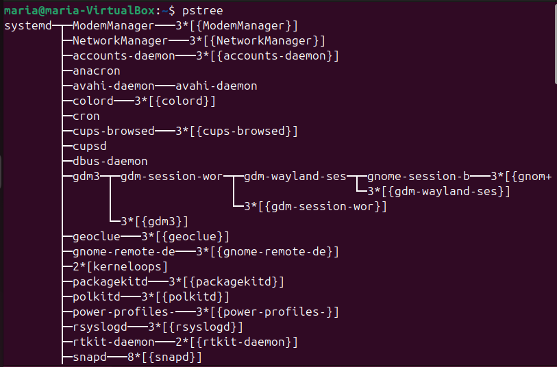
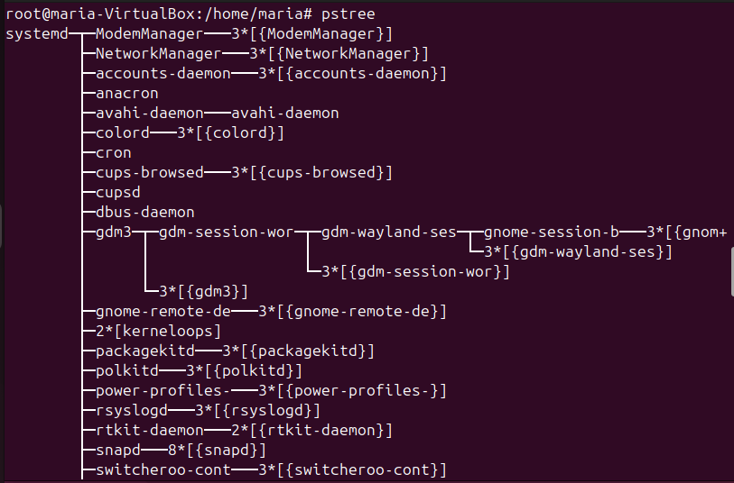


2. A més si no estem iniciats en la sessió d'un usuari i volem saber els seus processos podem afegir el paràmetre `-h`. La comanda completa seria `pstree -h maria`.       
```
pstree -h maria
```
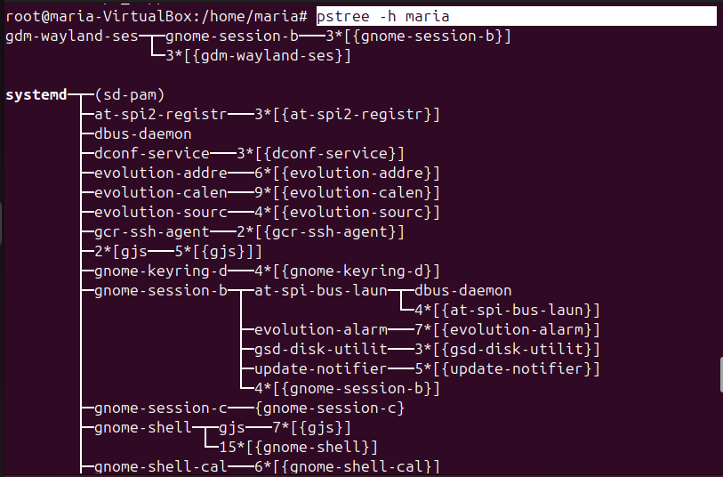


4. A continuació també podem afegir el paràmetre `-p` el qual mostra el PID dels processos. Per fer una prova del que he explicat, obrirem un terminal a part i executarem la comanda `pstree -p -h maria` en el terminal que ja estàvem abans. Aquí buscarem la branca que indica el nostre terminal (la qual normalment està en negreta) i la primera subbranca hauria de ser l'altre terminal. Important fixar-nos en el PID del segon terminal. Seguidament, executarem la comanda `kill -9 2930` (hauràs de canviar el PID 2930 pel que tu tinguis) aquesta força la terminació immediata d’un procés específic, utilitzant la senyal SIGKILL, que no pot ser ignorada pel procés. Una vegada executada s'hauria de tancar el segon terminal.       
```
pstree -p -h maria
```
```
kill -9 2930
```

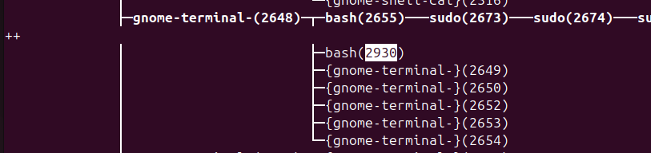
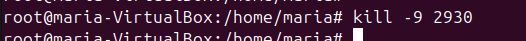
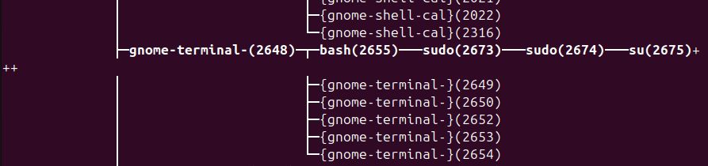

5. Ara executarem `top` aquesta mostra en temps real informació detallada sobre els processos actius al sistema, incloent ús de CPU, memòria, temps d'execució i estat dels processos. En la sortida de la comanda top, cada columna representa una informació específica dels processos actius. Aquí tens l’explicació de cada columna que es veu a la captura:       

    - PID: Identificador únic del procés (Process ID).
    - USER: Nom de l'usuari que està executant el procés.
    - PR: Prioritat del procés. Valors més baixos indiquen més prioritat.
    - NI: Valor de nice del procés, que afecta la seva prioritat (pot variar de -20 a 19).
    - VIRT: Memòria virtual utilitzada pel procés (inclou memòria reservada i compartida).
    - RES: Memòria física resident (en RAM) que està utilitzant el procés.
    - SHR: Memòria compartida entre diversos processos.
    - %CPU: Percentatge de CPU utilitzada pel procés.
    - %MEM: Percentatge de memòria RAM utilitzada pel procés.
    - TIME+: Temps total de CPU que el procés ha consumit des que es va iniciar.
    - COMMAND: Nom o comanda del procés executant-se.

    ```
    top
    ```
     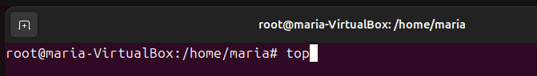

    Per exemple si obrim el Firefox ens indicarà que el PID és 3372, USER és maria, consumeix un 85,8% de CPU i un 5,2% de memòria, amb un temps acumulat d'execució de 7 segons.      


    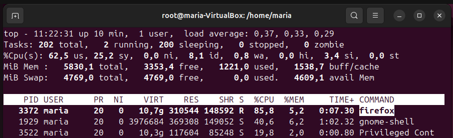


6. La comanda `renice -n 19 -p 3372` canvia la prioritat del procés amb PID 3372 (en aquest cas, Firefox) ajustant el seu valor de nice a 19, que és la prioritat més baixa.       
```
renice -n 19 -p 3372
```
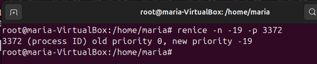
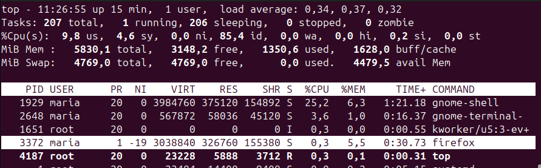


7. La comanda `ps aux` s'utilitza per mostrar una llista completa de tots els processos en execució al sistema, amb informació detallada.      


    - USER: Usuari que executa el procés.
    - PID: Identificador del procés.
    - %CPU i %MEM: Ús de CPU i memòria.
    - VSZ: Mida de la memòria virtual en kilobytes.
    - RSS: Mida de la memòria resident (RAM utilitzada pel procés).
    - TTY: Terminal associat al procés (si no en té, apareix com ?).
    - STAT: Estat del procés (ex.: R executant-se, S dormint, Z zombie).
    - START: Hora en què es va iniciar el procés.
    - TIME: Temps total de CPU utilitzat pel procés.
    - COMMAND: Comanda que va iniciar el procés. 


    ```
    ps aux
    ```
    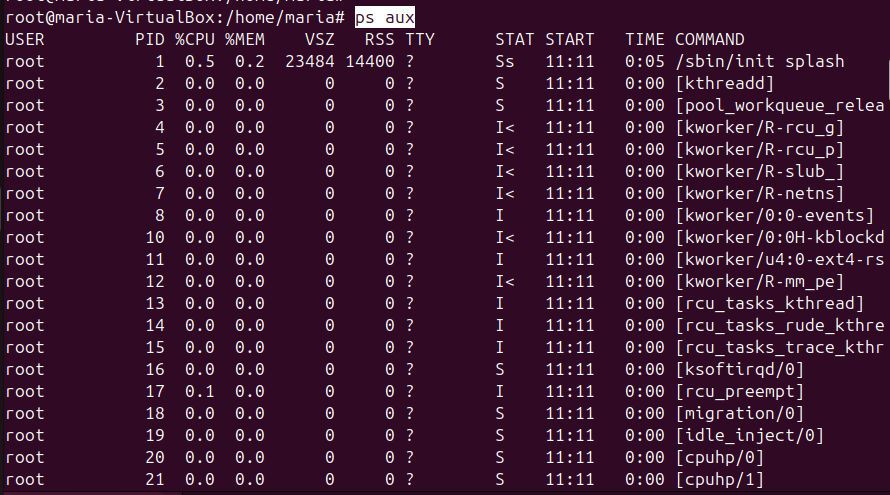
   
8. La comanda `ps -a` mostra una llista dels processos que s'estan executant en tots els terminals del sistema, excepte els processos propis de l'usuari que no tenen terminal associat (com els processos en segon pla).    
```
ps -a
```
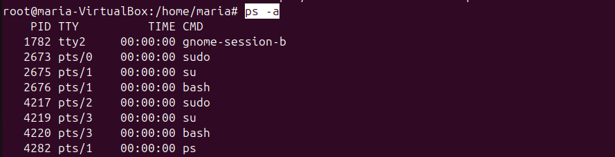


9. La comanda `ps -A` mostra tots els processos en execució al sistema, incloent-hi tant processos amb terminal associat com processos en segon pla o dimonis.      
```
ps -A
```
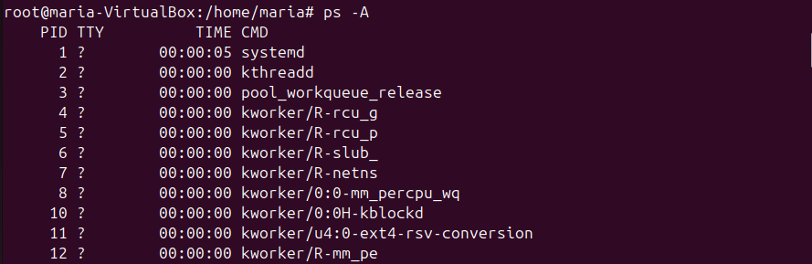


10. Seguidament, executarem top i farem Ctrl+Z per aturar-lo d'aquesta manera està en segon pla. Per veure els processos en segon pla tenim la comanda `jobs`.     
```
jobs
```
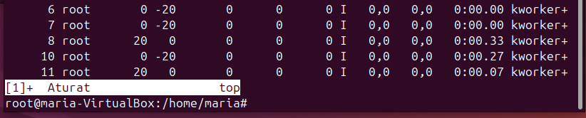
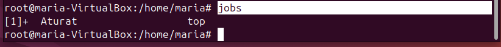


11. Per veure el PID de top podem executar `pstree -p | grep top`.     
```
pstree -p | grep top
```
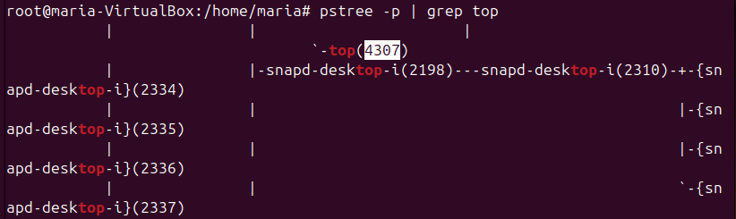


12. Seguidament el matarem amb `kill -9 4307` i llavors ens sortirà que top està "matat".      
```
kill -9 4307
```
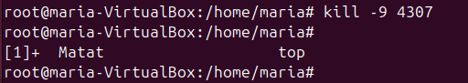


13. També quan un procés esta en segon pla podem optar per tornar-lo a ficar en primer pla amb `fg %1` (el numero després del % canvia segons el número que mostra jobs).      
```
jobs
```
```
fg %1
```
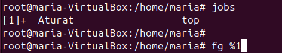


14. Tot seguit, també tenim l'ordre `top &` que executa l'eina top en segon pla, permetent que se segueixi executant mentre el terminal roman disponible per a altres ordres.      
```
top &
```
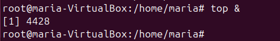


15. A continuació tenim la comanda `xeyes` amb la que farem un parell de exemples. Si l'executem i després fem Ctrl+Z l'aturem i la podem recuperar amb `fg %5`com hem fet abans en top.    
```
xeyes
```
```
fg %5
```
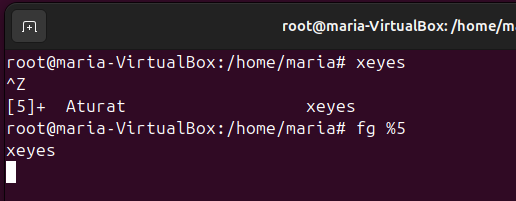


16. A més també ho podem fer amb `xeyes &` i recuperar de la mateixa manera que abans.     
```
xeyes &
```
```
jobs
```
```
fg %1
```
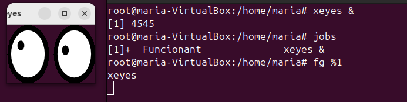


17. De la mateixa manera funciona executant xeyes i posteriorment escriure `bg xeyes` (és igual que fer Ctrl+Z).     
```
bg xeyes
```
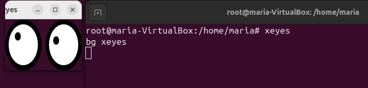


18. Per poder veure el PID d'un procés en concret com Firefox ho podem fer amb múltiples comandes com:
```
pgrep firefox
```
```
ps aux | grep firefox
```
```
pstree -p | grep firefox
```
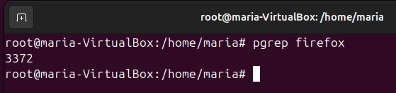
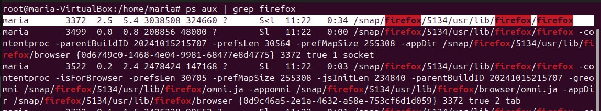
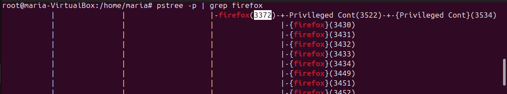


19. Per últim, la comanda `nice -n 19 xeyes` executa el programa xeyes amb la prioritat més baixa possible, fet que fa que rebi menys recursos de la CPU. Quina és la diferència entre renice i nice? La diferència entre nice i renice és que nice s'utilitza per establir la prioritat d'un procés en el moment en què es crea, mentre que renice serveix per canviar la prioritat d'un procés que ja està en execució.       
```
nice -n 19 xeyes
```
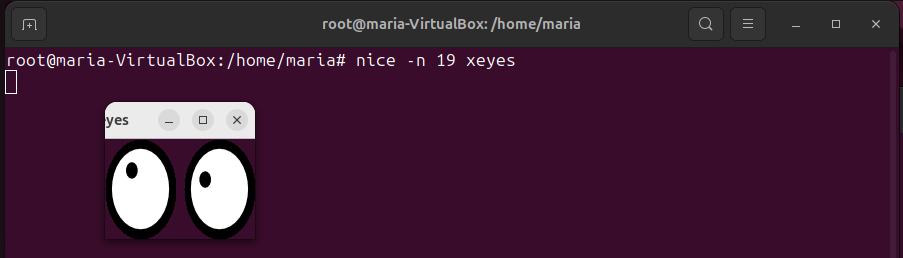
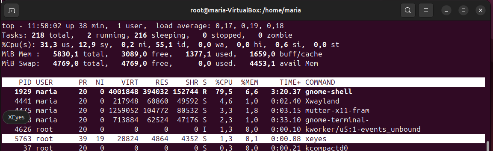


---
## Gestió d'usuaris i grups


La gestió d'usuaris i grups és una part fonamental del sistema operatiu Ubuntu 24 Desktop. Cada usuari té les seves pròpies configuracions, fitxers i permisos, la qual cosa permet una experiència personalitzada i segura. A més, agrupar usuaris facilita l'administració de permisos i l'accés a recursos compartits.


En aquest apartat, explorarem com crear, modificar i eliminar usuaris i grups. També veurem com establir permisos per assegurar-nos que les dades estiguin protegides i accessibles només per aquells que ho necessiten. Amb unes poques passes senzilles, podreu gestionar els vostres usuaris i grups de manera eficient i efectiva.


---
### Els fitxers més importants


En la gestió d'usuaris i grups d'Ubuntu, hi ha diversos fitxers clau que contenen informació essencial. A continuació, expliquem els més importants:


- **etc/passwd:** Aquest fitxer és un registre de tots els usuaris del sistema. Conté informació com el nom d'usuari, la identificació d'usuari (UID), el directori inicial i el shell predeterminat. És un fitxer accessible, per la qual cosa tothom pot veure qui són els usuaris del sistema.
- **etc/shadow:** Aquí s'emmagatzema la informació de les contrasenyes dels usuaris. Cada línia correspon a un usuari i conté la seva contrasenya encriptada. Si en aquest fitxer veiem un signe "!", significa que l'usuari està bloquejat i no pot accedir al sistema.
- **etc/gshadow:** Aquest fitxer és similar a /etc/group, però proporciona informació addicional sobre els grups. Aquí es poden veure els administradors de cada grup. És útil per gestionar els permisos i els drets d'accés dels grups d'usuaris.
- **etc/groups:** Conté informació sobre els grups del sistema. Cada línia representa un grup i inclou el nom del grup, el seu identificador (GID) i els membres que en formen part. Aquest fitxer és útil per veure quins usuaris pertanyen a cada grup.
---


### Crear i eliminar usuaris
#### USERADD


1. Per poder crear un nou usuari al sistema, utilitzarem la comanda useradd. Aquesta comanda ens permet afegir usuaris amb diversos paràmetres que ens ajuden a definir les seves característiques. A continuació, veurem alguns dels paràmetres clau que podem utilitzar:
    * **-m:** Aquest paràmetre indica que es crearà un directori d'usuari personal (home directory) automàticament. Això és important perquè cada usuari necessita un espai propi per emmagatzemar els seus fitxers.
    * **-s /bin/bash:** Amb aquest paràmetre, especificarem el shell que utilitzarà l'usuari. En aquest cas, estem indicant que volem que el shell sigui Bash, que és un dels més utilitzats en sistemes Linux.
    * **-d /home/nick:** Aquí podem definir el directori d'inici de l'usuari. En aquest exemple, establim que el directori personal de l'usuari serà /home/nick.
    * **nick:** Aquest és el nom de l'usuari que estem creant. En aquest cas, hem triat "nick" com a nom d'usuari.
    * **&& passwd nick:** Aquesta comanda s'utilitza per establir o canviar la contrasenya per a l'usuari "nick".
  
    ```
    useradd -m -s /bin/bash -d /home/nick nick && passwd nick
    ```
    


2. Una vegada fet, si observem el fitxer /etc/passwd/ podrem visualitzar el nou registre amb el nom de l'usuari que acabem de crear.        


#### ADDUSER


1. Per fer-ho d'una forma més senzilla haurem de executar la comanda `adduser (nom d'usuari)`. Seguidament ens apareixeran apartats per emplenar com la contrasenya, nom complet, número d'espai, telèfon, etc. Si revisem el contingut del fitxer /etc/passwd surt l'usuari que acabem de crear, per tant les dues formes de crear usuaris són vàlides.  
```
adduser marta
```


#### USERDEL


1. Per poder eliminar un usuari haurem d'utilitzar la comanda userdel que aquesta té diferents parametres el quals podem arribar a ser útils, per exemple `-r` aquest elimina l'usuari, el seu directori personal i els seus correus electrònics. Es recomana usar-lo per assegurar que s'eliminen també els fitxers personals de l'usuari i no quedin restes innecessàries al sistema.
```
userdel -r nick
```


2. Una vegada fet si revisem el fitxer /etc/passwd podem observar que l'usuari **nick** ja no existeix.


3. Seguidament també tenim el paràmetre `-f`, aquest força l'eliminació de l'usuari fins i tot si està iniciat o té fitxers encara en ús.
```
userdel -f andrea
```


---


#### Afegir usuaris per GUI


1. Per poder administrar el usuaris i grups per entorn gràfic haurem d'instal·lar per terminal un programa anomenat gnome-system-tools. 
```
apt install gnome-system-tools
```


2. Una vegada dins del programa, veurem els diferents usuaris del sistema, des del que podrem afegir, suprimir i gestionar grups. 


---


### Log usuari per GUI i terminal


1. Per iniciar sessió pel terminal haurem de executar la comanda "su" i seguidament el nom de l'usuari amb el qual volem iniciar-la. Per comprovar que ja estem dins podem executar la comanda pwd, aquesta en mostrarà la home de l'usuari.
```
su andrea
```
```
cd
```
```
ls -la
```
```
pwd
```


2. Per fer el inici de sessió des de la interfície gràfica, haurem de sortir de la sessió actual i entrar en l'usuari correcte, de forma habitual introduint la contrasenya.        


3. Seguidament, una vegada hem entrat, obrirem un terminal i comprovarem el pwd. Podem veure que quan fem un "ls -la" hi ha moltes més carpetes que abans, això és degut al fet que les carpetes de la home no es creen fins que l'usuari no inicia sessió des de la GUI.   
```
ls -la
```
```
pwd
```


---


### Bloquejar i desbloquejar usuaris


1. Per poder bloquejar usuaris haurem de escriure la comanda `usermod -L (nom d'usuari que volem bloquejar)`. Seguidament per poder comprovar si els canvis s'han aplicat, revisarem el fitxer /etc/shadow. Dins d'aquest fitxer baixarem fins trobar l'usuari i si apareix el símbol d'exclamació com mostra la captura de pantalla, vol dir que l'usuari està bloquejat.  
```
usermod -L andrea
```
```
cat /etc/shadow
```


2. Una altra forma per comprovar-ho és tancat la sessió i observar que no apareix l'usuari per GUI.


3. Per poder desbloquejar l'usuari haurem de escriure la comanda `usermod -U (nom d'usuari)`. Seguidament, si tornem a revisar el fitxer "/etc/passwd" veurem que no té el signe d'exclamació. Per acabar de comprovar-ho sortirem de la sessió actual i veurem que l'usuari torna a estar.      
```
usermod -U andrea
```
```
cat /etc/shadow
```


4. A més també tenim la comanda `passwd -u (nom usuari)` desbloqueja el compte de l'usuària Andrea perquè pugui tornar a iniciar sessió.   
```
passwd -u andrea
```


---


### Modificar nom d’un usuari


1. Per canviar el nom d’un usuari i del seu grup en un sistema Linux, primer utilitzem la comanda `usermod -l nou_nom antic_nom`, que actualitza el nom de l’usuari al sistema, tot i que aquest canvi no afecta el directori personal ni els fitxers associats.
```
usermod -l lena helena
```

2. A continuació, podem modificar el directori personal de l’usuari amb `usermod -d /home/nou_nom -m nou_nom`, on l’opció -d especifica el nou directori i -m mou els continguts del directori antic al nou. Si preferim fer-ho manualment, podem renombrar el directori amb `mv /home/antic_nom /home/nou_nom`, assegurant-nos després d’ajustar els permisos correctament.
```
mv /home/helena /home/lena
```
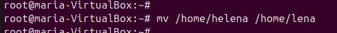
3. Per canviar també el nom del grup associat, fem servir `groupmod -n nou_grup antic_grup`, actualitzant així el nom del grup al sistema.
```
groupmod -n lena helena
```
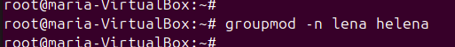
4. Finalment, verifiquem i ajustem els permisos dels fitxers amb la comanda `chown -R nou_nom:nou_grup /home/nou_nom`, garantint que el nou usuari i grup tenen els accessos correctes al directori personal i als fitxers. Amb aquests passos ens assegurem que el sistema reconeix de manera coherent els canvis en el nom de l’usuari, el grup i el directori personal.
```
chown -R lena:lena /home/lena
```
```
id lena
```
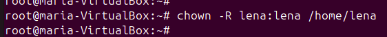
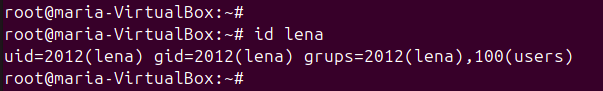


---


### Crear i eliminar grups
#### GROUPADD


1. Per crear un grup amb groupadd només haurem de executar la comanda `groupadd (nom del grup)`. Seguidament, mirarem el fitxer "/etc/gshadow" i comprovarem que realment està.
```
groupadd sistemes0369
```
```
cat /etc/gshadow
```


2. Seguidament, per aplicar un gid personalitzat haurem d'afegir el paràmetre "-g (número de gid desitjat)". Després comprovarem els canvis al fitxer "/etc/group".
```
groupadd -g 1006 asixb
```
```
cat /etc/group
```


#### ADDGROUP


1. El cas de la comanda addgroup és molt paregut al anterior, ja que només haurem d'introduir la comanda i consecutivament el nom del grup. L'única diferència notable és el fet que t'informa dels canvis aplicats. Si anem al fitxer "/etc/group" podrem veure que el grup està creat.
```
addgroup informatica
```
```
cat /etc/group
```


#### GROUPDEL


1. Per eliminar un grup en groupdel haurem d'utilitzar la mateixa estructura que en les dues anteriors. Seguidament, revisar que realment ja no està al fitxer "/etc/group".
```
groupdel sistemes0369
```
```
cat /etc/group
```


#### DELGROUP


1. Una altra forma de eliminar grups és utilitzar la comanda delgroup.
```
delgroup informatica
```
```
cat /etc/group
```


---


### Afegir i treure usuaris de grups
#### USERMOD


1. Per poder afegir un usuari haurem d'utilitzar la comanda `usermod -aG (nom grup) (nom usuari)`. Si comprovem el resultat a "/etc/group" veurem que l'usuari ara ja està afegit.
```
usermod -aG asixb andreaperez
```
```
cat /etc/group
```


2. Seguidament per treure l'usuari ficarem la mateixa comanda, però en el paràmetre "-G" només.
```
usermod -G asixb andreaperez
```


#### GPASSWD
1. A més també podem afegir usuaris a grups amb la comanda "gpasswd -a (nom usuari) (nom grup)".
```
gpasswd -a maria asixb
```
```
cat /etc/group
```


2. En aquesta mateixa comanda també podem treure usuaris de grups amb el paràmetre `-d`.
```
gpasswd -d maria asixb
```
```
cat /etc/group
```


#### ADDUSER
1. En adduser també podem afegir usuaris a grups, utilitzant la comanda `adduser (nom usuari) (nom grup)`.
```
adduser andreaperez informatica
```
```
cat /etc/group
```


2. En una comanda pareguda a l'anterior podem eliminar aquests usuaris dels grups, `deluser (nom usuari) (nom grup)`.
```
deluser andreaperez asixb
```
```
cat /etc/group
```


---


### Modificar grup principal d’un usuari
1. Per modificar el nom el grup principal d'un usuari haurem d'utilitzar la comanda "usermod -g (nom grup) (nom usuari)". Per comprovar-ho farem un "id (nom usuari)", aqui si revisem el gid veurem que ara està canviat.
```
id andreaperez
```
```
usermod -g informatica andreaperez
```
```
id andreaperez
```


---
## Gestió de permisos


### Permissos normals


1. El primer haurem de fer és crear 4 usuaris, en el meu cas he creat a Lola, Laura, Mariona i Martina.
```
adduser lola
```
```
adduser laura
```
```
adduser mariona
```
```
adduser martina
```


2. Seguidament, revisarem que realment estan creats els 4 usuaris al fitxer /etc/passwd.
```
cat /etc/passwd
```


3. Després crearem un grup anomenat grup-a i afegirem als usuaris lola i mariona.
```
addgroup grup-a
```
```
adduser lola grup-a
```
```
adduser mariona grup-a
```


4. A continuació revisarem al fitxer /etc/group.
```
cat /etc/group
```


5. Tot seguit iniciarem sessió a través de terminal en un dels usuaris que forma part de grup-a, en aquest cas lola. A més al directori /tmp crearem una carpeta anomenada fitxers-a i dins fitxer1. Seguidament revisarem els permisos de la carpeta i el fitxer amb `ls -l`.
```
su lola
```
```
cd /tmp
```
```
mkdir fitxers-a
```
```
ls -l | grep fitxers-a
```
```
touch fitxers-a/fitxer1
```
```
ls -la | grep fitxers-a
```


---


#### CHMOD


La comanda chmod a Linux i altres sistemes Unix-like serveix per canviar els permisos d’accés als fitxers i directoris, controlant qui pot llegir, escriure o executar-los. El nom prové de "change mode" (canviar mode).


1. Per utilitzar la comanda chmod en aquest cas, utilitzarem el paràmetre `-R`, que serveix per aplicar els canvis de permisos de forma recursiva a la carpeta indicada i a tots els seus fitxers i subdirectoris. Després afegirem els números `750`, on cada dígit indica els permisos: el 7 (propietari) significa lectura (4) + escriptura (2) + execució (1), és a dir, permisos complets; el 5 (grup) significa lectura (4) + execució (1), però sense escriptura; i el 0 (altres) significa cap permís. Això afecta el comportament d'accés a la carpeta i als fitxers, limitant-lo segons el rol de cada usuari. Per acabar, indicarem la carpeta on volem fer els canvis, en aquest cas fitxers-a, amb la comanda `chmod -R 750 fitxers-a`. Si revisem amb `ls -l`, podrem veure que la carpeta i tots els fitxers continguts han actualitzat els seus permisos segons aquest esquema.
```
chmod -R 750 fitxers-a/
```
```
ls -l | grep fitxers-a
```
```
ls -la fitxers-a/
```


2. També podem afegir permisos amb lletres utilitzant el comandament chmod, com en aquest cas on s’ha executat `sudo chmod -R g+x,o+r,u-x fitxers-a/`. Aquí, el paràmetre `-R` aplica els canvis recursivament a la carpeta i a tots els fitxers i subdirectoris que conté. L'opció `g+x` afegeix el permís d'execució per al grup, `o+r` permet que altres usuaris (que no són ni propietaris ni del grup) puguin llegir, i `u-x` elimina el permís d'execució del propietari. Després de la comanda, els permisos de la carpeta fitxers-a són `drw-r-xr--`, on el propietari té lectura i escriptura (rw-), el grup té lectura i execució (r-x), i altres usuaris només tenen lectura (r--).     
```
sudo chmod -R g+x,o+r,u-x fitxers-a/
```
```
ls -l | grep fitxers-a
```


3.  A més es pot especificar directament una combinació concreta de permisos amb l’opció `g=rw`, que assigna exclusivament permisos de lectura i escriptura al grup, sobreescrivint els permisos anteriors. Això permet una gestió més específica i flexible dels permisos.    
```
sudo chmod -R g=rw fitxers-a/
```
```
ls -la | grep fitxers-a
```
```
ls -l | grep fitxers-a
```
```
sudo chmod -R a+x fitxers-a/
```
```
ls -l | grep fitxers-a
```
```
ls -la | grep fitxers-a
```


4. Una vegada explicat tot això tornarem als permisos 750 i des de lola crearem un fitxer i l'eliminarem per comprovar que tot funciona correctament. 
```
chmod -R 750 fitxers-a/
```
```
cd fitxers-a/
```
```
ls
```
```
touch fitxer3
```
```
ls
```
```
rm fitxer3
```


5. Després entrarem des de mariona, si recordem aquesta usuaria estava al grup-a i a més el grup només té permisos de lectura i execució a la carpeta fitxers-a. Per tant, si fem un `ls` per visualitzar el contingut ens deixarà, però si intentem crear un nou fitxer o eliminar un existent no tindrem permisos.
```
su mariona
```
```
ls
```
```
touch fitxer4
```
```
rm fitxer4
```


6. Per acabar, entrarem en martina, aquesta usuaria no pertany al grup-a i per tant si fa un `ls` de la carpeta fitxers-a no podrà.
```
su martina
```
```
ls
```


---


#### CHGRP
El comandament chgrp en Linux i altres sistemes similars serveix per canviar el grup al qual pertany un fitxer o directori. Això permet controlar qui té permís per accedir o modificar el fitxer, ja que els grups tenen permisos específics.


1. A continuació, executarem la comanda `chgrp -R grup-a fitxers-a` per canviar el grup propietari de la carpeta fitxers-a i tot el seu contingut a grup-a en comptes de lola. Després, crearem un nou fitxer anomenat fitxer2 dins del directori amb `touch fitxers-a/fitxer2` i verificarem el resultat amb `ls -l fitxers-a`, on veurem que el fitxer nou adopta el grup per defecte de l’usuari creador i no el del directori. Per solucionar-ho i fer que els fitxers creats heretin automàticament el grup del directori, establirem el bit setgid amb `chmod g+s fitxers-a`. Finalment, si provem de crear un altre fitxer amb `touch fitxers-a/fitxer3`, comprovarem amb `ls -l fitxers-a` que aquest nou fitxer ara sí que té el grup propietari grup-a, igual que el directori, garantint així la consistència en el grup propietari.
```
sudo chgrp -R grup-a fitxers-a
```
```
ls -l | grep fitxers-a
```
```
touch /fitxers-a/fitxer2
```
```
ls -la fitxers-a
```
```
chmod g+s fitxers-a
```
```
touch fitxers-a/fitxer3
```
```
ls -l fitxers-a
```


---


#### CHOWN


La comanda chown en sistemes operatius basats en Unix i Linux s'utilitza per canviar el propietari i/o el grup associat a un fitxer o directori. Només l'usuari amb privilegis de superusuari (root) o el propietari actual del fitxer pot utilitzar aquesta comanda per modificar aquests permisos. La sintaxi bàsica és `chown [opcions] usuari[:grup] fitxer`, on pots especificar un nou propietari i opcionalment un nou grup. Aquesta comanda és essencial per gestionar la seguretat i els accessos en entorns multiusuari, assegurant que només els usuaris autoritzats puguin interactuar amb els recursos del sistema.


1. El primer que haurem de fer és crear una carpeta nova, en aquest cas anomenada documentacions. Seguidament, veurem que com hem creat la carpeta des de l'usuari maria el usuari propietari i grup propietari són maria. Per poder canviar aquesta opció al usuari marta executarem la comanda `sudo chown marta:marta documentacions/` i revisarem el resultat.
```
mkdir documentacions
```
```
ls -la | grep documentacions
```
```
sudo chown marta:marta documentacions/
```
```
ls -la | grep documentacions
```
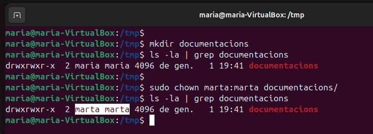


---


### Permissos especials


Els permisos especials en Ubuntu (i altres sistemes operatius basats en Linux) són atributs addicionals que es poden assignar als fitxers i directoris per controlar de manera més precisa qui pot accedir a ells i com es poden utilitzar. Aquests permisos especials són SUID, SGID i Sticky bit, i proporcionen un nivell extra de seguretat i funcionalitat. Aquests permisos tenen un comportament específic que no es pot aconseguir només amb els permisos tradicionals de lectura, escriptura i execució.


---


#### STICKY
Aquest permís s'assigna habitualment a directoris i fa que només el propietari d'un fitxer, el propietari del directori o l'administrador del sistema puguin eliminar o renombrar els fitxers dins d'aquest directori, tot i que altres usuaris puguin escriure'ls.


1. Per començar, creem un directori anomenat compartits amb la comanda `mkdir` i li assignem permisos inicials 757 (lectura, escriptura i execució per a l’usuari i el grup, i només execució per als altres). A continuació, activem el Sticky Bit amb la comanda `chmod o+t compartits` o `chmod 1757 compartits`. Això garanteix que només el propietari d’un fitxer dins del directori (o l’administrador) pugui eliminar o modificar els fitxers. Finalment, verifiquem que el Sticky Bit s’ha aplicat correctament amb la comanda `ls -l`, on observem la lletra `t` al final dels permisos del directori.
```
mkdir compartits
```
```
chmod 757 compartits/
```
```
ls -l | grep compartits
```
```
chmod 1757 compartits/
```
```
chmod o+t compartits/
```
```
ls -l | grep compartits
```


2. Seguidament, accedim al directori com a usuari `lola` i creem dos fitxers: `fitxer-lola` i `prova-lola`. Podem comprovar que els fitxers s’han creat correctament amb la comanda `ls`. Després, intentem esborrar el fitxer `prova-lola`, i com que som els propietaris, el sistema ens ho permet sense problemes. Aquest pas ens mostra que podem gestionar els nostres propis fitxers dins d’un directori amb Sticky Bit activat.
```
su lola
```
```
cd compartits
```
```
touch fitxer-lola
```
```
touch prova-lola
```
```
ls
```
```
rm prova-lola
```
```
ls
```


3. A continuació, accedim al mateix directori com a un altre usuari, laura. Creem dos fitxers anomenats `fitxer-laura` i `prova-laura` per comprovar el comportament del Sticky Bit. Posteriorment, intentem eliminar el fitxer `fitxer-lola`, que pertany a l’usuari `lola`. El sistema ens denega el permís, mostrant un missatge d’error. Això confirma que gràcies al Sticky Bit, només el propietari d’un fitxer (o l’administrador) pot eliminar-lo, fins i tot si altres usuaris tenen permisos d’escriptura al directori.
```
su laura
```
```
ls
```
```
touch fitxer-laura
```
```
touch prova-laura
```
```
ls
```
```
rm prova-laura
```
```
ls
```
```
rm fitxer-lola
```


---


#### SUID
Quan un fitxer té aquest permís, s'executa amb els permisos del propietari del fitxer en lloc dels permisos de l'usuari que el llança. Això és útil, per exemple, en programes que necessiten privilegis d'administrador per realitzar certes tasques.


1. Per començar, creem un programa en C (script.c) que obre el directori /root i mostra el seu contingut. Això no és possible per a usuaris sense privilegis d'administrador, ja que el directori /root està restringit.
```
sudo su
```
```
nano script.c
```
```
#include <stdio.h>
#include <dirent.h>


int main() {
   struct dirent *entry;
   DIR *dp = opendir("/root");


   if (dp == NULL) {
       perror("No s'ha pogut obrir /root");
       return 1;
   }


   printf("Contingut de /root:\n");
   while ((entry = readdir(dp))) {
       printf("%s\n", entry->d_name);
   }


   closedir(dp);
   return 0;
}
```


2. Compilem el fitxer amb la comanda gcc script.c -o script per generar l'executable. Després, utilitzem la comanda chmod u+s script per assignar el permís SUID al fitxer. Això es pot verificar amb la comanda ls -l, on veiem una s en lloc de la x al camp de permisos de l’usuari. Això significa que l'executable s’executarà amb els privilegis del propietari del fitxer (en aquest cas, root). Finalment, comprovem el funcionament executant el programa com un usuari normal (mariona) i veiem que podem accedir al contingut de /root, gràcies al SUID.
```
gcc script.c -o script
```
```
sudo chmod +x script
```
```
sudo chmod u+s script
```
```
su mariona
```
```
./script
```


---


#### SGID
Aquest permís fa que els fitxers executables s'executin amb els permisos del grup del fitxer en lloc dels permisos del grup de l'usuari que el llança. També afecta els directoris, de manera que els fitxers creats dins d'aquest directori pertanyin al mateix grup que el directori, independentment del grup de l'usuari.


1. Per començar, assignem el permís SGID a l’executable script amb la comanda chmod g+s script. Això fa que el fitxer s’executi amb els permisos del grup propietari del fitxer, en lloc dels permisos del grup de l’usuari que el llança. Seguidament, verifiquem que el permís SGID s’ha aplicat correctament amb la comanda ls -l | grep script. En els permisos del fitxer, observem una s al camp del grup (en lloc de la x), que indica que el permís especial SGID està actiu. Aquest permís també és aplicable a directoris, on assegura que els fitxers creats dins d’ells pertanyin al mateix grup que el directori, independentment del grup de l’usuari que els crea. Aquesta funcionalitat ens permet gestionar de manera més eficient els permisos en entorns de treball col·laboratius.     
```
sudo chmod g+s script
```
```
la -l | grep script
```


---

### Permissos en ACL
Els permisos ACL (Access Control Lists) són una extensió dels permisos tradicionals de Linux que ens permeten assignar permisos més granulars i personalitzats als usuaris i grups. Amb les ACL, podem especificar permisos detallats per a usuaris o grups concrets, sense estar limitats únicament als tres nivells bàsics d’usuari, grup i altres. Aquesta funcionalitat és especialment útil en entorns col·laboratius o complexos, on diferents usuaris necessiten accedir a fitxers o directoris amb permisos específics, millorant així la flexibilitat i el control sobre la seguretat del sistema.


1. Per començar, assignem permisos ACL a l'usuari `mariona` sobre la carpeta `compartits`, atorgant permisos complets (rwx) amb la comanda `setfacl -m`. Seguidament, utilitzem `getfacl` per verificar que l'usuari `mariona` té aquests permisos.   
```
sudo setfacl -m user:mariona:rwx compartits
```
```
getfacl compartits
```


2. Tot seguit, eliminem els permisos de l'usuari `mariona` amb `setfacl -x` i, després, comprovem amb `getfacl` que l'entrada de l'usuari ha desaparegut.    
```
sudo setfacl -x mariona compartits
```
```
getfacl compartits
```


3. A continuació, assignem permisos ACL a altres usuaris sobre el directori `compartits`. Donem permisos complets a `lola` i a `laura` amb `setfacl -m`. Tot seguit, utilitzem `getfacl` per verificar que les dues entrades ACL s'han configurat correctament. Després, buidem totes les entrades ACL del directori compartits amb la comanda `setfacl -b`. Finalment, comprovem amb `getfacl` que només queden els permisos bàsics sense ACL.    
```
sudo setfacl -m user:lola:rwx compartits
```
```
sudo setfacl -m user:laura:rwx compartits
```
```
getfacl compartits
```
```
setfacl -b compartits
```
```
getfacl compartits
```


4. En aquesta part, configurem una entrada ACL predeterminada per al grup `grup-a` amb permisos complets (rwx) mitjançant `setfacl -d`. Seguidament, fem servir `getfacl` per confirmar que els permisos predeterminats s'han aplicat correctament. Això implica que qualsevol nou fitxer creat al directori heretarà aquests permisos per defecte.      
```
sudo setfacl -d -m g:grup-a:rwx compartits
```
```
getfacl compartits
```


5. Després, comprovem els permisos del directori `compartits` amb la comanda `ls -l`. Observem que el directori mostra un símbol `+`, indicant que té configuracions ACL aplicades, la qual cosa confirma que les ACL estan en funcionament.    
```
la -l | grep compartits
```


6. Tot seguit, creem un nou directori anomenat informes amb la comanda `mkdir`. A continuació, assignem permisos ACL a l'usuari `lola` amb permisos complets (rwx) mitjançant `setfacl -m`. Utilitzem `getfacl` per assegurar-nos que els permisos s'han aplicat correctament. Després, limitem els permisos del directori amb `chmod 770`, restringint l'accés només a l'usuari propietari i al grup. Finalment, comprovem el comportament dels permisos al directori `informes`. L'usuari `lola` pot crear fitxers sense cap problema, però quan l'usuari `mariona` intenta fer-ho, el sistema li denega l'accés, ja que no té permisos configurats. Això ens confirma que els permisos ACL i bàsics estan funcionant de manera adequada.    
```
mkdir informes
```
```
sudo setfacl -m user:lola:rwx informes
```
```
getfacl informes
```
```
ls -l | grep compartits
```
```
chmod 770 informes/
```
```
ls -l | grep compartits
```
```
su lola
```
```
cd informes
```
```
touch informe1
```
```
ls
```
```
su mariona
```
```
cd informes
```
```
touch informes/informe2
```


---


### UMASK
La umask (User Mask) és un paràmetre del sistema que determina els permisos predeterminats que es restaran dels permisos per defecte quan es creen nous fitxers o directoris. És una eina important per gestionar la seguretat i les restriccions d'accés als sistemes basats en Unix/Linux, com Ubuntu.


Vídeo explicatiu càlculs umask: <https://www.youtube.com/watch?v=Hpdc4s6tvfc&t=238s>


1. El primer pas serà visualitzar el fitxer /etc/login.defs. Aquí observarem que el umask per defecte és 022, aquest estableix que els fitxers nous tindran permisos 644 (lectura/escriptura per al propietari, lectura per al grup i altres) i els directoris tindran 755 (lectura/escriptura/execució per al propietari, lectura/execució per al grup i altres).
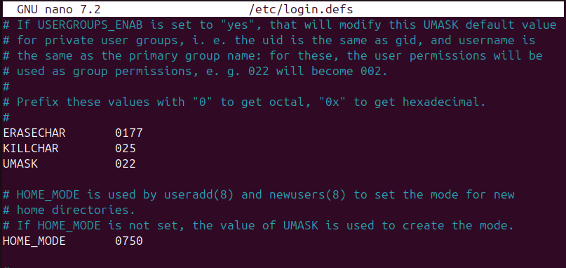


2. Una vegada fora del fitxer, també podem comprovar el umask amb la comanda `umask` i establir un de nou amb `umask 027`, aquest configura permisos predeterminats de 640 per a fitxers i 750 per a directoris, restringint tot accés a "altres" i limitant el grup a lectura o execució. Per comprovar-ho crearem la carpeta prova2 i farem `ls -la`.
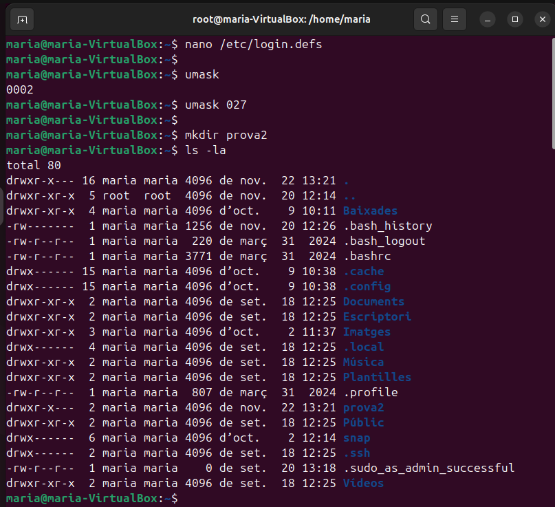


3. A més crearem un fitxer nou per acabar de comprovar l'efecte del umask 027. Seguidament, el canviarem per 137, aquest configura permisos predeterminats de 640 per a fitxers i 640 per a directoris, restringint accés d'altres en execució i grup en escriptura. Per comprovar-ho crearem el fitxer `p1` i la carpeta `p2`.
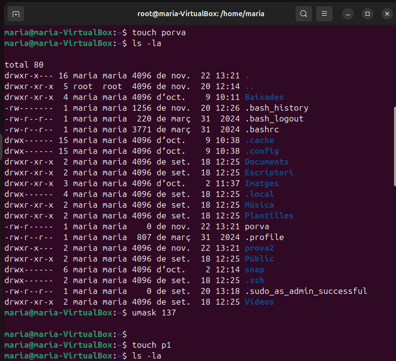
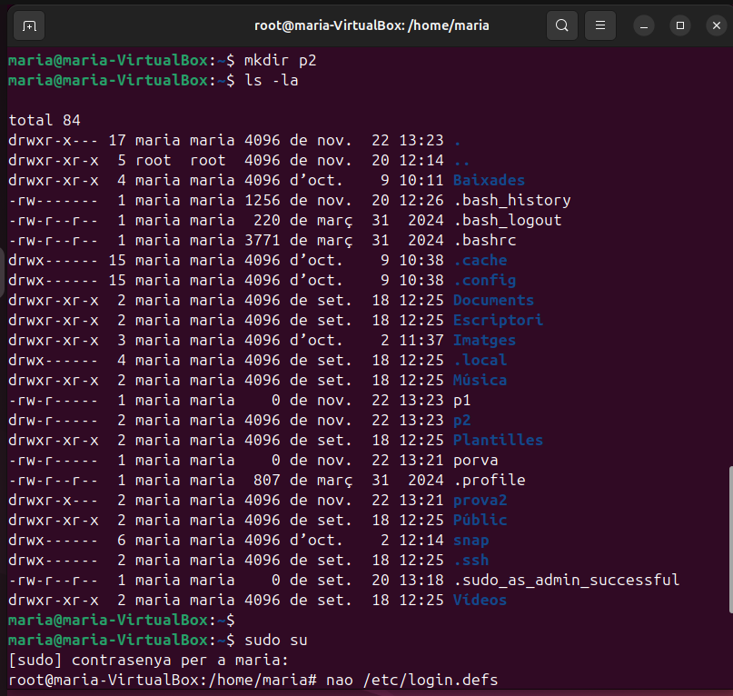


---


## Sistemas de fitxers i particions
### Estructura física
L’estructura física fa referència als components tangibles que constitueixen un sistema d’emmagatzematge. Aquests inclouen discos durs (HDD), unitats d'estat sòlid (SSD), memòries flash, i altres dispositius. Els elements físics importants són les pistes, sectors i cilindres en el cas dels HDD, i les cel·les d'emmagatzematge en els SSD. Aquesta estructura és la base sobre la qual es construeixen els mecanismes d'emmagatzematge i recuperació de dades.


---


### Estructura lògica
L’estructura lògica representa com es gestionen i organitzen les dades dins del sistema operatiu. Inclou elements com el sistema de fitxers, carpetes, i enllaços simbòlics. Els sistemes de fitxers (com NTFS, FAT32, ext4) defineixen la manera com es llegeixen, escriuen i organitzen les dades emmagatzemades al dispositiu físic. Aquesta estructura permet als usuaris accedir a la informació d'una manera comprensible i eficient.


---


### Estructura de la informació
L’estructura de la informació descriu com s’organitzen i gestionen les dades tant a nivell físic com lògic dins d’un dispositiu d’emmagatzematge. Inclou aspectes com les unitats mínimes on es desen les dades i com aquestes són agrupades per optimitzar el rendiment. A continuació, es detalla uns conceptes clau dins d’aquesta estructura:


#### MIDA DEL SECTOR
La mida del sector és la unitat mínima física on es guarden les dades en un dispositiu d'emmagatzematge. Per defecte, aquesta mida sol ser de 512 bytes, però pot variar en dispositius més moderns amb sectors de 4 KB (4096 bytes). Aquesta mida està definida de fàbrica i no es pot modificar. Tot i això, el sistema operatiu no treballa directament amb sectors sinó amb blocs, que són unitats lògiques més grans on es guarden les dades. 


Per poder revisar els discs haurem d'executar la comanda "fdisk -l", aquesta és molt útils, ja que et mostra l'identificador del disc (/dev/sda), el tamany (50 GB), el tipus (GPT o MBR), número de sectors, tamany del sector, etc.
```
sudo fdisk -l
```


#### MIDA DEL BLOC
El bloc és la unitat mínima lògica d'emmagatzematge utilitzada pel sistema operatiu. La mida del bloc es pot configurar durant el procés de formatatge d'una partició. La mida del bloc influeix en l'eficiència de l'emmagatzematge: blocs més grans poden ser més ràpids, però poden generar més espai desaprofitat (fragmentació interna).   


Per mostrar els blocs haurem de especificar quina partició sobretot. La comanda és la següent:
```
tune2fs -l /dev/sda2 | grep Block
```


#### FRAGMENTACIÓ INTERNA
La fragmentació interna es produeix quan un fitxer no omple completament un bloc assignat, deixant espai sense utilitzar. Aquest espai es considera desaprofitat. La mida del bloc és clau per minimitzar aquest tipus de fragmentació. Si reduïm la mida dels blocs, es pot disminuir la fragmentació interna, però això pot impactar negativament el rendiment, ja que el sistema haurà de gestionar més blocs.  


1. Seguidament, crearem un fitxer nou anomenat hola, en el que escriurem "bon dia". Després comprovarem que existeix amb un "ls" i mostrarem el contingut per terminal amb "cat". Per demostrar la fragmentació interna executarem la comanda "du -b hola" i "du -sh hola". Podem comprovar que en la primera comanda mostra un 8  que vol dir que el fitxer ocupa 8 Bytes, en la segona comanda mostra la mida real que ocupa el fitxer, aquesta és 4Kb.   
```
echo "bon dia" > hola
```
```
ls
```
```
cat hola
```
```
du -b hola
```
```
du -sh hola
```


2. Per últim, si revisem per GUI els paràmetres del fitxers, ens mostra 8 Bytes.


#### FRAGMENTACIÓ EXTERNA
La fragmentació externa passa quan els fitxers es guarden en blocs dispersos en lloc de ser contigus. Això afecta el rendiment, ja que es necessiten més operacions per accedir a les dades. Aquesta situació és més habitual en dispositius d'emmagatzematge que han estat utilitzats durant molt de temps sense una reorganització (per exemple, una desfragmentació).  


Aquesta es pot resoldre fent una desfragmentació, aquesta l’aconseguirem executant la comanda "e4defrag -c /dev/sda2" per visualitzar el que cal desfragmentar. Tot seguit per realitzar el procés escriurem la mateixa comanda, però sense el paràmetre "-c". D'aquesta manera aconseguirem organitzar el fitxers i augmentar el rendiment del disc.
```
e4defrag -c /dev/sda2
```
```
e4defrag /dev/sda2
```


---


### Tipus de formateig
Hi ha tres tipus principals de formatatge, que es diferencien en la manera com preparen el dispositiu i tracten els blocs defectuosos:


* Formatatge de baix nivell: És un procés lent que organitza els sectors físics i reescriu tota la informació. Marca els blocs defectuosos i elimina completament totes les dades, recuperant l'estructura física del dispositiu. Sovint és realitzat pels fabricants.


* Formatatge intermig: No esborra les dades existents, però analitza el dispositiu i marca els blocs defectuosos perquè no s’utilitzin en el futur. És útil per diagnosticar problemes sense perdre informació.


* Formatatge ràpid: És molt més veloç perquè no comprova ni marca blocs defectuosos ni esborra les dades físicament. Només elimina l'índex del sistema de fitxers, fent que els fitxers semblin esborrats, però encara estiguin presents físicament fins que es sobreescriguin.


La diferència principal entre aquests tipus és el tractament de les dades i dels blocs defectuosos, així com la velocitat i la profunditat del procés.


---


### Creació de particions i formateig
1. Per començar, afegirem un disc dur de 2 GB i executarem la comanda "fdisk -l", per revisar que detecta el disc.
```
fdisk -l
```


2. Seguidament, crearem una partició i utilitzarem la meitat del disc dur.
```
fdisk /dev/sdb
```


3. Una vegada fet, revisarem una altra vegada amb el "fdisk -l" que ara el disc té una nova partició, la sdb1.
```
fdisk -l
```


4. El següent que farem és formatar la nova partició en format ext4 i amb mida de bloc 2048.
```
mkfs.ext4 -b 2048 /dev/sdb1
```


5. Com a comprovació haurem d'executar la comanda següent, la qual mostra la mida de bloc de la partició sdb1, per comprovar que el paràmetre -b de la comanda anterior ha funcionat:
```
tune2fs -l /dev/sdb1 | grep Block
```


---


### Muntatge de particions
#### TEMPORAL
1. Per fer un muntatge temporal primer haurem de crear una carpeta en la qual afegirem un nou fitxer, anomenat "hola". Seguidament, executarem la comanda que fa possible el muntatge temporal "mount -t ext4 /dev/sdb1 /var/particio1". Si tornem a visualitzar el contingut de la carpeta veurem que el fitxer "hola", ja no està, això no vol dir que estigui esborrat sinó que al muntar la carpeta desapareix. A més per verificar que un muntatge està correctament realitzat veurem que apareix lost+found dins del directori.
```
cd /var
```
```
mkdir particio1
```
```
cd particio1/
```
```
touch hola
```
```
mount -t ext4 /dev/sdb1 /var/particio1
```


2. Seguidament, quan creem fitxers dins del directori muntat, una vegada es desmunta desapareixen, però no s'esborren.
```
cd particio1/
```
```
touch adeu
```


---


#### DEFINITIVA


1. Per començar, si volem un muntatge definitiu haurem de afegir una nova línia al fitxer /etc/fstab.
```
nano /etc/fstab
```
```
/dev/sdb1   /var/particio1  ext4    defaults    0   0
```


2. Una vegada acabat reiniciarem la vm i una vegada es torni a encendre carregarà el muntatge.    
```
reboot
```


3. Seguidament, si comprovem el directori veurem que ja està muntat.
```
sudo su
```
```
cd /var
```
```
ls particio1/
```


---


### Comparticio de carpeta a traves de servidor Samba


La compartició de carpetes a través de Samba és una manera eficient i flexible de permetre que diferents dispositius d’una xarxa, independentment del seu sistema operatiu (Windows, Linux, macOS), accedeixen a recursos compartits com fitxers i carpetes. Samba és un programari de codi obert que implementa el protocol SMB/CIFS, facilitant la comunicació i la transferència de dades entre ordinadors de diverses plataformes. Aquesta funcionalitat és àmpliament utilitzada tant en entorns domèstics com empresarials per compartir dades de manera segura i còmoda.


---


#### EXT4 ~ Ubuntu
(Fourth Extended Filesystem) és un sistema de fitxers avançat utilitzat principalment en Linux, que ofereix millores significatives en rendiment, escalabilitat i fiabilitat en comparació amb els seus predecessors ext2 i ext3. És capaç de gestionar sistemes de fitxers de fins a 1 exabyte i fitxers individuals de fins a 16 terabytes. Inclou característiques com el journaling per garantir la integritat de les dades, l’al·locació retardada per optimitzar l’ús de l’espai i el control de fragmentació per millorar l’eficiència. Gràcies a aquestes funcionalitats, ext4 s’ha convertit en un dels sistemes de fitxers més utilitzats en entorns Linux.


1. El primer que haurem de fer és canviar l'adaptador de xarxa a pont.


2. Seguidament, instal·larem a la màquina real el smbclient.
```
sudo apt install smbclient
```


3. Després tornarem a la vm i instal·larem nautilus-shared.
```
sudo apt install nautilus-share
```


4. Per fer servir-lo haurem de fer clic sobre un directori i escollir l'opció recursos compartits.


5. Aquí veurem que tenim diferents opcions de permisos, però si intentem aplicar-los veurem que realment no podem.


6. Per compartir recursos hi ha una millor forma que amb nautilus-shared i aquesta és samba. Per això haurem de instal·lar-lo a la vm.     
```
sudo apt install samba
```


7. Per poder afegir un nou recurs haurem d'anar a smb.conf, aqui anirem fins al final del fitxer i afegirem totes aquestes linies, que com podem veure son per definir la ruta, l'usuari, els permisos, etc.
```
nano /etc/samba/smb.conf
```


8. Una vegada fet haurem de reiniciar el servei samba amb la següent comanda:
```
systemctl restart smbd nmbd
```


9. Després anirem al directori i li canviarem un parell de coses: permisos (que en aquest cas, són totalment permissius) i usuari + grup propietari (aquest seran nobody:nogroup, per a que qualsevol usuari pugui accedir i crear).
```
cd /var
```
```
ls -l
```
```
chmod 777 particio1/
```
```
chown nobody:nogroup particio1/
```
```
ls -l | grep particio1
```


10. Seguidament, crearem l'usuari que havíem definit abans en el fitxer smb.conf, anonemat "platano". Després li assignarem una contrasenya per al samba.
```
adduser platano
```
```
smbpasswd -a platano
```


11. Tot seguit, visualitzarem des de la màquina real els recursos compartits del servidor (màquina virtual), veurem que ens apareix el directori en qüestió.
```
sudo smbclient -L //192.168.203.208
```


12. A partir de la interfície gràfica anirem a fitxers, altres ubicacions i afegirem la següent línia en el requadre que marca la captura: smb://192.168.203.208/particio1.
```
smb://192.168.203.208/particio1
```


13. Després afegirem l'usuari "platano" i la contrasenya que hem assignat per al samba anteriorment. Seguidament ja estarem dins del directori.    


14. Per últim, farem unes proves de connexió. El que haurem de fer és crear una carpeta o fitxer des de la màquina real i més tard comprovar al servidor que s'han realitzat els canvis a temps real.


---


#### NTFS ~ Windows
(New Technology File System) és un sistema de fitxers desenvolupat per Microsoft, utilitzat principalment en sistemes Windows, que destaca per la seva seguretat, eficiència i funcionalitats avançades. Pot gestionar volums de fins a 16 exabytes i fitxers de fins a 256 terabytes, a més d’integrar un sistema de permisos avançats basats en ACL per controlar l’accés a fitxers i carpetes. També inclou journaling per garantir la integritat davant fallades, així com compressió i xifratge de fitxers mitjançant EFS. Gràcies a aquestes característiques, NTFS és el sistema de fitxers per defecte en les versions modernes de Windows.


1. Per començar, comprovarem l'estat del disc amb fdisk -l, com podem observar queda encara la mitad.
```
fdisk -l
```


2. Per tant, crearem l'altra particio.
```
fdisk /dev/sdb
```
```
fdisk -l
```


3. Seguidament, la formatarem, però en aquest cas NO serà en ext4 sinó en NTFS.
```
mkfs.ntfs /dev/sdb2
```


4. Una vegada fet crearem el directori particio2 i crearem el fitxer hola (com a la particio1).
```
cd /var
```
```
mkdir particio2
```
```
cd particio2
```
```
touch hola
```


5. Tot seguit, farem un muntatge definitiu al fitxer fstab. Com podem comprovar aquí també serà necessari canviar ext4 per NTFS.
```
/dev/sdb2   /var/particio2  ntfs    defaults    0   0
```


6. Seguidament afegirem un nou recurs compartit al fitxer smb.conf, aquest tindrà un usuari diferent anomenat "fresa". Quan acabessim haurem de reiniciar el servei samba.
```
systemctl restart smbd nmbd
```


7. Després canviarem permisos i propietaris a la carpeta que volem compartir, però si ens fixem quan revisem el resultat no s'apliquen els canvis de propietaris, això és perquè la partició es NTFS.
```
chmod 777 particio2
```


8. Per poder solucionar-ho haurem d'anar també al fstab i afegir nobody, nogroup a la línia de muntatge.
```
/dev/sdb2   /var/particio2  ntfs    defaults,uid=nobody,gid=nogroup    0   0
```


9. Una vegada fet, haurem de crear l'usuari "fresa" i afegir una contrasenya de samba específica del usuari.
```
adduser fresa
```
```
smbpasswd -a fresa
```


10. Ara des de la màquina real comprovarem els recursos compartits del servidor.
```
sudo smbclient -L //192.168.1.155
```


11. Ens connectarem amb l'usuari fresa i ja tindrem accés. Per comprovar-ho crearem la carpeta "prova".


12. Després anirem al servidor i veurem que la carpeta està creada.


13. Seguidament, ens connectarem des de Windows, per fer-ho haurem de estar amb una vm en adaptador pont. Més tard afegirem una nova unitat de xarxa, la qual portara la ruta "\\\192.168.1.155\particio2". A més haurem de marcar l'opció "Conectar con otras credenciales" si no no funcionarà.     


14. Tot seguit, ficarem les credencials de l'usuari fresa i ja tindrem accés al recurs compartit.


15. Per últim, crearem una carpeta nova des de Windows i comprovarem que apareix tant al servidor com a la màquina real.


---
## Còpia de seguretat i automatització de tasques


---


## Quotes de disc
Les quotes de disc a Ubuntu són una eina que permet limitar la quantitat d'espai en disc que pot utilitzar cada usuari o grup al sistema. Això és útil per evitar que un usuari ocupi tot l’espai disponible i per gestionar millor els recursos en entorns compartits, com servidors o ordinadors multiusuari. Les quotes es poden configurar per definir límits tant en la quantitat de fitxers com en la mida total que es pot emmagatzemar, assegurant un ús més equilibrat i controlat de l'espai disponible.


1. El primer que haurem de fer és afegir un disc nou, en aquest cas de 5 GB.     
```
fdisk -l
```
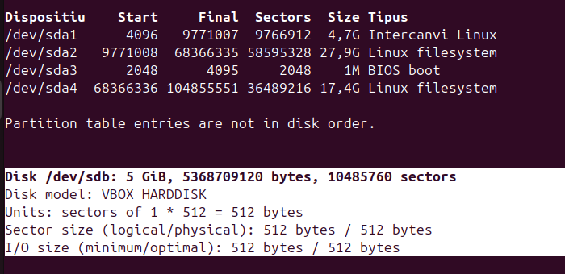


2. Seguidament, farem una única partició en tot el disc.   
```
fdisk /dev/sdc
```
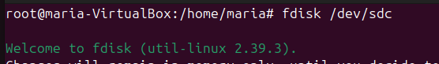


3. Després la formatarem amb ext4.     
```
mkfs.etx4 /dev/sdc1
```
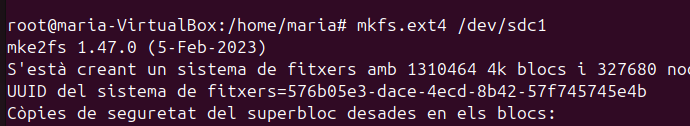


4. Tot seguit comprovarem que la partició està creada.     
```
fdisk -l
```
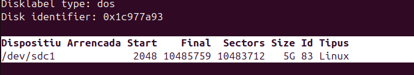


5. A continuació farem una actualització del repositori de paquets i instal·larem **quota**.       
```
sudo apt update
```
```
sudo apt install quota
```
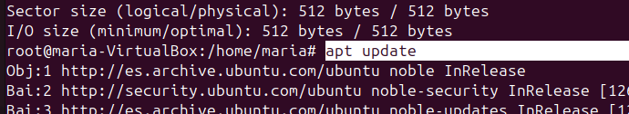
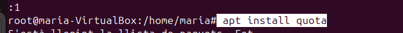


6. Seguidament crearem una carpeta en /mnt anomenada dades.    
```
cd /mnt
```
```
mkdir dades
```
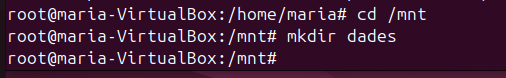


7. Posteriorment, anirem a afegir una nova linia a /etc/fstab per muntar la carpeta creada a la particio del disc de 5GB. Important afegir usrquota i grpquota ja que aixi podrem establir quotes.     
```
/dev/sdc1   /mnt/dades  ext4    defaults,usrquota,grpquota  0   0
```
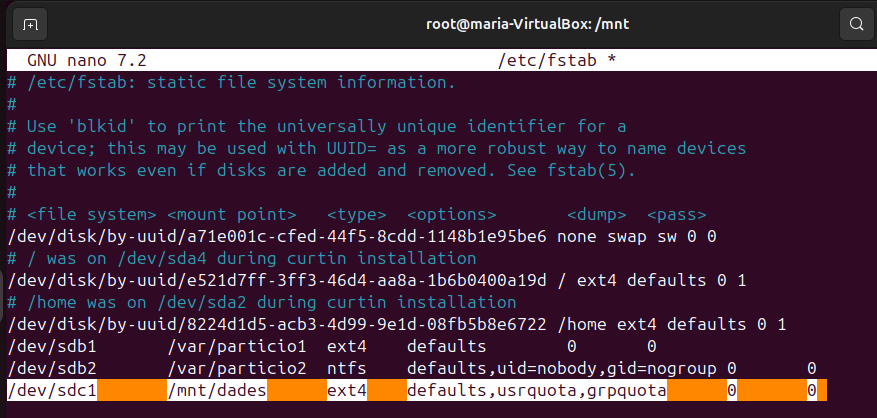


8. Una vegada fet reinciarem el sistema i comprovarem que el directori ja esta muntat. A més afegirem dos comandes crucials `quotacheck -cug /mnt/dades` que verifica i crea els fitxers de quotes per a usuaris i grups en un sistema de fitxers, i `quotaon /mnt/dades` que activa la gestió d’aquestes quotes. També crearem un usuari nou al que establirem quotes, anomenat usuari1.      
```
reboot
```
```
ls /mnt/dades
```
```
quotacheck -cug /mnt/dades
```
```
quotaon /mnt/dades
```
```
ls /mnt/dades
```
```
adduser usuari1
```
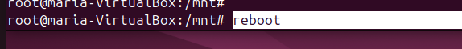
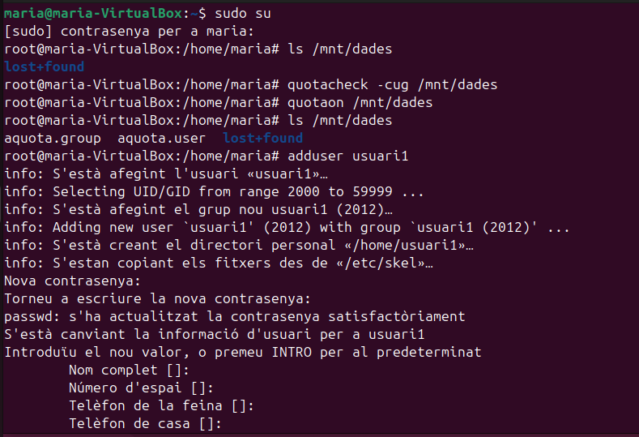


9. Després executarem la comanda `quota -u usuari1` que mostra l’ús del disc i els límits de quota assignats a un usuari específic. Com podem comprovar el resultat marca que no en té cap.    
```
quota -u usuari1
```
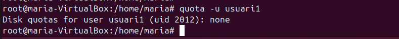


10. Per afegir quotes a un usuari haurem de executar la comanda `edquota -u usuari1`. Aquí ens mostrara diferents columnes, nosaltres només haurem de tindre en compte dos: soft i hard. El soft límit és un límit flexible que es pot superar temporalment durant un període de gràcia, mentre que el hard limit és un límit estricte que no es pot superar mai. Això permet advertir l'usuari abans d'arribar al límit màxim absolut. En aquest cas hem establert com a soft límit 1024 i en hard 2048.      
```
edquota -u usuari1
```
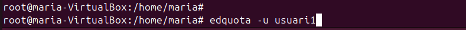
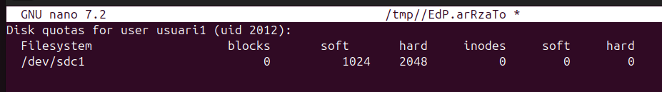


11. Seguidament, executarem la comanda `repquota /mnt/dades` aquesta mostra un informe detallat de l’ús de disc i les quotes de usuaris i grups en un sistema de fitxers.      
```
repquota /dev/sdc1
```
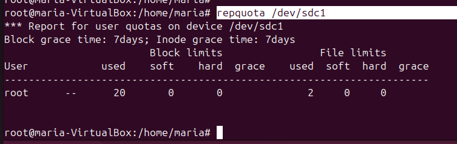


12. Tot seguit, afegirem permisos 777 a la carpeta dades.
```
cd /mnt
```
```
chmod 777 dades/
```


13. A continuació entrarem amb usuari1 i crearem un fitxer especificant tamany i contingut. Si fem un `quota -u usuari1` veurem que segons el tamany assignat del fitxer el resultat determina l'espai utilitzat.      
```
dd if=/dev/zero of=test bs=1K count=800
```
```
quota -u usuari1
```


14. Si ho comprovem des de root amb repquota també ens indicara el mateix espai i l'usuari que l'ocupa.        
```
repquota /dev/sdc1
```


15. Ara tornarem a ser usuari1 i crearem 2 fitxers més per observar que passa si sobrepassem el límit. Com podem observar al fitxer test2 salta l'avís, però podem continuar creant més fitxers. Com és possible? El sistema accepta el fitxer que estàs creant, però realment està buit, per tant, s'estan aplicant les restriccions de quota de manera correcta.      
```
dd if=/dev/zero of=test1 bs=1K count=800
```
```
dd if=/dev/zero of=test2 bs=1K count=800
```
```
dd if=/dev/zero of=test3 bs=1K count=800
```


16. Si ho comprovem, podrem observar que indica 6 dies de gràcia, els grace days només són aplicables al soft límit, indicant el temps durant el qual es pot excedir aquest límit abans que es comencin a imposar restriccions.    
```
quota -u usuari1
```


17. Com a dada interessant si no volem grace days amb la comanda `edquota -t` podem modificar-los a 0.     
```
edquota -t
```


18. Ara per poder fer la següent part eliminarem tots els fitxers creats i revisarem la quota.       
```
cd /mnt/dades
```
```
rm tes*
```
```
ls
```
```
quota -u usuari1
```


19. Per poder mostrar de forma més clara com funciona quota, delimitarem soft a 100 i hard a 400.      
```
edquota -u maria
```


20. Seguidament, descarregarem una foto d'internet i l'apegarem a /mnt/dades, com podem comprovar si la foto passa el límit salta un error de quota.       


21. Però si ens n'adonem la foto segueix al directori i a més és visible, això és perquè li baixa la qualitat per a que pugui d'alguna forma entrar dins del límit de la quota.    


22. Si provem de tornar a copiar la foto aquesta, ja no serà visible, perquè la quota ja està plena per l'altra.       


---
## Webgrafia

Molta de la informació extreta està al **Moodle de 0369 - Implantació de Sistemes Operatius**. Seguidament, els següents links són d'internet:

Linux.die.net. Manual de comandes per a la gestió de processos. Disponible a: <https://linux.die.net/man/>

Tecmint. Manage Users and Groups in Linux. Disponible a: <https://www.tecmint.com/manage-users-and-groups-in-linux/>

Arch Wiki. File Systems. Disponible a: <https://wiki.archlinux.org/title/File_systems>

Tecmint. Setting Disk Quotas. Disponible a: <https://www.tecmint.com/set-filesystem-disk-quotas-on-ubuntu/>

Ubuntu Official Documentation. Disk Quotas. Disponible a: <https://help.ubuntu.com/community/DiskQuotas>

Ubuntu Tutorials. Create a USB stick on Ubuntu. Disponible a: <https://ubuntu.com/tutorials/create-a-usb-stick-on-ubuntu#1-overview>

---


