# Gestió d'usuaris i serveis

Per a la documentació completa visita [mkdocs.org](https://www.mkdocs.org).

---
## Introducció

Començarem instal·lant Ubuntu Linux en un entorn de màquina virtual. L'objectiu és assegurar-nos que el sistema operatiu estigui ben configurat per gestionar usuaris, grups i polítiques de contrasenyes de manera eficaç. En aquesta primera fase, ens centrarem en la creació i gestió de comptes d'usuari locals, així com en l'assignació de permisos als grups i la definició de polítiques de seguretat per a les contrasenyes i accessos.

Un cop tinguem la configuració inicial a punt, passarem a instal·lar i gestionar serveis essencials que són crucials per al bon funcionament del sistema. Això inclou la configuració de serveis i processos, l'optimització de l'ús dels recursos disponibles, i l'administració dels serveis actius segons les necessitats del sistema.

A continuació, ens ocuparem de la creació i gestió de particions i sistemes de fitxers. Ens assegurarem que l'espai es distribueixi de manera adequada, aplicarem quotes de disc i implementarem còpies de seguretat automàtiques per protegir la integritat de les dades.

Finalment, realitzarem proves exhaustives per verificar que tot funcioni correctament, incloent la gestió d'usuaris, grups i serveis, així com la integritat dels fitxers, sistemes de particions i quotes de disc. Documentarem cada pas del procés de manera detallada, que inclourà la creació de comptes d'usuari, la configuració de serveis, l'administració de particions, i el pla de recuperació en cas de desastres. A més, acompanyarem la documentació amb captures de pantalla que il·lustrin les configuracions i ajustaments realitzats durant el procés.


---
## Gestió de processos

---
## Gestió d'usuaris i grups

La gestió d'usuaris i grups és una part fonamental del sistema operatiu Ubuntu 24 Desktop. Cada usuari té les seves pròpies configuracions, fitxers i permisos, la qual cosa permet una experiència personalitzada i segura. A més, agrupar usuaris facilita l'administració de permisos i l'accés a recursos compartits.

En aquest apartat, explorarem com crear, modificar i eliminar usuaris i grups. També veurem com establir permisos per assegurar-nos que les dades estiguin protegides i accessibles només per aquells que ho necessiten. Amb unes poques passes senzilles, podreu gestionar els vostres usuaris i grups de manera eficient i efectiva. 

---
### Els fitxers més importants

En la gestió d'usuaris i grups d'Ubuntu, hi ha diversos fitxers clau que contenen informació essencial. A continuació, expliquem els més importants:

- **etc/passwd:** Aquest fitxer és un registre de tots els usuaris del sistema. Conté informació com el nom d'usuari, la identificació d'usuari (UID), el directori inicial i el shell predeterminat. És un fitxer accessible, per la qual cosa tothom pot veure qui són els usuaris del sistema.
- **etc/shadow:** Aquí s'emmagatzema la informació de les contrasenyes dels usuaris. Cada línia correspon a un usuari i conté la seva contrasenya encriptada. Si en aquest fitxer veiem un signe "!", significa que l'usuari està bloquejat i no pot accedir al sistema.
- **etc/gshadow:** Aquest fitxer és similar a /etc/group, però proporciona informació addicional sobre els grups. Aquí es poden veure els administradors de cada grup. És útil per gestionar els permisos i els drets d'accés dels grups d'usuaris.
- **etc/groups:** Conté informació sobre els grups del sistema. Cada línia representa un grup i inclou el nom del grup, el seu identificador (GID) i els membres que en formen part. Aquest fitxer és útil per veure quins usuaris pertanyen a cada grup.
---

### Crear i eliminar usuaris
#### USERADD

1. Per poder crear un nou usuari al sistema, utilitzarem la comanda useradd. Aquesta comanda ens permet afegir usuaris amb diversos paràmetres que ens ajuden a definir les seves característiques. A continuació, veurem alguns dels paràmetres clau que podem utilitzar:
    * **-m:** Aquest paràmetre indica que es crearà un directori d'usuari personal (home directory) automàticament. Això és important perquè cada usuari necessita un espai propi per emmagatzemar els seus fitxers.
    * **-s /bin/bash:** Amb aquest paràmetre, especificarem el shell que utilitzarà l'usuari. En aquest cas, estem indicant que volem que el shell sigui Bash, que és un dels més utilitzats en sistemes Linux.
    * **-d /home/nick:** Aquí podem definir el directori d'inici de l'usuari. En aquest exemple, establim que el directori personal de l'usuari serà /home/nick.
    * **nick:** Aquest és el nom de l'usuari que estem creant. En aquest cas, hem triat "nick" com a nom d'usuari.
    * **&& passwd nick:** Aquesta comanda s'utilitza per establir o canviar la contrasenya per a l'usuari "nick".

    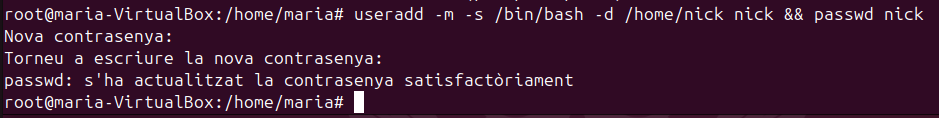

2. Una vegada fet, si observem el fitxer /etc/passwd/ podrem visualitzar el nou registre amb el nom del usuari que acabem de crear. 
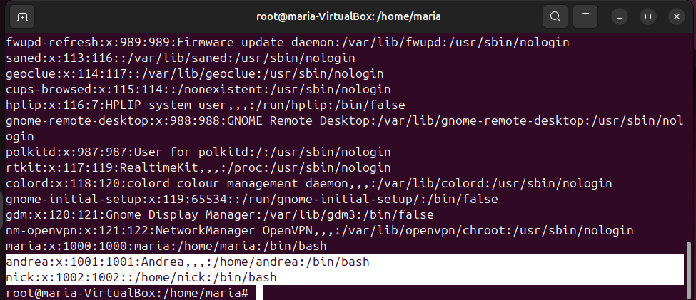

#### ADDUSER

1. Per fer-ho d'una forma mes senzilla haurem de executar la comanda adduser (nom d'usuari). Seguidament ens apareixeran apartats per emplenar com la contrasenya, nom complet, número d'espai, telèfon, etc. Si revisem el contingut del fitxer /etc/passwd.   
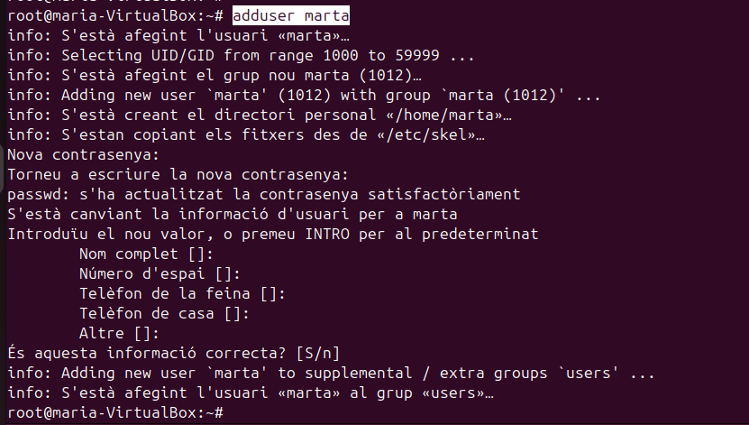
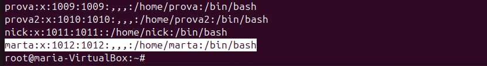

#### USERDEL

1. Per poder eliminar un usuari haurem d'utilitzar la comanda userdel que aquesta te diferents parametres el quals podem arribar a ser utils, en aquest apartat veurem dues opcions.
    * **-r:**
    * **-f:** 

    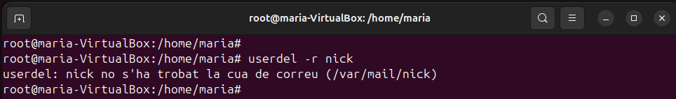

2. Una vegada fet si revisem el fitxer /etc/passwd podem observar que l'usuari **nick** ja no existeix.
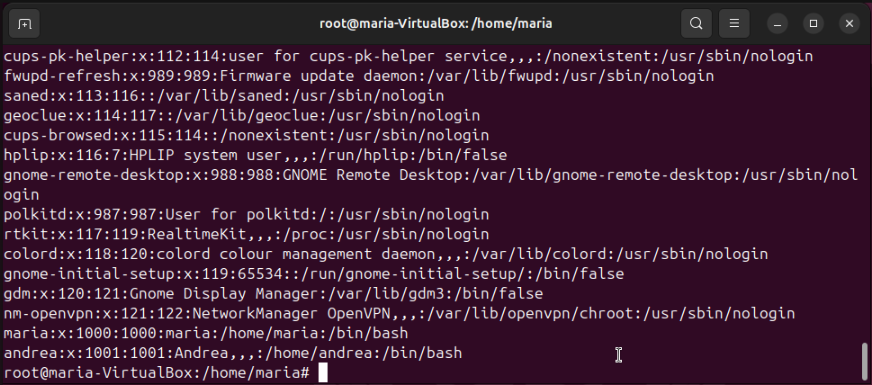

3. Seguidament també tenim el parametre **-f**, aquest 
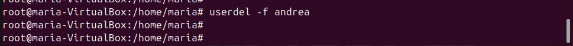
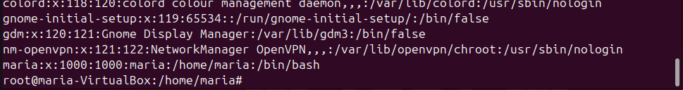

---

#### Afegir usuaris per GUI

1. Per poder administrar el usuaris i grups per entorn gràfic haurem de instal·lar per terminal un programa anomenat gnome-system-tools.  
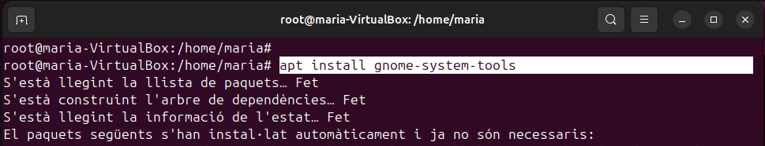

2. Una vegada dins del programa, veurem els diferents usuaris del sistema, des del aqui podrem afegir, suprimir i gestionar grups.  
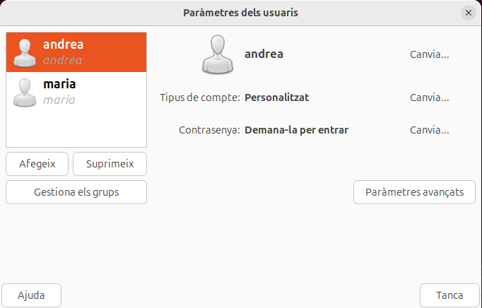

---

### Log usuari per GUI i terminal

1. Per iniciar sessió pel terminal haurem de executar la comanda "su" i seguidament el nom del usuari amb el que volem inciar-la. Per comprovar que ja estem dins podem executar la comanda pwd, aquesta en mostrarà la home de l'usuari.
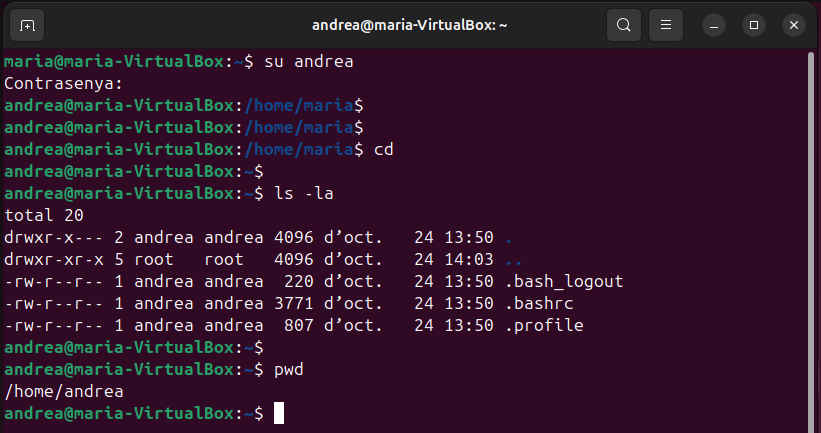

2. Per fer el inici de sessió des de la interficie grafica, haurem de sortir de la sessió actual i entrar en l'usuari correcte, de forma habitual introduint la contrasenya. 
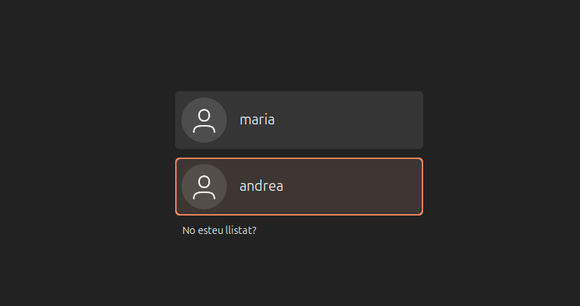
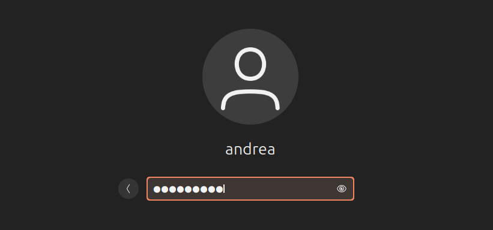

3. Seguidament una vegada hem entrat, obrirem un terminal i comprovarem el pwd. Podem veure que quan fem un "ls -la" hi han moltes mes carpetes que abans, això és degut a que les carpetes de la home no és creen fins que l'usuari no inicia sessió des de fora.    
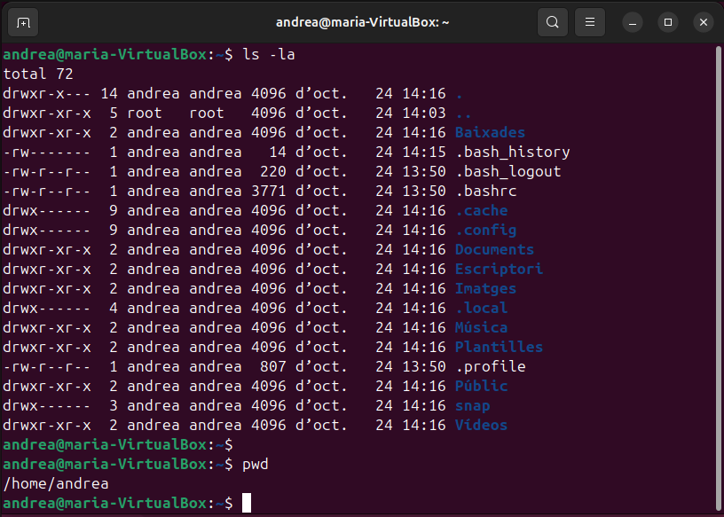

---

### Bloquejar i desbloquejar usuaris

1. Per poder bloquejar usuaris haurem de escriure la comanda "usermod -L (nom d'usuari que volem bloquejar)". Seguidament per poder comprovar si els canvis s'han aplicat, revisarem el fitxer /etc/shadow. Dins d'aquest fitxer baixarem fins trobar l'usuari i si apareix el simbol d'exclamació com mosra la captura de pantalla, vol dir que l'usuari està bloquejat. Una altra forma per comprovar-ho és tancat la sessió i observar que no apareix l'usuari.  

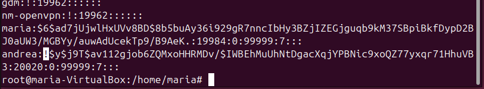
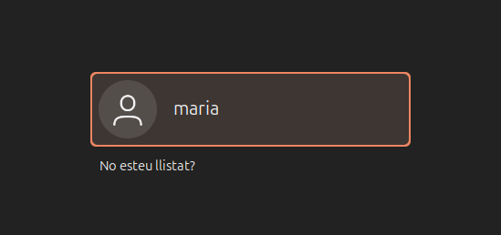
---

2. Per poder desbloquejar l'usuari haurem de esciure la comanda "usermod -U (nom d'usuari)". Seguidament si tornem a revisar el fitxer "/etc/passwd" veurem que no té el signe d'exclamació. Per acabar de comprovar-ho sortirem de la sessió actual i veurem que l'usuari torna a estar. 
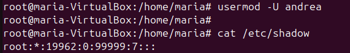
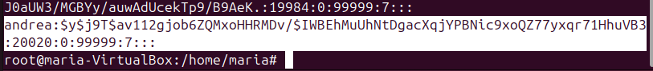
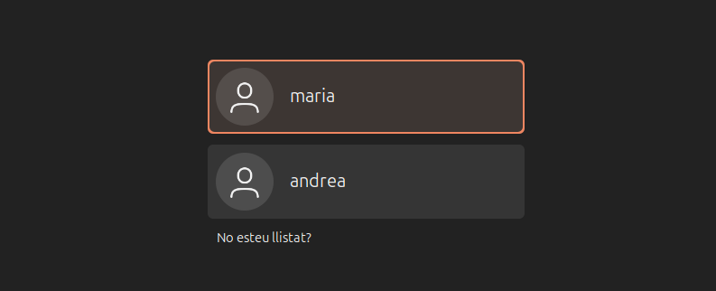
---

3. 
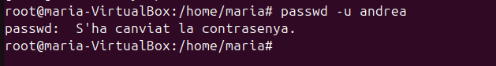


---

### Modificar nom d’un usuari

1. Per poder modificar el nom d'usuari, haurem de modificar també diferents fitxers i directoris, ja que, ha de coincidir per tant de funcionar. Necessitarem seguir 4 parts indispensables: 
    * usermod -l:
    * 

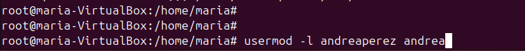
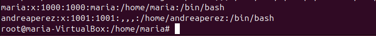

2. 
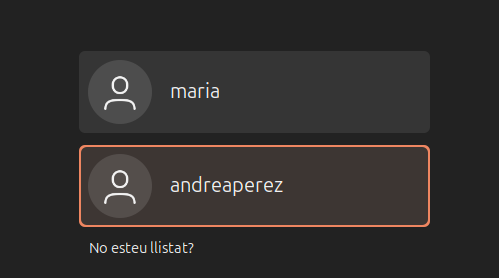
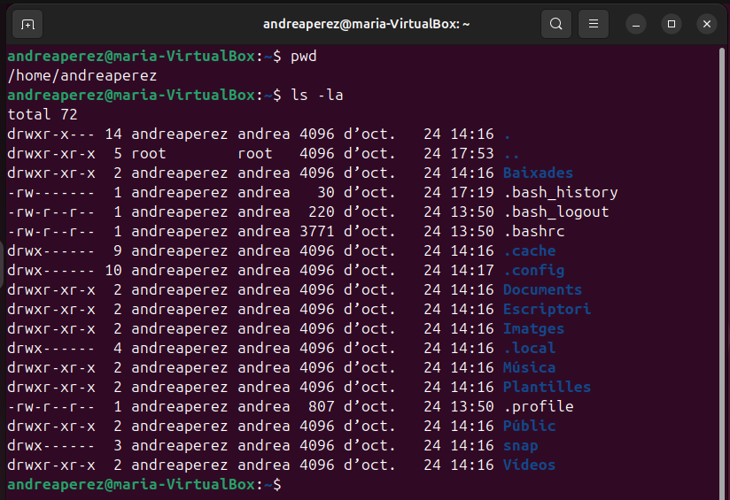

---

### Crear i eliminar grups
#### GROUPADD

1. Per afegir un grup amb groupadd nomes haurem de ejecutar la comanda "groupadd (nom del grup)". Seguidament mirarem el fitxer "/etc/gshadow" i comprovarem que realment està. 
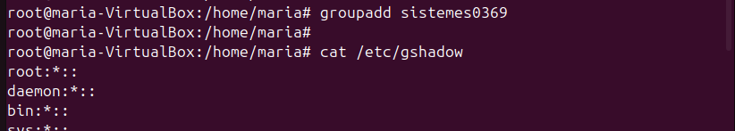


2. Seguidament, per aplicar un gid customitzat haurem d'afegir el parametre "-g (número de gid desitjat)". Després comprovarem els canvis al fitxer "/etc/group".
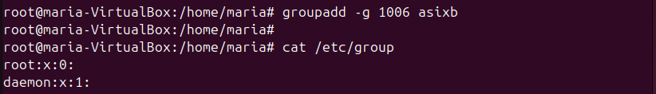
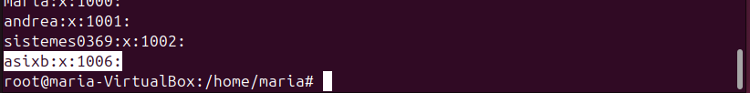

#### ADDGROUP

1. El cas de la comanda addgroup és molt paregut al anterior, ja que només haurem de introduir la comanda i consecutivament el nom del grup. L'única diferencia notable és el fet de què t'informa dels canvis aplicats. Si anem al fitxer "/etc/group" podrem veure que el grup està creat.
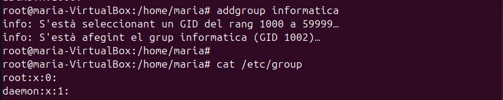
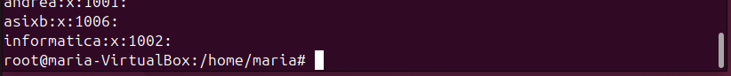


#### GROUPDEL

1. Per eliminar un grup en groupdel haurem d'utilitzar la mateixa estructura que en les dues anteriors. Seguidament revisar que realment ja no està al fitxer "/etc/group".
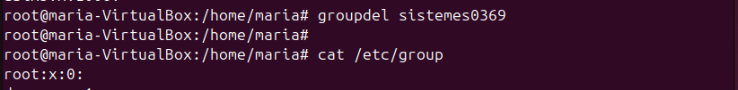

#### DELGROUP

1. Una altra forma de eliminar grups és utilitzar la comanda delgroup. 
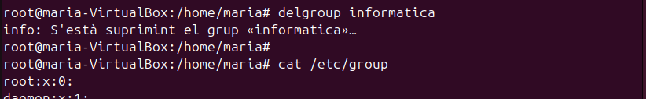

---

### Afegir i treure usuaris de grups
#### USERMOD

1. Per poder afegir un usuari haurem d'utilitzar la comanda "usermod -aG (nom grup) (nom usuari)". Si comprovem el resultat a "/etc/group" veurem que l'usuari ara ja està afegit.
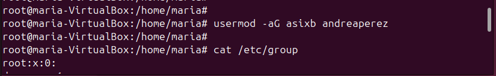
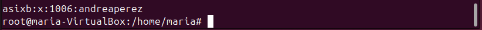

2. Seguidament per treure l'usuari ficarem la mateixa comanda, però en el parametre "-G" només.
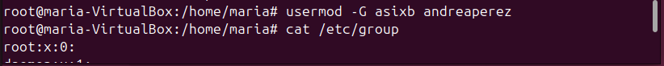

### CANVIAR LA FOTOOOOO!!!!
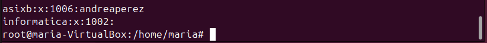

#### GPASSWD
1. A més també podem afegri usuaris a grups amb la comanda "gpasswd -a (nom ususari) (nom grup)". 
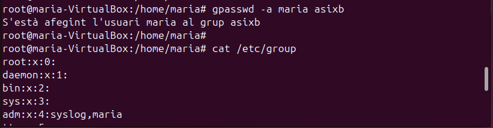
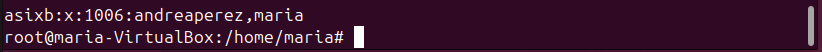

2. En aquesta mateixa comanda també podem treure usuaris de grups amb el parametre "-d".
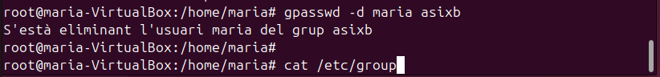
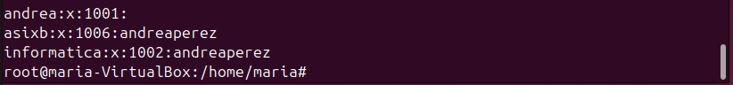

#### ADDUSER
1. En adduser també podem afegir ususaris a grups, utilitzant la comanda "adduser (nom usuari) (nom grup)". 
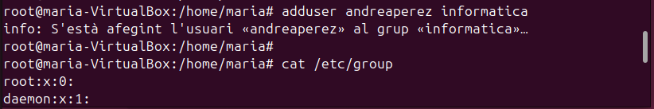
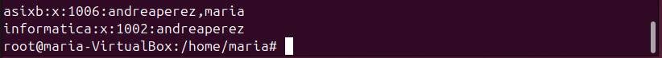

2. En una comanda pareguda a l'anterior podem eliminar aquests usuaris dels grups, "deluser (nom usuari) (nom grup)"
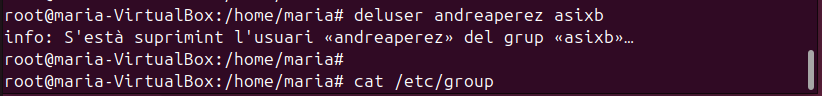
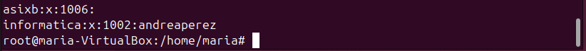

---

### Modificar grup principal d’un usuari
1. Per modificar el nom el grup principal d'un usuari haurem d'utilitzar la comanda "usermod -g (nom grup) (nom usuari)". Per comprovar-ho farem un "id (nom usuari)", aqui si revisem el gid veurem que ara està canviat.
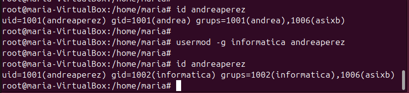

---
## Gestió de permisos

### Permissos normals

1. El primer haurem de fer és crear 4 usuaris, en el meu cas he creat a Lola, Laura, Mariona i Martina.
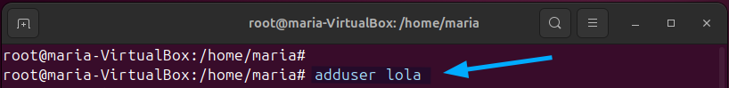 
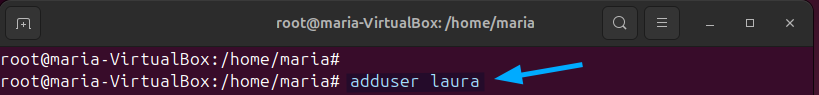
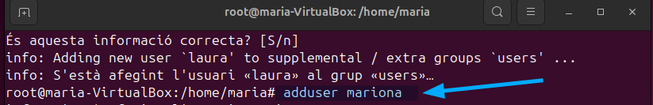 
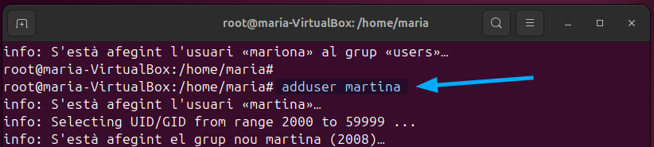

2. Seguidament, revisarem que realment estan creats els 4 usuaris al fitxer /etc/passwd. 


3. Després crearem un grup anomenat grup-a i afegirem als usuaris lola i mariona.
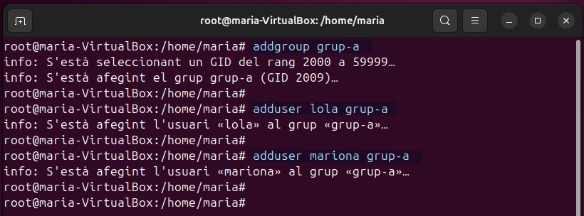

4. L'ultim pas 
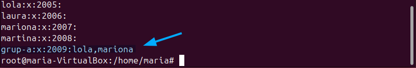


#### CHGRP
1. 


2. 


#### CHMOD
1. 


2. 


3. 


4. 


5. 


6. 


#### CHOWN


### Permissos especials
#### STICKY
1. 


2. 


3. 


#### SUID
1. 


2. 


#### SGID
1. 


### Permissos en ACL 
1. 


2. 


3. 


4. 


5. 


6. 


---
## Sistemas de fitxers i particions
### Estructura física
L’estructura física fa referència als components tangibles que constitueixen un sistema d’emmagatzematge. Aquests inclouen discos durs (HDD), unitats d'estat sòlid (SSD), memòries flash, i altres dispositius. Els elements físics importants són les pistes, sectors i cilindres en el cas dels HDD, i les cel·les d'emmagatzematge en els SSD. Aquesta estructura és la base sobre la qual es construeixen els mecanismes d'emmagatzematge i recuperació de dades.

### Estructura lògica
L’estructura lògica representa com es gestionen i organitzen les dades dins del sistema operatiu. Inclou elements com el sistema de fitxers, carpetes, i enllaços simbòlics. Els sistemes de fitxers (com NTFS, FAT32, ext4) defineixen la manera com es llegeixen, escriuen i organitzen les dades emmagatzemades al dispositiu físic. Aquesta estructura permet als usuaris accedir a la informació d'una manera comprensible i eficient.

### Estructura de la informació
#### MIDA DEL SECTOR
La mida del sector és la unitat mínima física on es guarden les dades en un dispositiu d'emmagatzematge. Per defecte, aquesta mida sol ser de 512 bytes, però pot variar en dispositius més moderns amb sectors de 4 KB (4096 bytes). Aquesta mida està definida de fàbrica i no es pot modificar. Tot i això, el sistema operatiu no treballa directament amb sectors sinó amb blocs, que són unitats lògiques més grans on es guarden les dades.  

1. Per poder revisar els discs haurem d'executar la comanda "fdisk -l", aquesta és molt utils ja que et mostra l'identificador del disc (/dev/sda), el tamany (50 GB), el tipus (GPT o MBR), número de sectors, tamany del sector, etc.
```
sudo fdisk -l
```


#### MIDA DEL BLOC
El bloc és la unitat mínima lògica d'emmagatzematge utilitzada pel sistema operatiu. La mida del bloc es pot configurar durant el procés de formatatge d'una partició. La mida del bloc influeix en l'eficiència de l'emmagatzematge: blocs més grans poden ser més ràpids però poden generar més espai desaprofitat (fragmentació interna).    

Per mostrat els blocs haurem de especificar quina partició sobre tot. La comanda és la següent:
```
tune2fs -l /dev/sda2 | grep Block
```


#### FRAGMENTACIÓ INTERNA
La fragmentació interna es produeix quan un fitxer no omple completament un bloc assignat, deixant espai sense utilitzar. Aquest espai es considera desaprofitat. La mida del bloc és clau per minimitzar aquest tipus de fragmentació. Si reduïm la mida dels blocs, es pot disminuir la fragmentació interna, però això pot impactar negativament el rendiment, ja que el sistema haurà de gestionar més blocs.   

1. Seguidament, crearem un fitxer nou anomenat hola, en el que escriurem "bon dia". Després comprovarem que existeix amb un "ls" i mostrarem el contigut per terminal amb "cat". Per demostrar la fragmentació interna executarem la comanda "du -b hola" i "du -sh hola". Podem comprovar que en la primera comanda mostra un 8  que vol dir que el fitxer ocupa 8 Bytes, en la segona comanda mostra la mida real que ocupa el fitxer, aquesta és 4Kb.    
```
echo "bon dia" > hola
```
```
ls
```
```
cat hola
```
```
du -b hola
```
```
du -sh hola
```


2. Per últim, si revisem per GUI els parametres del fitxers, ens mostra 8 Bytes.


#### FRAGMENTACIÓ EXTERNA
La fragmentació externa ocorre quan els fitxers es guarden en blocs dispersos en lloc de ser contigus. Això afecta el rendiment, ja que es necessiten més operacions per accedir a les dades. Aquesta situació és més habitual en dispositius d'emmagatzematge que han estat utilitzats durant molt de temps sense una reorganització (per exemple, una desfragmentació).   

1. La fragmentació externa es pot resoldre fent una desfragmentació, aquesta l'aconseguirem executant la comanda "e4defrag -c /dev/sda2" per visualitzar el que es necessita desfragmentar. Tot seguit per realitzar el proces escriurem la mateixa comanda, però sense el parametre "-c". D'aquesta manera aconseguirem organitzar el fitxers i augmentar el rendiment del disc. 


### Tipus de formateig
Hi ha tres tipus principals de formatatge, que es diferencien en la manera com preparen el dispositiu i tracten els blocs defectuosos:

* Formatatge de baix nivell: És un procés lent que organitza els sectors físics i reescriu tota la informació. Marca els blocs defectuosos i elimina completament totes les dades, recuperant l'estructura física del dispositiu. Sovint és realitzat pels fabricants.

* Formatatge intermig: No esborra les dades existents, però analitza el dispositiu i marca els blocs defectuosos perquè no s’utilitzin en el futur. És útil per diagnosticar problemes sense perdre informació.

* Formatatge ràpid: És molt més veloç perquè no comprova ni marca blocs defectuosos ni esborra les dades físicament. Només elimina l'índex del sistema de fitxers, fent que els fitxers semblin esborrats però encara estiguin presents físicament fins que es sobreescriguin.

La diferència principal entre aquests tipus és el tractament de les dades i dels blocs defectuosos, així com la velocitat i la profunditat del procés.

### Creacio de particions i formateig
1. Per començar, afegirem un disc dur de 2 GB i executarem la comanda "fdisk -l", per revisar que detecta el disc.


2. Seguidament, crearem una particio i utilitzarem la mitad del disc dur.


3. Una vegada fet, revisarem una altra vegada amb el "fdisk -l" que ara el disc te una nova particio, la sdb1.


4. El següent que farem és formatar la nova particio en format ext4 i amb mida de block 2048.


5. Com a comprovació haurem d'executar la comanda següent, la qual mostra la mida de block de la particio sdb1, per comprovar que el parametre -b de la comanda anterior ha funcionat: 


### Muntatge de particions
#### TEMPORAL
1. Per fer un muntatge temporal primer haurem de crear una carpeta en la que afegirem un nou fitxer, anomenat "hola". Seguidament executarem la comanda que fa possible el muntatge temporal "mount -t ext4 /dev/sdb1 /var/particio1". Si tornem a visualitzar el contigut de la carpeta veurem que el fitxer "hola", ja no està, això no vol dir que estigui esborrat sinó que al muntar la carpeta desapareix. A més per verificar que un muntatge està correctament realitzat veurem que apareix lost+found dins del directori.


2. Seguidament, quan creem fitxers dins del directori muntat, una vegada es desmunta desapareixen, però no s'esborren.


#### DEFINITIVA

1. Per començar, si volem un muntatge definitiu haurem de afegir una nova linia al fitxer /etc/fstab. 


2. Una vegada acabat reiniciarem la vm i una vegada es torne a encendre carregara el muntatge.     


3. Seguidament si comprovem el directori veurem que ja està muntat.


### Comparticio de carpeta a traves de servidor Samba
#### EXT4

1. El primer que haurem de fer és canviar l'adaptador de xarxa a pont.


2. Seguidament, instal·larem a la màquina real el smbclient.


3. Després tornarem a la vm i instal·larem nautilus-shared.


4. Per utilitzar-lo haurem de fer clic sobre un directori i escollir l'opcio recursos compartits.


5. Aqui veurem que tenim diferents opcions de permissos, però si intentem aplicarlos veurem que realment no podem.


6. Per compartir recursos hi ha una millor forma que amb nautilus-shared i aquesta és samba. Per això haurem de instal·lar-lo a la vm.      


7. Per poder afegir un nou recurs haurem d'anar a smb.conf, aqui anirem fins al final del fitxer i afegirem totes aquestes linies, que com podem veure son per definir la ruta, l'usuari, els permissos, etc.


8. Una vegada fet haurem de reinciar el servei samba amb la següent comanda:


9. Després anirem al directori i li canviarem un parell de coses: permissos (que en aquest cas, són totalment permissius) i usuari + grup propietari (aquest seran nobody:nogroup, per a que qualsevol usuari pugui accedir i crear).


10. Seguidament crearem l'usuari que haviem deifnit abans en el fitxer smb.conf, anonemat "platano". Després li assignarem una contrasenya per al samba.


11. Tot seguit, visutalitzarem des de la maquina real els recursos commpartits del servidor (maquina virtual), veurem que ens apareix el directori en qüestió.


12. A partir de la interficie grafica anirem a fitxers, altres ubicacions i afegirem la següent linia en el recuadre que marca la captura: smb://192.168.203.208/particio1.


13. Després afegirem l'usuari "platano" i la contrasenya que hem assignat per al samba anteriorment. Seguidament ja estarem dins del directori.     


14. Per últim, farem unes proves de connexió. El que haurem de fer és crear una carpeta o fitxer des de la maquina real i després comprovar al servidor que s'han realitzat els canvis a temps real.


#### NTFS

1. Per començar, comprovarem l'estat del disc amb fdisk -l, com podem observar queda encara la mitad.


2. Per tant, crearem l'altra particio.


3. Seguidament la formatarem, però en aquest cas NO serà en ext4 sinó en NTFS.


4. Una vegada fet crearem el directori particio2 i crearem el fitxer hola (com a la particio1).


5. Tot seguit, farem un mutatge definitiu al fitxer fstab. Com podem comprovar aqui també serà necessari canviar ext4 per NTFS.


6. Seguidament afegirem un nou recurs compartit al fitxer smb.conf, aquest tindrà un usuari diferent anomenat "fresa". Quan acabessim haurem de reinciar el servei samba.


7. Després canviarem permissos i propietaris a la carpeta que volem compartir, però si ens fixem quan reivsem el resultat no s'apliquen els canvis de propietaris, això és perquè la particio es NTFS.


8. Per poder solucionar-ho haurem d'anar també al fstab i afegir nobody, nogroup a la linia de muntatge.


9. Una vegada fet, haurem de crear l'usuari "fresa" i afegir una contrasenya de samba especifica del usuari.


10. Ara des de la maquina real comprovarem els recursos compartits del servidor.


11. Ens connectarem amb l'usuari fresa i ja tindrem acces. Per comprovar-ho crearem la carpeta "prova".


12. Després anirem al servidor i veurem que l'carpeta esta creada.


13. Seguidament, ens connectarem des de Windows, per fer-ho haurem de estar amb una vm en adaptador pont. Despés afegirem una nova unitat de xarxa, qual portara la ruta "\\\192.168.1.155\particio2". A més haurem de marcar l'opció "Conectar con otras credenciales" sinó no funcionarà.      


14. Tot seguit, ficarem les credencials de l'usuari fresa i ja tindrem acces al recurs compartit.


15. Per últim, crearem una carpeta nova des de windows i comprovarem que apareix tant al servidor com a la maquina real.


---
## Còpia de seguretat i automatització de tasques

---
## Quotes de disc


---
