# Administració de dominis i seguretat

Per a la documentació completa visita [mkdocs.org](https://www.mkdocs.org).

---
## Introducció

En aquest projecte, configuraré un sistema Ubuntu Linux en una màquina virtual per gestionar dominis, usuaris i polítiques de seguretat mitjançant LDAP. Instal·laré i configuraré un servidor LDAP, crearé usuaris i grups, i definiré normes de seguretat per protegir l’accés al sistema.

També integraré serveis essencials com servidors de fitxers i connexions remotes segures, optimitzant els recursos i assegurant una gestió centralitzada dels usuaris. A més, aplicaré mesures de seguretat per protegir el sistema i controlar els permisos d’accés.

Finalment, faré proves per verificar que tot funciona correctament i documentaré cada pas amb captures de pantalla.
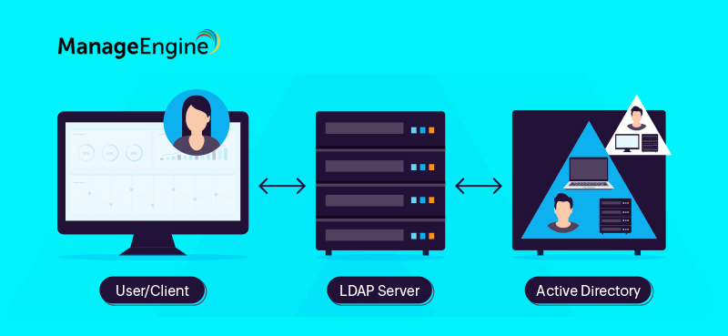

---

## Instal·lació domini ldap

Un domini LDAP és una estructura que ens ajuda a gestionar usuaris, grups i recursos dins d'una xarxa de manera centralitzada. Funciona com un directori organitzat jeràrquicament, similar a un arbre, on podem trobar usuaris, grups, i altres recursos (impressores, servidors) organitzats en Unitats Orgàniques (UOs), com si fossin carpetes dins del domini.

Estructura bàsica d'un domini LDAP:

* UOs: Contenen grups d'usuaris i recursos (ex. "Recursos Humans", "TI").
* Usuaris: Representen les persones de la xarxa, amb atributs com nom, correu, contrasenya, etc.
* Grups: Col·leccions d'usuaris amb permisos similars (ex. "Administradors").
* Recursos: Impressores, servidors, etc.

Per crear l'esquema bàsic d'un domini LDAP tenim dues opcions:

* Fitxers LDIF: Creem un fitxer amb la informació (usuaris, grups, etc.) i el carreguem al servidor LDAP. És útil per afegir moltes dades de cop.

* Comanda `ldapadd`: Utilitzem aquesta comanda per afegir directament la informació al servidor LDAP. Llegirà un fitxer LDIF i afegirà les dades al domini.

**Polítiques de Grup (GPOs)**

Els GPOs permeten aplicar configuracions i regles comunes a grups d'usuaris o dispositius dins del domini, com limitacions d'accés o configuracions de seguretat.


---

1. En la màquina server ubuntu desktop 24 haurem de canviar la interifície a NatNetwork. 
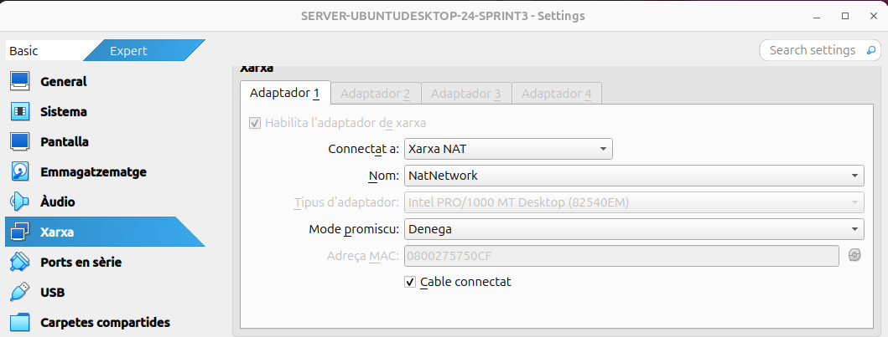

2. Seguidament, revisarem la ip i la farem estàtica, ja que, els servidors sempre han de tindre una ip fixa.
```
ip a
```
```
google.com
```

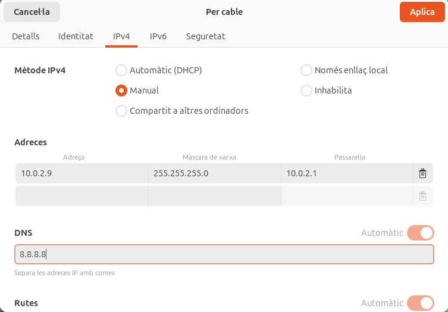
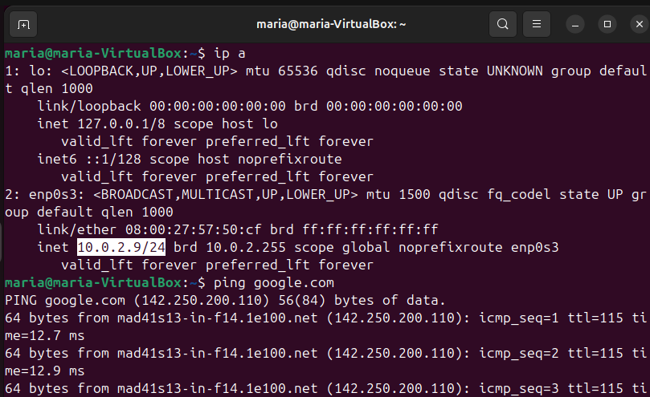

3. A continuació, farem un `apt update` i `apt upgrade`.
```
apt update
```
```
apt upgrade
```
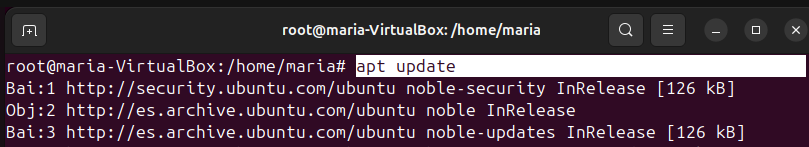
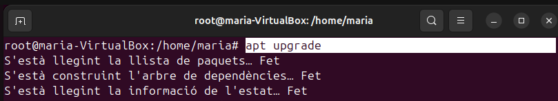

4. Després anirem al moodle descarregarem el comprimit arxius.zip i el descomprimirem amb la comanda `unzip`, com podem observar té diferents arxius de configuració.
```
cd Baixades/
```
```
unzip arxius.zip
```
```
ls
```
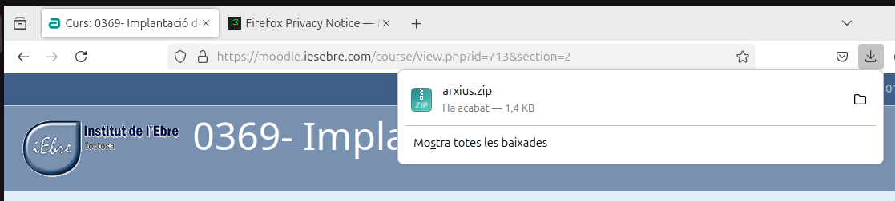
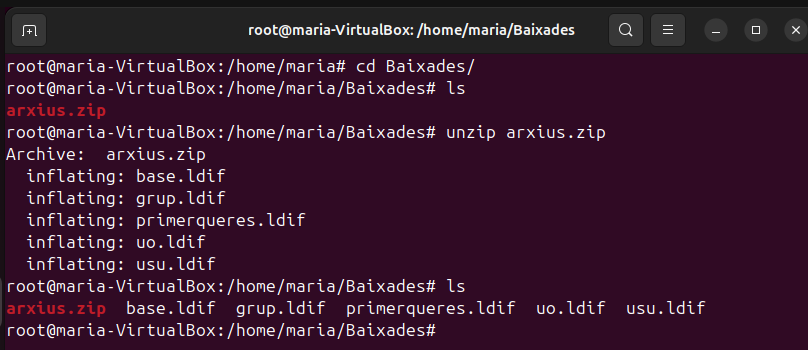

5. Tot seguit, canviarem el hostname de la nostra vm (aquest pas és opcional). A més al fitxer /etc/hosts tornarem a canviar el hostname si ho hem fet previament i també afegirem una nova linia en la que indicarem la ip del server, el nostre hostname, el nom del domini en aquest cas "asix.cat" i per últim afegirem una altra vegada el hostname. 
```
nano /etc/hosts
```
```
nano /etc/hostname
```
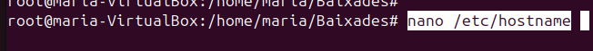
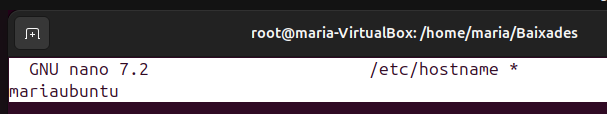
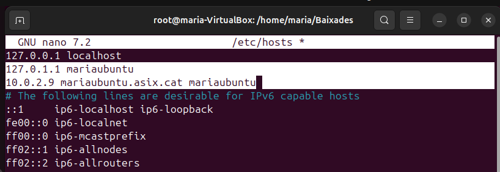

6. Seguidament, reiniciarem la vm i una vegada encesa comprovem el hostname.
```
reboot
```
```
hostname
```
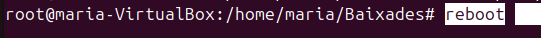
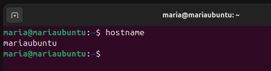

7. Ara instal·larem els paquets slapd i ldap-utils.
```
apt install slapd ldap-utils
```
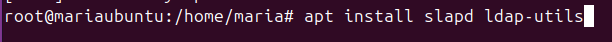

8. Una vegada a inciada l'instal·lació assignarem una contrassenya a l'administrador.       
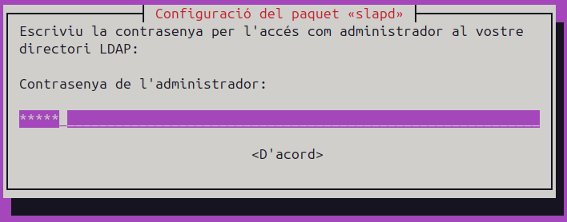
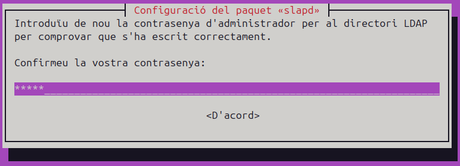

9. Després amb la comanda slapcat mirarem la informació del slapd, com podem comprovar no hi ha cap domini configurat.
```
slapcat
```
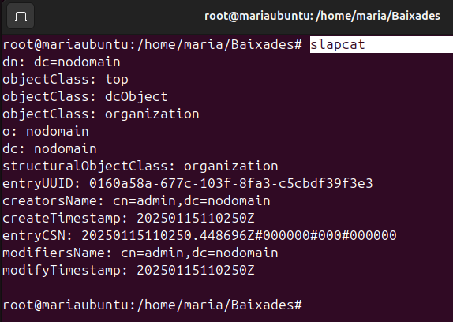

10. En aquest cas tornarem a configurar slapd. Una vegada dins clicarem en "No" per poder continuar, després escriurem el nom del domini dues vegades, a més tornarem a configurar la contrasenya i clicarem en "Sí" dues per afegir la configuració actual.        
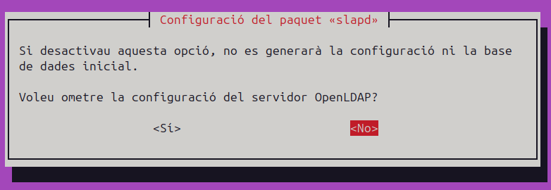
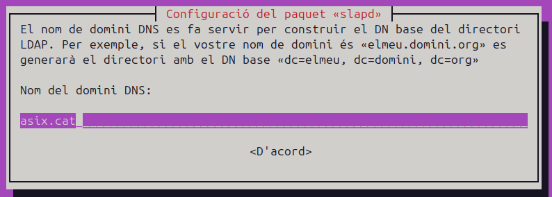
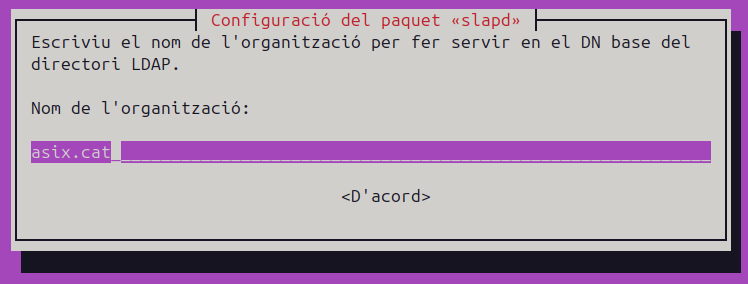
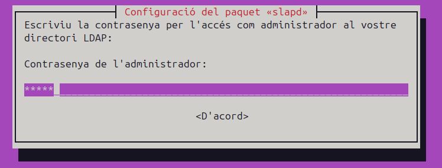
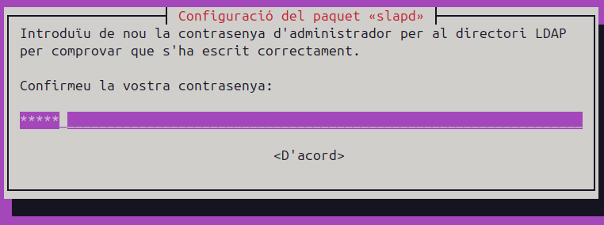
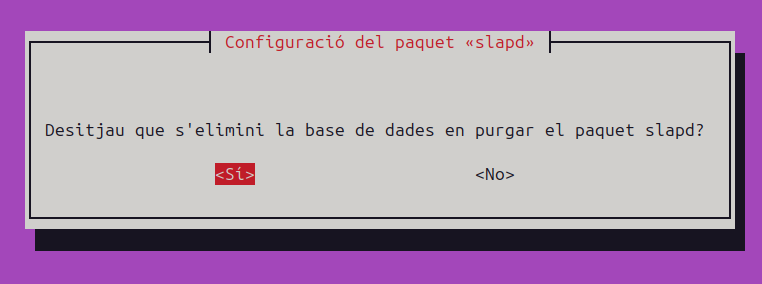
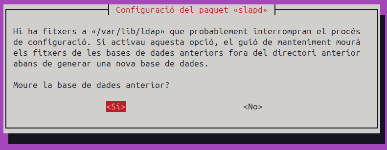

11. Seguidament, si tornem a fer slapcat veurem que s'ha actulitzat la informació del domini.
```
slapcat
```
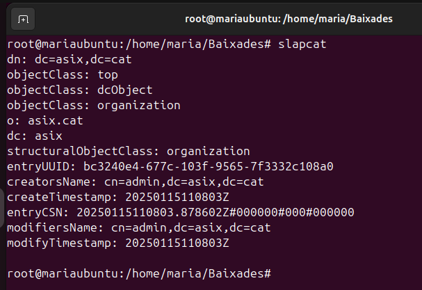

12. Ara el que farem és editar el fitxer de configuració "uo.ldif", aquí definirem les unitats organitzatives (OU) dins del directori LDAP, que serveixen per agrupar i organitzar objectes com usuaris, grups o altres unitats, mantenint una estructura jeràrquica clara i coherent.
```
nano uo.ldif
```
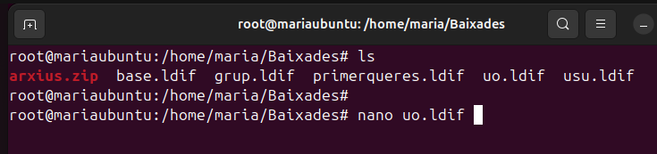
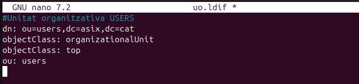

13. Tot seguit, editarem el fitxer "grup.ldif", la seva funció és crear i configurar grups dins del directori LDAP, permetent agrupar usuaris amb propòsits específics, com gestionar permisos i accessos de manera eficient.
```
nano grup.ldif
```
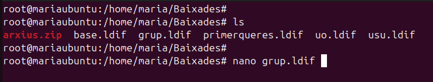
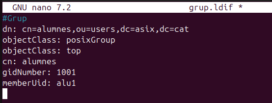

14. Per últim, configurarem fitxer "usu.ldif" on definirem els atributs dels usuaris (nom, UID, contrasenya i OU corresponent) per assegurar que cadascun tingui accés al sistema i als recursos necessaris.
```
nano usu.ldif
```
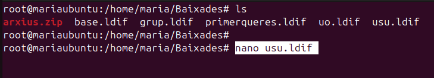
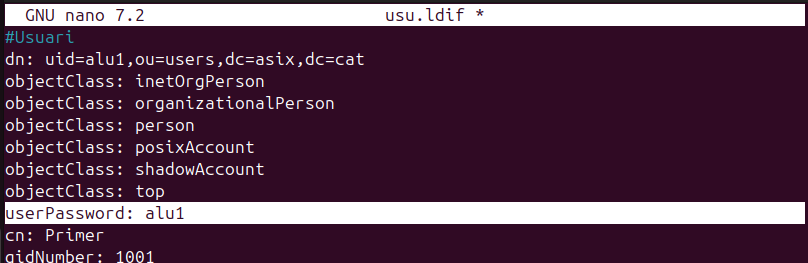
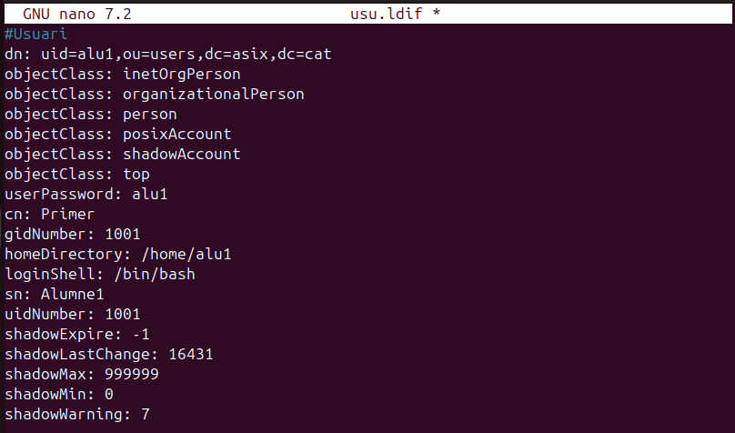

15. Seguidament, afegirem tots el fitxers de configuració i revisarem el slapcat.
```
ldapadd -c -x -D "con=admin,dc=asix,dc=cat" -W -f uo.ldif
```
```
ldapadd -c -x -D "con=admin,dc=asix,dc=cat" -W -f grup.ldif
```
```
ldapadd -c -x -D "con=admin,dc=asix,dc=cat" -W -f usu.ldif
```
```
slapcat
```

    * -x: Connexió simple.
    * -D: Usuari administrador que afegeix dades.
    * -W: Demana la contrasenya de l'usuari.
    * -f: Fitxer LDIF amb les dades a afegir.

    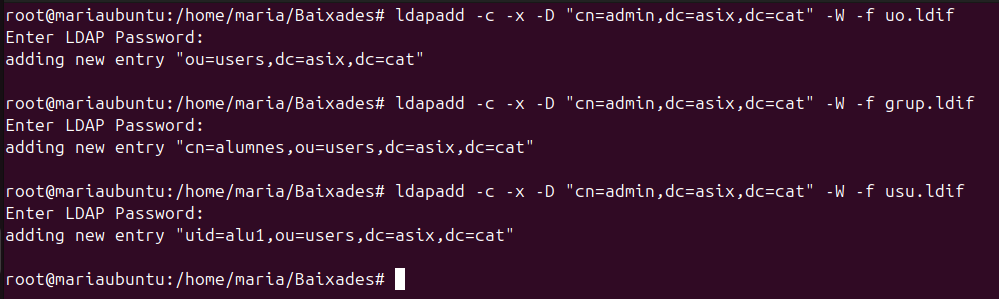
    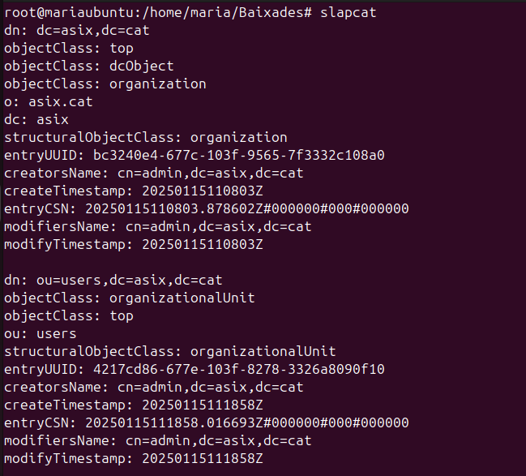
    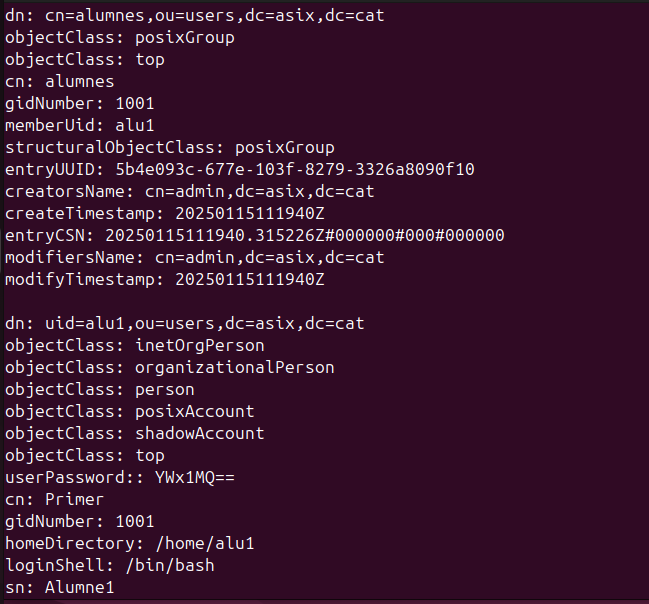
    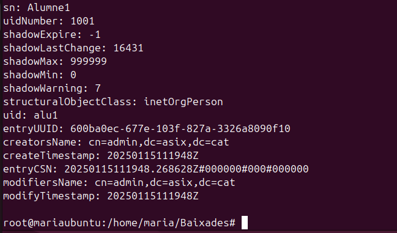

---

## Unir un client al domini
En aquest apartat unirem un client al domini per permetre una gestió centralitzada dels usuaris i recursos de xarxa. Això facilitarà l’autenticació, l’aplicació de polítiques de seguretat i la gestió dels permisos d’accés. A continuació, veurem els passos necessaris per realitzar aquesta configuració de manera eficient i segura.

1. El primer que haurem de fer és canviar l'adaptador de xarxa del Ubuntu Desktop 24 Client a NatNetwork, així estaràn a la mateixa xarxa i es podran comunicar.        
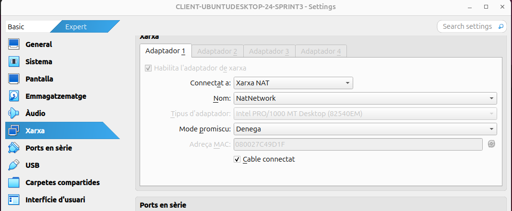

2. A més revisarem la ip des de terminal per comprovar que no coincideixen i seguidament farem ping al servidor.
```
ip a
```
```
ping 10.0.2.9
```
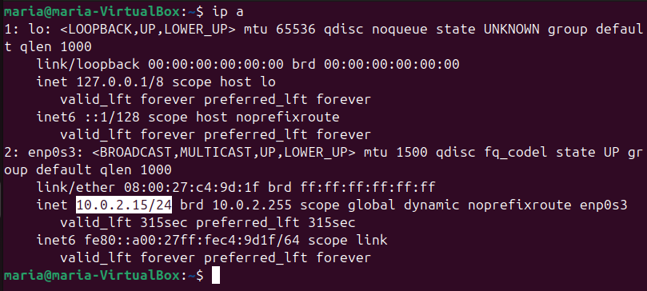
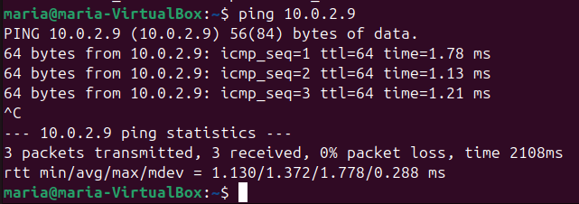

3. A continuació, descarregarem els paquets de ldap client i farem un reconfigure per posar a punt la configuració.
```
apt install libnss-ldap libpam-ldap nscd
```
```
depkg-reconfigure ldap-auth-config
```
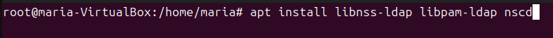
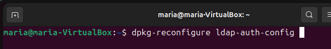

4. En la primera i segona pantalla haurem de indicar "Sí", després escriurem el nom de domini i configurarem la contrasenya.        
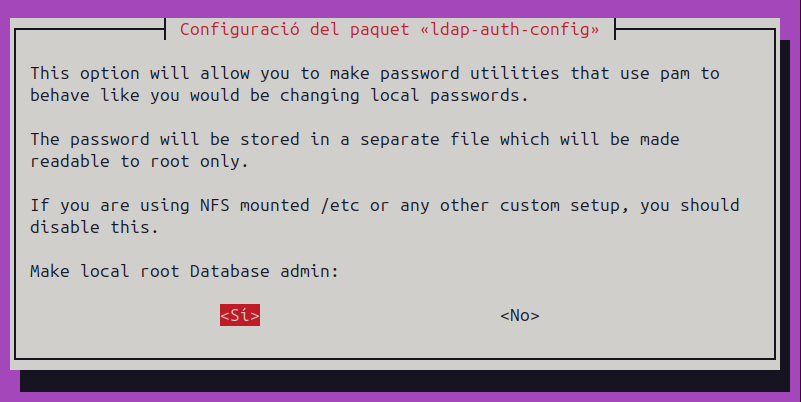

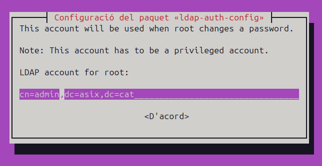
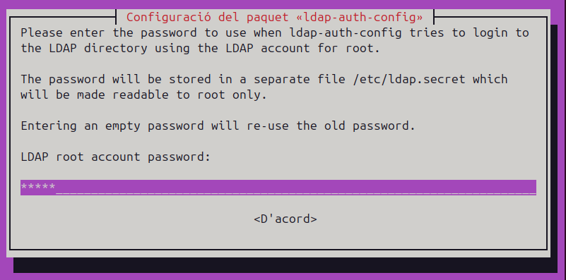
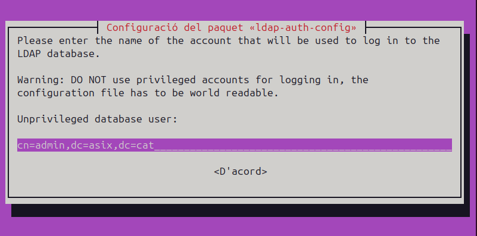


5. Una vegada hem fet tota la configuració anterior en tornara a preguntar i li haurem de indicar "Sí". També escriurem la ip del server a la següent pantalla i tornarem a introduir el domini, després escollirem la versio i continuarem així fins arribar al tipus d'encriptacio que serà l'última pantalla de configuració.        
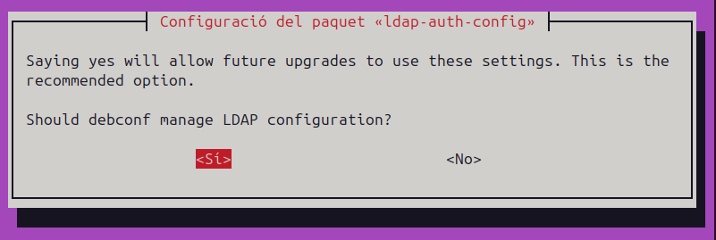
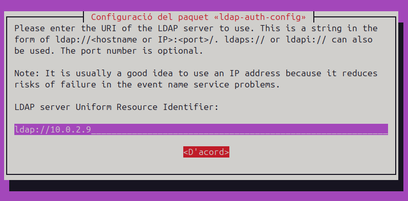
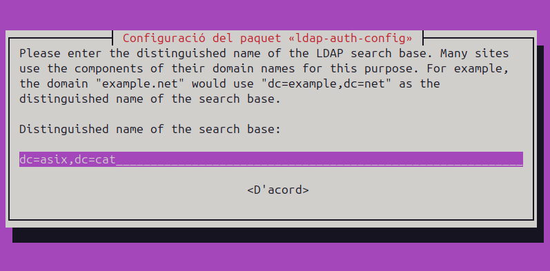
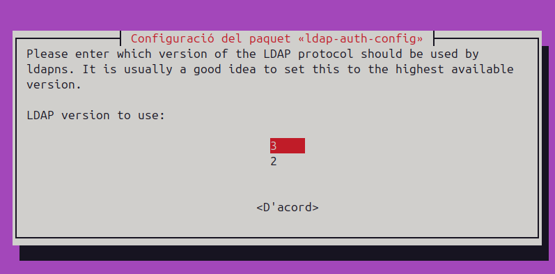
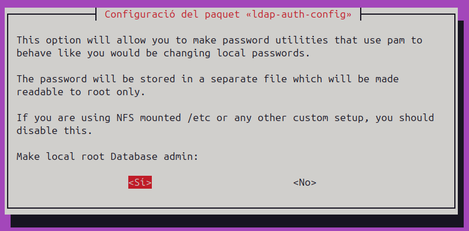


6. Al finalitzar la configuració haurem d'editar una seria de fitxers com /etc/nsswitch.conf en el que escriurem "ldap compat" davant de les 4 primeres linies, això indica que el sistema ha de buscar la informació en el servidor ldap. 
```
nano /etc/nsswitch.conf
```


7. El següent fitxer és /etc/pam.d/common-session en aquest li haurem d'escriure una nova linia. La línia configura que, durant l’autenticació, si l’usuari no té un directori home, aquest es creï automàticament utilitzant com a plantilla el contingut de /etc/skel i aplicant un umask=077 per garantir que els permisos siguin segurs (només accessibles pel propietari).
```
nano /etc/pam.d/common-session
```


8. Aquest últim fitxer de configuració, no és estrictament necessari en l'última versió d'ubuntu, encara que si estas en versions anteriors serà fundamental. Haurem d'afegir una nova linia, aquesta configura la sessió predeterminada com "ubuntu" i permet l'inici de sessió manual escrivint el nom d'usuari a LightDM.
```
nano /usr/share/lightdm/lightdm.conf.d/50-ubuntu.conf
```


9. Seguidament revisarem que l'usuari creat en el servidor està al llistat del client i si és així iniciarem sessió des de terminal. 
```
getent passwd | grep alu1
```


10. Per provar que funciona amb interficie grafica reiniciarem la vm i en la pantalla de bloqueig iniciarem sessio amb un usuari no llistat, aquí indicarem username i password. Si tot funciona bé quan obrim un terminal i escribim la comanda "whoami" ens ha de donar l'usuari ldap. 
```
reboot
```
```
whoami
```


---

## Canvis en un Ubuntu Server

En aquest apartat realitzarem la instal·lació i configuració del domini LDAP en un Ubuntu Server, seguint el mateix procés que en Ubuntu Desktop, però sense interfície gràfica. Treballarem exclusivament des de la línia de comandaments per instal·lar, configurar i gestionar el servidor LDAP, assegurant-ne el correcte funcionament i la integració amb els usuaris i recursos de la xarxa.

1. El primer canvi és que el hostname del servidor ha de ser directament el propi nom del domini ldap.       


2. Seguidament com estem en un entorn sense GUI haurem de editar el fitxer de netplan per afegir una ip estàtica.       


3. Una vegada hem acabat comprovarem que la ip és la correcta i farem un ping al exterior per saber si tenim connexió a internet.       


---

## Gestió del domini

En aquest apartat abordarem la gestió del domini mitjançant comandes essencials d'LDAP, com ldapsearch, ldapadd, ldapdelete i ldapmodify. Aquestes eines permeten consultar, afegir, eliminar i modificar usuaris, grups i altres elements del directori LDAP. A través d'aquests comandaments, assegurarem un control precís de la base de dades LDAP i una administració eficient dels recursos del domini.

---

### LDAPSEARCH

En aquest apartat explorarem ldapsearch, una eina fonamental per consultar informació emmagatzemada en el directori LDAP. Amb aquesta comanda, podem buscar usuaris, grups i altres objectes del domini aplicant diferents filtres i opcions. Aprendrem a utilitzar ldapsearch de manera eficient per obtenir informació rellevant i verificar la configuració del servidor LDAP.

1. El primer que farem és provar diferents opcions com buscar un usuari pel uid.
```
ldapsearch -xLLL -b "dc=asix,dc=cat" uid=miguel
```


2. Seguidament buscarem per uid, però concretant en els camps. Els camps que no existeixent com 'mail' no els mostra.
```
ldapsearch -xLLL -b "dc=asix,dc=cat" uid=miguel dn cn sn mail uid
```


3. Seguidament llistarem tots el posixGroup.
```
ldapsearch -xLLL -b "dc=asix,dc=cat" objectClass=posixGroup dn
```


4. A més, podem buscar el numero que hi ha de grups, tenint en compte que el sistema també conta el espais en blanc.
```
ldapsearch -xLLL -b "dc=asix,dc=cat" objectClass=posixGroup dn | wc -l
```


5. A continuació buscarem a partir de un uid major o igual a 1002.
```
ldapsearch -xLLL -b "dc=asix,dc=cat" "uidNumber>=1002" dn uidNumber
```


6. Ara buscarem a partir de un 'cn' que comence amb 'M' o qualsevol registre de mail. A més també tenim l'opció de que les dues opcions s'han de complir amb '&' en comptes de '|'.
```
ldapsearch -xLLL -b "dc=asix,dc=cat" "(|(cn=M*)(mail=*))"
```
```
ldapsearch -xLLL -b "dc=asix,dc=cat" "(&(cn=M*)(mail=*))"
```


---

### LDAPADD 

En aquest apartat explorarem ldapadd, una eina fonamental per afegir noves entrades al directori LDAP. Amb aquesta comanda, podrem introduir usuaris, grups i altres objectes al directori mitjançant un fitxer LDIF que defineix les dades a afegir. Aprendrem a utilitzar ldapadd de manera eficient per incorporar noves entrades i gestionar la informació del domini LDAP de manera centralitzada.

#### OPCIÓ 1
Per poder afegir un fitxer ho podem fer d'aquesta manera, la qual només involucra una comanda.
```
ldapadd -x -D "cn=admin,dc=asix,dc=cat" -W -f dades_prova.ldif
```


#### OPCIÓ 2
La segona opció és afegir una nova linia al fitxer i després executar ldapmodify. 
```
ldapmodify -x -D "cn=admin,dc=asix,dc=cat" -W -f grups.ldif
```


---

### LDAPDELETE 

En aquest apartat explorarem ldapdelete, una eina essencial per eliminar entrades del directori LDAP. Amb aquesta comanda, podrem suprimir usuaris, grups i altres objectes del directori de manera controlada. Aprendrem a utilitzar ldapdelete per gestionar i mantenir el directori LDAP net, eliminant elements que ja no siguin necessaris o que hagin caducat, tot garantint la seguretat i coherència del sistema.

#### OPCIÓ 1
La primera opció per eliminar és només amb la comanda ldapdelete. 
```
ldapdelete -x -D "cn=admin,dc=asix,dc=cat" -W "cn=persones,ou=users,dc=asix,dc=cat"
```


#### OPCIÓ 2
Com a alternativa, també podem utilitzar ldapmodify.
```
ldapmodify -x -D "cn=admin,dc=asix,dc=cat" -W -f grups.ldif
```


---

### LDAPMODIFY  

En aquest apartat explorarem ldapmodify, una eina clau per modificar les entrades existents al directori LDAP. Amb aquesta comanda, podrem actualitzar informació d'usuaris, grups i altres objectes del directori mitjançant un fitxer LDIF que defineix els canvis a aplicar. Aprendrem a utilitzar ldapmodify de manera eficient per mantenir el directori LDAP actualitzat i gestionar les modificacions de dades de manera centralitzada i controlada.

---

#### CHANGETYPE: MODIFY
1. El primer que farem és afegir les dues ultimes linies al fitxer de configuració i després executar la comanda.
```
ldapmodify -x -D "cn=asix,dc=asix,dc=cat" -W -f proves.ldif
```


2. Seguidament eliminarem d'aquesta manera el camp mail.
```
ldapmodify -x -D "cn=asix,dc=asix,dc=cat" -W -f proves.ldif
```


3. També podem optar per una opció així.
```
ldapmodify -x -D "cn=asix,dc=asix,dc=cat" -W -f proves.ldif
```


---

#### CHANGETYPE: MODRDN
1. En aquest cas podem també podem utilitzar modrdn amb deleteoldrdn.
```
ldapmodify -x -D "cn=asix,dc=asix,dc=cat" -W -f proves.ldif
```


---

## Entorns gràfics

En aquest apartat parlarem de Apache Directory Studio i JXplorer, dues eines gràfiques molt útils per gestionar directoris LDAP de manera visual. Aquestes aplicacions faciliten la interacció amb el servidor LDAP sense necessitat d’utilitzar la línia de comandes, fet que fa que sigui molt més senzill gestionar les dades.

---

### Apache Directory Studio

Apache Directory Studio és una eina completa que permet crear, editar i eliminar entrades en el directori LDAP. A més, té una interfície clara i intuïtiva per fer cerques i administrar la configuració del servidor LDAP de manera fàcil.

1. Primer ens assegurarem que les màquines virtuals tinguin connexions.


2. Aleshores veurem si java està instal·lat escrivint l'ordre "java -version". Jo no el tenia, així que vaig instal·lar java.
```
sudo apt install default-jre
```


3. Després baixarem el directory studio d'apache de la web i després descomprimirem el paquet.
```
cd Baixades
```
```
tar -xzvf
```


4. Seguidament, entrarem dins del directori i executarem el programa i un cop estiguem dins afegirem una nova Connexió LDAP.
```
cd ApacheDirectoryStudio/
```
```
./ApacheDirectoryStudio
```


5. Després escriurem el nom de la connexió, la ip del servidor i després crearem una contrasenya.       


6. Tot seguit, podrem visualitzar totes les unitats organitzatives, grups i usuaris que hem creat al servidor.      


1. Per crear una UO, hem d'iniciar una nova entrada.        


2. A continuació, afegim l'opció "organizationalUnit" i "top".      


3. Després li ficarem un nom, en aquest cas "prova".        


4. Per últim, li donarem a finish i ja la tindrem creada.       


1. Ara crearem un grup, hem d'iniciar una nova entrada.     


2. A continuació, afegim l'opció "posixGroup" i "top".      


3. Seguidament, incloem un nom comú (cn) i un identificador de grup (gidNumber).        


4. En finalitzar, l'entrada del grup hauria de semblar-se al format següent.        


5. Passant a crear un usuari, també iniciem una nova entrada.       


6. A continuació, incloem les opcions "inetOrgPerson", "organizationalPerson", "person", "posixAccount", "shadowAccount" i "top".       


7. Posteriorment, afegim un identificador d'usuari (uid), un identificador de grup (gidNumber), un nom comú (cn) i un cognom (sn). A més, proporcionem detalls per al directori d'inici i l'identificador d'usuari, entre altres coses.     


8. Un cop finalitzats aquests detalls, ja tindrem el nostre usuari a l'esquema.     


9. Finalment inciarem sessió amb l'usuari i revisarem al server que l'usuari està a ldap.       


---

### JXplorer

Per altra banda, JXplorer és una eina més lleugera que també serveix per treballar amb LDAP. Tot i ser més senzilla que Apache Directory Studio, és molt útil per fer cerques ràpides i gestionar entrades sense complicacions.

1. El primer que farem serà instal·lar "JXplorer".
```
sudo apt install jxplorer
```


2. Seguidament executarem el programa, tenim dues formes per fer-ho.
```
nohup jxplorer
```
```
nohup jxplorer &
```


3. Una vegada dins afegirem el servidor ldap.       


4. Tot seguit, crearem una nova entrada per a la UO.        


5. Després crearem el grup.     


6. Per últim afegirem un nou usuari.        


7. Ara que ja tenim tota l'estructura feta, inciarem sessio amb l'usuari i després revisarem al servidor.       


---

## Server NFS

### Què és NFS?
NFS (Network File System) és un protocol que permet compartir directoris i fitxers entre màquines a través d'una xarxa. És molt utilitzat en entorns Linux/Unix per permetre que una màquina accedeixi a fitxers d'una altra com si fossin locals, tot i que estan en un servidor remot.

### Diferència entre NFS i Samba

* NFS és ideal per compartir fitxers entre màquines Linux/Unix dins d'una xarxa local (encara que també es pot aplicar a clients Windows).

* Samba es fa servir per compartir fitxers entre sistemes Linux i Windows, ja que utilitza el protocol SMB que és propi de Windows.

### Autenticació a nivell de host

L’autenticació a nivell de host assegura que només les màquines autoritzades poden accedir als recursos compartits. Això es fa mitjançant la validació de l’adreça IP o el nom de l’equip. Si l’equip està autoritzat, pot muntar els recursos, si no, no pot accedir-hi.

---

### Instal·lació

#### SERVIDOR 

1. Instal·larem el servei nfs-kernel-server i una vegada fet revisarem l'estat del servei.
```
apt update
```
```
apt install nfs-kernel-server
```
```
systemctl status nfs-server
```


#### CLIENT UBUNTU
1. En ubuntu client instal·larem el paquet "nfs-common rpcbind".


#### CLIENT WINDOWS 

1. Aquí entrarem dins del "control panel", clicarem en "iconos pequeños" i després en "Programas y caracteristicas"


2. Després farem clic en "Activar o desactivar las caracteristicas de Windows" dins activarem tottes les caselles de NFS.


3. Quan acabem ens sortirà un missatge de que els canvis han estat aplicats.


---

### Compartición carpeta al server y pruebas

1. Primer, crearem la carpeta "compartida" en l'arrel, li ficarem els permissos de propetari nobody:nogroup i permissos total de lectura, escriptura i execució. 
```
cd /
```
```
mkdir compartida
```
```
ls -la | grep compartida
```
```
chown nobody:nogroup compartida/
```
```
chmod -R 777 compartida/
```


2. A més, entrarem dins del fitxer /etc/exports i afegirem una nova linia.
```
nano /etc/export
```
```
/compartida *(rw,sync,no_subtree_check)
```


3. Seguidament, entrarem dins de la carpeta i crearem un fitxer anomenat "hola".
```
cd compartida
```
```
touch hola
```
```
ls
```


4. En windows provarem connexió amb el server.
```
ipconfig
```


5. Tot seguit, entrarem en "Red" i afegirem la ip del server, de forma que ens sortirà la carpeta.      


6. A continuació, crearem una carpeta nova dins del recurs compartit.


7. Després, anirem al client ubuntu, crearem la carpeta "nfs" a /mnt, afegirem permissos 777 i muntarem la carpeta al servidor. Una vegada fet entrarem dins i crearem un fitxer.
```
cd /mnt
```
```
mkdir nfs
```
```
chmod -R 777 nfs/
```
```
ls nfs/
```
```
mount 10.0.2.9:/compartida /mnt/nfs/
```
```
touch provaubuntu
```


8. Per últim, revisarem la carpeta al servidor per comprovar que realment estàn els dos fitxers que hem creat amb els diferents clients.
```
cd compartida/
```
```
ls
```


---

### Perfil Movil (Ubuntu LDAP)

Un perfil mòbil permet que els usuaris tinguin les mateixes dades i configuracions disponibles a qualsevol màquina. Amb LDAP, els fitxers i la configuració de l’usuari es guarden en un servidor centralitzat, així que l’usuari pot accedir-hi des de qualsevol màquina sense dependre de la màquina en si.


1. El primer que farem és un `apt install nfs-kernel-server` si no el tenim fet.        


2. Seguidament crearem la carpeta "perfils", li donarem permisos "nobody:nogroup" de propietari.        


3. Després anirem a /etc/exports i aquí afegirem una nova linia.        


4. Una vegada hem acabat de editar el fitxer reiniciarem el servei per a que s'apliquen els canvis.     


5. A continuació anirem al client que ja estava prèviament al domini i instal·larem aquests paquets: apt install nfs-common rpcbind.        


6. Després crearem la carpeta perfils i afegirem permisos 777.      


7. Seguidament, farem el muntatge permanent al fitxer /etc/fstab.       


8. Tornarem al servidor i afegirem un nou usuari, aquest és important que tingui com a home la ruta /perfils.       


9. A continuació, en l'usuari revisarem que està l'user que acabem de crear.        


10. Per últim, reniciarem i entrarem amb l'usuari.           


---

## Server SAMBA

### Què és Samba?
Samba és una implementació de SMB (Server Message Block), un protocol que permet compartir fitxers i impressors entre sistemes Linux/Unix i Windows. Gràcies a Samba, els equips Linux poden interactuar i compartir recursos amb equips Windows, ja que SMB és el protocol que utilitzen els sistemes Windows per la compartició de fitxers i serveis de xarxa.

### Funcionalitat de Samba

Samba permet que els sistemes Linux/Unix es comportin com a servidors de fitxers i impressores per a dispositius Windows, i viceversa. Això inclou:

* Compartir directoris i arxius entre equips Windows i Linux.
* Fer servir els serveis d’impressió entre aquests sistemes operatius.
* Permetre la connexió a màquines Windows des de Linux (i a l’inrevés) amb un control total sobre permisos i autenticació.

--- 

1. El primer pas és instal·lar samba al servidor.       


2. Seguidament, crearem la carpeta /proves, li assignarem permissos 777 i prpitaris nobody:nogroup. A més cream un fitxer de prova anomenat "hola".     


3. A continuació editarem el fitxer de configuració de samba.       


4. Dins del fitxer afegirem les següents linies.
    * `[proves]`: Defineix el nom del recurs compartit, en aquest cas "proves".
    * `path=/proves`: Especifica la ruta al sistema de fitxers on es troba la carpeta compartida.
    * `guest ok = yes`: Permet que els usuaris convidats accedeixin al recurs sense necessitat d’autenticació.
    * `directory mask = 0755`: Defineix els permisos de les carpetes creades dins del recurs compartit (propietari: lectura/escriptura/execució, grup i altres: només lectura i execució).
    * `create mask = 0644`: Estableix els permisos dels fitxers creats (propietari: lectura/escriptura, grup i altres: només lectura).
    * `browseable = yes`: Fa que el recurs compartit sigui visible quan es navega per la xarxa.
    * `read list = blau, @colors`: Permet accés de només lectura als usuaris especificats (blau i el grup colors).
    * `write list = blau`: Permet accés de lectura i escriptura a l'usuari blau.
    * `#read only = yes`: Aquesta línia està comentada, per tant, no té efecte, però si s'activés, faria que el recurs fos només de lectura.
    * `writable = yes`: Permet que el recurs sigui modificable (escriptura activada).
    * `invalid users = roig`: Bloqueja l’accés a l’usuari roig, impedint-li connectar-se al recurs compartit.

    
    

5. Tot seguit, crearem els usuaris de samba, crearem el grup "colors" i afegirem a "roig" i "groc".     


6. Després comprovarem que realment estan creats.       


7. Assignarem contrasenyes a cadascun dels usuaris.     


8. Anirem al client i instal·larem el paquet smbclient.     


9. Posteriorment, anirem a "arxius", clicarem en "altres" i afegirem la ruta del recurs compartit.      


10. Una vegada fet clicarem en anonim, entrarem dins de la carpeta i crearem un directori nou.      


11. Si anem al server podrem comprovar que la carpeta esta creada.      


12. Seguidament, provarem amb l'usuari "blau". Com podem comprovar té permisos de lectura i escriptura.     


13. Ara amb l'usuari "groc", si recordem anteriorment li hem assignat permisos només de lectura, al crear el directori ens denega.      


14. Per últim, roig no pot ni entrar dins del recurs compartit, ja que l'hem ficat a invalid users.     


---

### LDAP Authetication 

L'autenticació LDAP en Samba permet utilitzar un servidor LDAP (com OpenLDAP) per gestionar els usuaris i les contrasenyes en una xarxa Samba. Això vol dir que els usuaris poden iniciar sessió en recursos compartits de Samba utilitzant les credencials d'usuari emmagatzemades en un directori LDAP.

1. El primer que farem és afegir les següent linies de configuració a smb.conf. Aquestes especifiquen els servidor ldap.


2. Seguidament, anirem al client i inicarem sessió amb un usuari que ja formi part de ldap.


3. Amb aquest mateix usuari entrarem dins del recurs compartit.


4. Com podem observar podem escriure i llegir dins del directori.


---

## Webgrafia

Molta de la informació extreta està al **Moodle de 0369 - Implantació de Sistemes Operatius**. Seguidament, els següents links són d'internet:

Directory.apache.org. Entorns gràfics. Disponible a: <https://directory.apache.org/studio/>

Jxplorer.org. Entorns gràfics. Disponible a: <https://jxplorer.org/>

YouTube. Entorns gràfics. Disponible a: <https://www.youtube.com/watch?v=iLs8jKh73pk>

Shapehost. Ldap authetication. Disponible a: <https://shape.host/resources/advanced-samba-configuration-in-debian-a-comprehensive-guide>

---
