# Gestió de discs


Per a la documentació completa visita [mkdocs.org](https://www.mkdocs.org).


---
## Introducció
Quan es treballa amb ordinadors, és molt important protegir les dades i assegurar-se que el sistema segueixi funcionant encara que hi hagi problemes amb els discos d’emmagatzematge. Per això s’utilitza RAID, una tecnologia que permet combinar diversos discos per millorar la seguretat i evitar la pèrdua d’informació en cas de fallada.

En aquest treball, configuraré RAID en un sistema Ubuntu Linux dins d’una màquina virtual. Això inclou triar el tipus de RAID més adequat segons les necessitats, instal·lar-lo i fer proves per comprovar que funciona correctament. Per exemple, veuré què passa si falla un disc en una configuració RAID 1, que fa còpies de seguretat automàticament, o com es comporta RAID 5, que combina seguretat i bon ús de l’espai.

L’objectiu no és només aprendre a instal·lar RAID, sinó també entendre com funciona, com es pot reparar si hi ha problemes i com assegurar que les dades estiguin sempre disponibles. Documentaré cada pas amb captures de pantalla i explicacions senzilles perquè es pugui repetir en altres sistemes.

Aquest treball m’ajudarà a comprendre millor com es protegeixen les dades en un sistema informàtic i com evitar pèrdues d’informació en cas d’errors tècnics.       
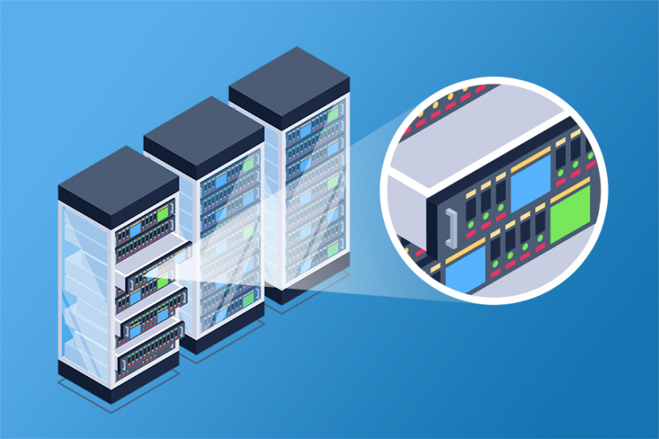

---

## Teoria bàsica
RAID és una tecnologia que permet combinar diversos discos durs per aconseguir més velocitat, més seguretat o totes dues coses alhora. És molt útil en servidors i sistemes on és important protegir les dades i evitar pèrdues en cas de fallada d’un disc. A més, en sistemes Linux, es poden crear volums lògics RAID per gestionar millor l’espai d’emmagatzematge i fer que sigui més flexible.

Hi ha diferents tipus de RAID, i cadascun té les seves característiques:

RAID 0 és el més ràpid, ja que divideix les dades entre tots els discos i permet llegir i escriure més ràpidament. Però té un problema important: si un dels discos falla, es perden totes les dades. Per això només s’utilitza en situacions on la velocitat és la prioritat, com en edició de vídeo o jocs.       
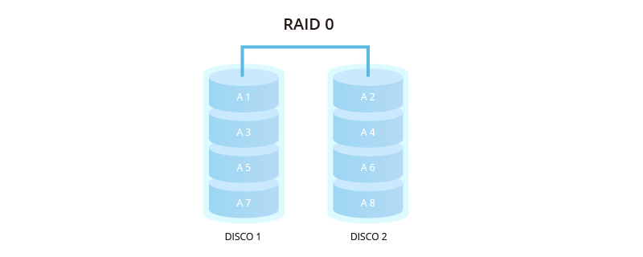

RAID 1, en canvi, és molt segur perquè guarda una còpia exacta de les dades en dos discos. Si un d’ells es fa malbé, el sistema segueix funcionant amb l’altre sense perdre informació. Això sí, només s’aprofita la meitat de l’espai, ja que tot es duplica. És ideal per a servidors i sistemes crítics on la seguretat és el més important.     


RAID 5 ofereix un bon equilibri entre seguretat i aprofitament de l’espai. Utilitza almenys tres discos i distribueix tant les dades com la paritat, que és una mena de informació addicional que permet reconstruir les dades si un disc falla. Així, encara que un disc es trenqui, el sistema pot seguir funcionant sense perdre informació. És una bona opció per a servidors i sistemes que necessiten seguretat sense perdre massa espai.     
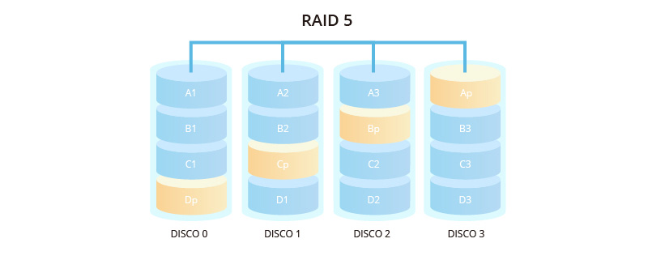

RAID 6 funciona de manera similar a RAID 5, però amb més protecció. Utilitza almenys quatre discos i guarda dues còpies de paritat, la qual cosa permet que fins a dos discos fallin alhora sense perdre dades. Això el fa ideal per a entorns on la informació ha d’estar sempre disponible, com en grans bases de dades o centres de dades.       
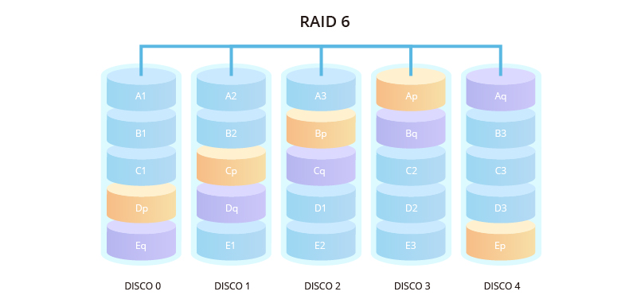

A Linux, configurar RAID es pot fer amb l’eina mdadm, i es pot combinar amb LVM (Logical Volume Manager) per gestionar millor els discos. Això permet afegir o modificar espai d’emmagatzematge sense perdre dades ni haver de tornar a configurar-ho tot.

---
## RAID 1

1. El primer que farem és instal·lar el paquet mdadm.
```
apt install mdadm
```
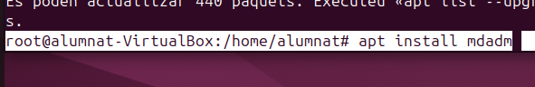

2. Seguidament, afegirem i revisarem els dos discs de 1GB.
```
fdisk -l 
```
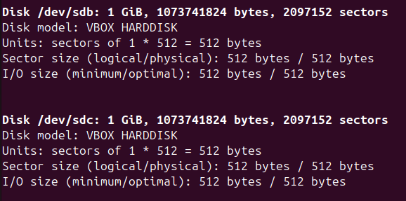

3. A continuació, crearem una partició principal als dos discs, com aviem fet en apartats anteriors. A més una vegada acaba de crear, abans de sortir escriurem "t" pel terminal i després "fd", d'aquesta manera indiquem que és de Linux.
```
fdisk /dev/sdb
```
```
fdisk /dev/sdc
```
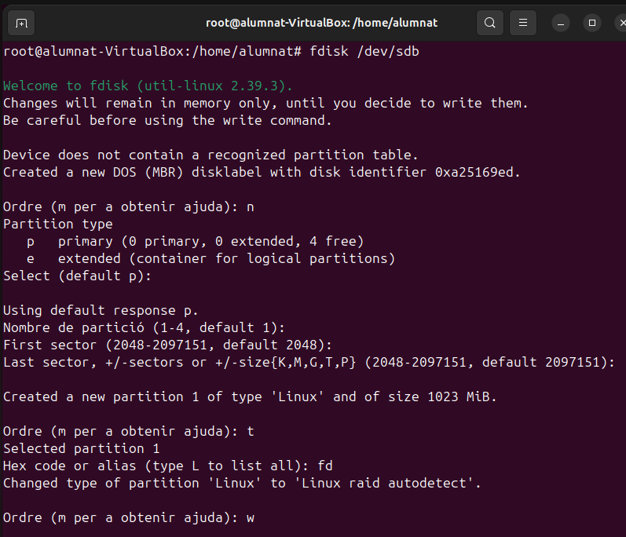
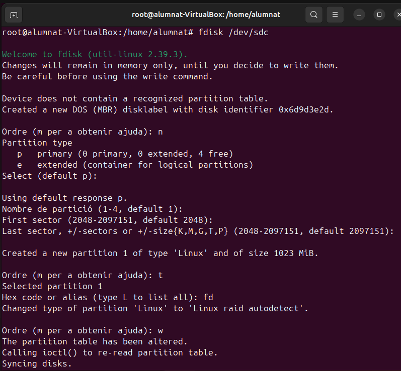

4. Posteriorment, tornarem a revisar els disc per comprovar el seu estat.
```
fdisk -l
```
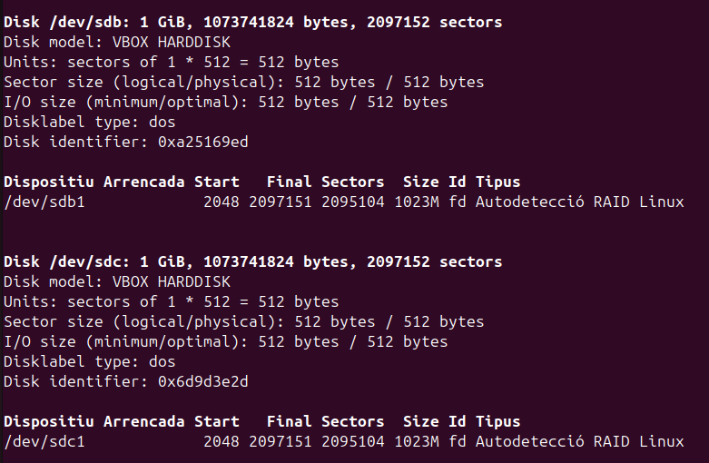

5. Tot seguit, crearem la carpeta raid1 en la ruta /mnt/ i li afegirem permissos. 
```
cd /mnt
```
```
mkdir raid1
```
```
chmod 777 raid1
```
```
ls -la | grep raid1
```
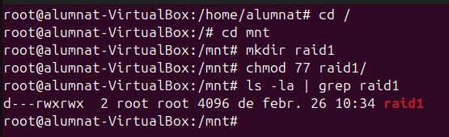

6. El següent pas serà executar la comanda `mdadm --create /dev/md0 --level=1 --raid-devices=2 /dev/sdb1 /dev/sdc1`, aquesta indica el tipus de raid i el numero de discs que volem utilitzar. 
```
mdadm --create /dev/md0 --level=1 --raid-devices=2 /dev/sdb1 /dev/sdc1
```
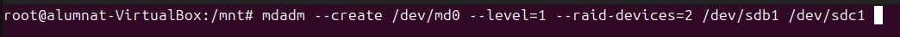
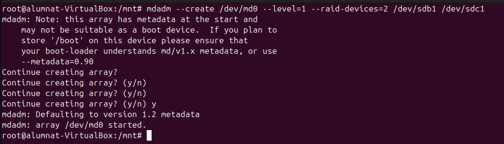

7. Seguidament, formatarem /dev/md0.
```
mkfs.ext4 /dev/md0
```
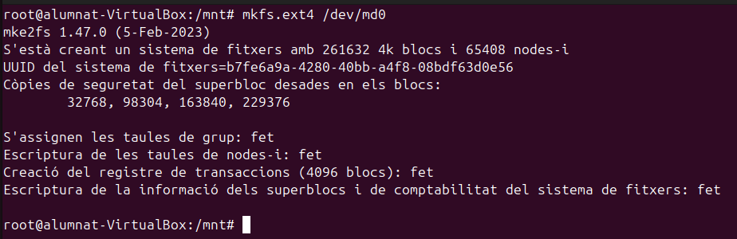

8. A continuació, revisarem /dev/md0.
```
mdadm --detail /dev/md0
```
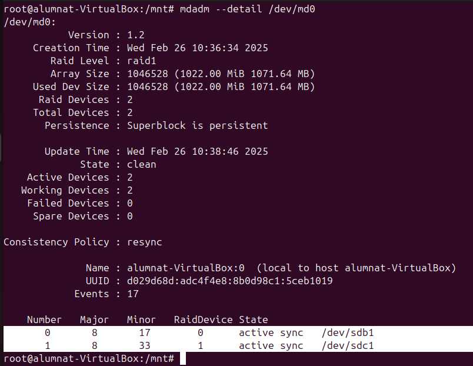

9. Després executarem la commanda `mdadm --detail --scan > /etc/mdadm/mdadm.conf` i revisarem el fitxer.
```
mdadm --detail --scan > /etc/mdadm/mdadm.conf
```
```
nano /etc/mdadm/mdadm.conf
```
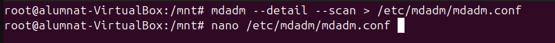
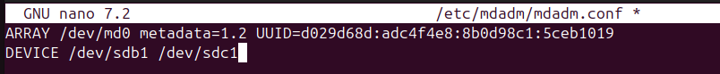

10. Posteriorment, afegirem una linia nova al fitxer, aquesta indica les particions que utilitzarem.
```
DEVICE /dev/sdb1 /dev/sdc1
```
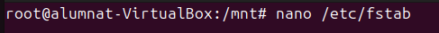

11. Una vegada, ja hem fet tots els passos anteriors, afegirem una nova linia al fstab muntant el raid a la carpeta que hem creat abans.
```
nano /etc/fstab
```
```
/dev/md0    /mnt/raid1  ext4    deafults    0   0
```
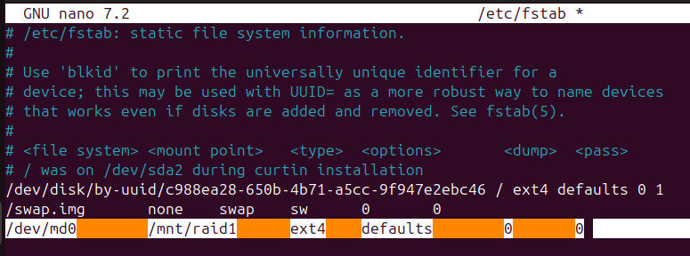

12. Seguidament, reiniciarem la maquina.
```
reboot
```
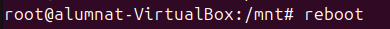

13. A continuació, farem un muntatge, reiniciarem el serveis i la màquina virtual.
```
mount -a
```
```
systemctl daemon-reload
```
```
update-initramfs -u -k all
```
```
reboot
```
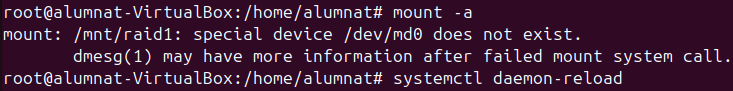
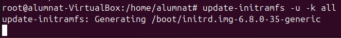
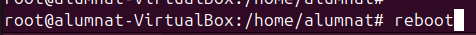

14. Una vegada hem fet els passos anteriors quan visualitzem el raid ens haura de sortir els dos disc i estat clean.
```
mdadm --detail /dev/md0
```
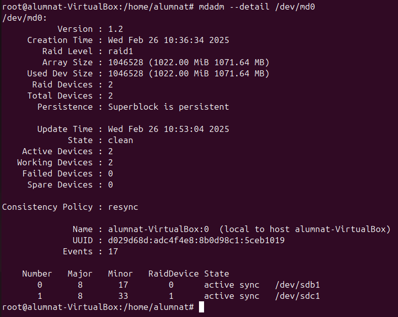

15. Per acabar de revisar el funcionamemt, entrarem dins de la carpeta raid1, crearem contingut i la visualitzarem.
```
cd /mnt/raid1
```
```
touch provafitxer
```
```
mkdir prova
```
```
ls -la
```
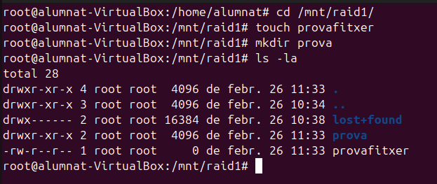

16. Seguidamet, desmuntarem el disc sdb del raid. D'aquesta manera comprovarem que amb el metode espill podrem continuar treballant amb l'altre disc.
```
mdadm /dev/md0 -f /dev/sdb1
```
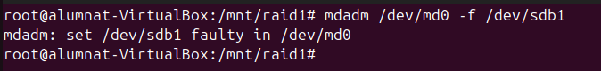

17. Quan revisem l'estat del raid veurem que sdb1 esta faulty.
```
mdadm --detail /dev/md0
```
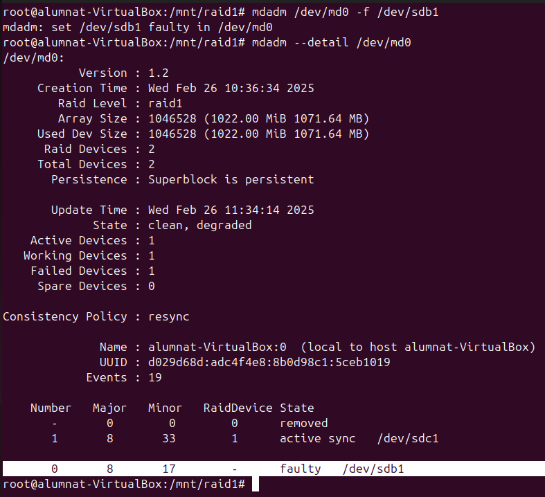

18. Després l'eliminarem amb la mateixa comanda que per desactivar-lo però amb el paràmetre `-r`. Posterioment revisarem l'estat del raid, aquí podrem comprovar que ja no està sdb.
```
mdadm /dev/md0 -r /dev/sdb1
```
```
mdadm --detail /dev/md0
```
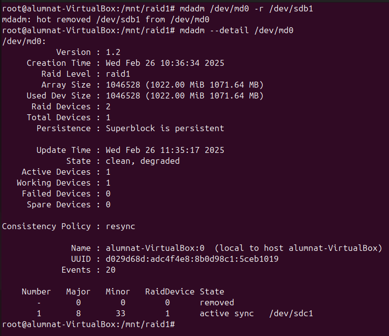

19. En aquest cas si tornem a revisar veurem que la carpeta raid1 segueix existint i podem accedir als recursos. A més crearem un fitxer per comprovar que al afegir posteriorment el sdb segueix estan. 
```
cd /mnt/raid1
```
```
ls -la 
```
```
touch provafitxer2
```
```
ls
```
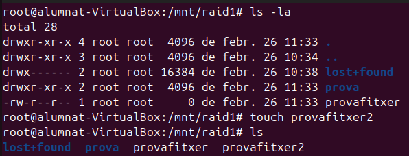

20. Seguidament tornarem a realitzar la mateixa comanda per eliminar i deshabilitar pero amb el paràmetre `-a` per afegir sdb1. Quan revisem l'estat veurem que esta en 'spare rebuilding' aquest indica que s'està afegint.
```
mdadm /dev/md0 -a /dev/sdb1
```
```
mdadm --detail /dev/md0
```
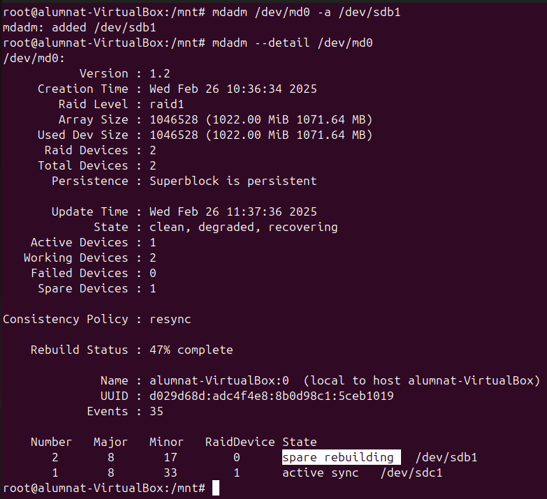

21. Quan tornem a revisar després d'una estona veurem que ja esta actiu de nou. A més la carpeta raid1 conté tots els arxius creats posterioment.
```
mdadm --detail /dev/md0
```
```
ls raid1
```
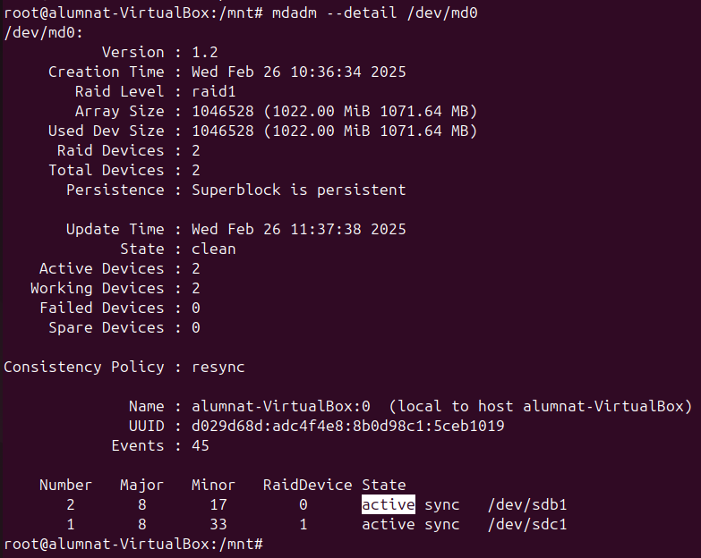
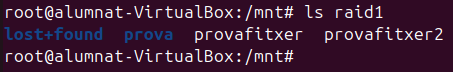

22. Per fer una altra prova, tancarem la vm eliminarem des de virtualbox el disc i tornarem a encendre-la.      
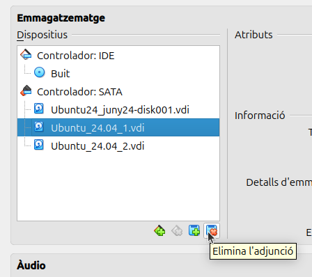
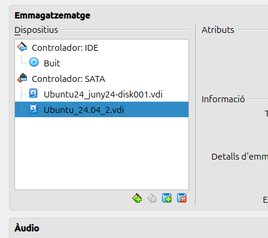

23. Quan el treiem veurem que només tenim un disc al raid i l'estat està inactiu.
```
mdadm --detail /dev/md0
```
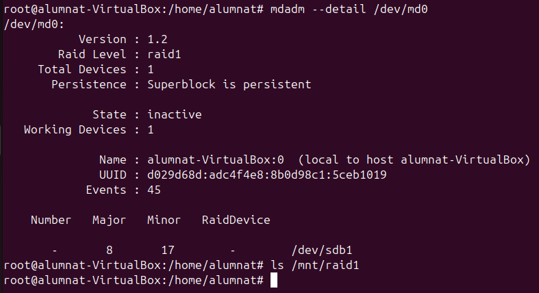

24. Per intentar restaurar-ho pararem el funcionament del raid, muntarem una altra vegada la carpeta raid1 i actualitzarem els canvis. Com podem comprovar al entrar dins de la carpeta tindrem acces i el contingut continua intacte.
```
mdadm --stop /dev/md0
```
```
mdadm -As /dev/md0
```
```
mount -a
```
```
update-initramfs -u -k all
```
```
ls /mnt/raid1
```
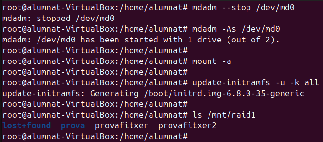

25. Seguidament, revisarem l'estat del raid i a la carpeta raid1 crearem una nova carpeta per comporvar que al afegir el disc el contigut persisteix intacte.
```
mdadm --detail /dev/md0
```
```
cd /mnt/raid1
```
```
mkdir prova2
```
```
ls
```
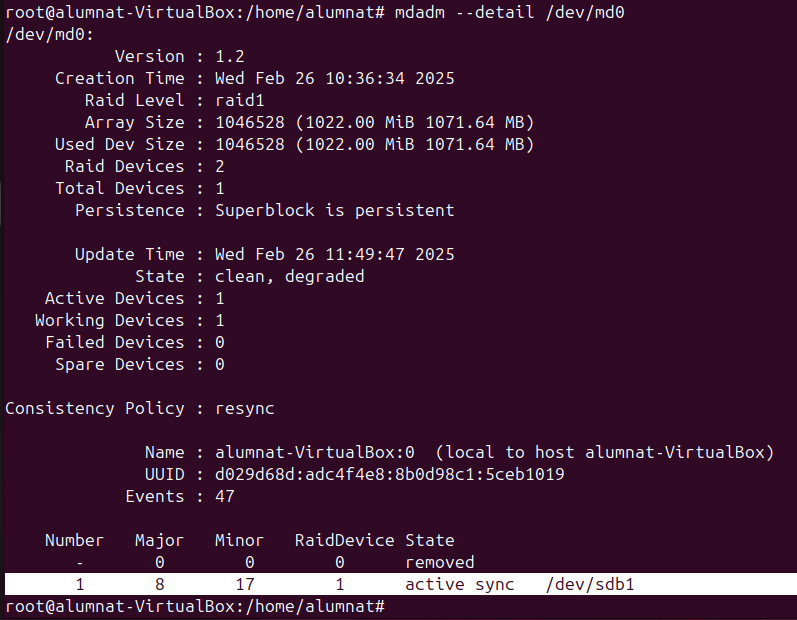
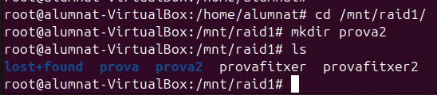

26. Tot seguit, tornarem ha afegir un disc a la vm des de virtualbox, aquest serà un de nou, per realment comprovar el funcionament.        
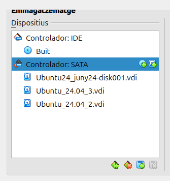
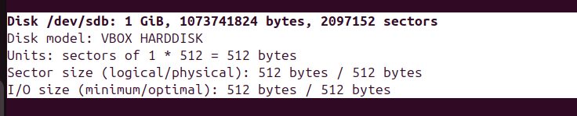

27. A continuació al ser un disc nou realitzarem el procés del principi.        
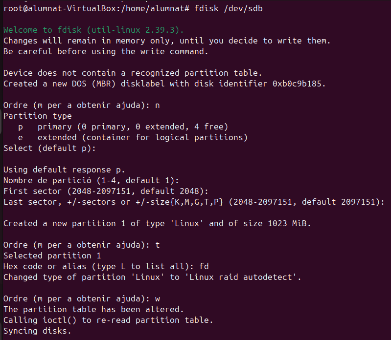
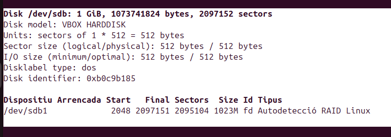
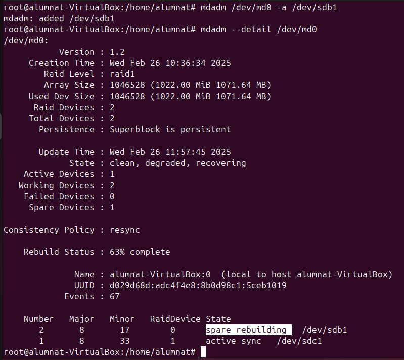
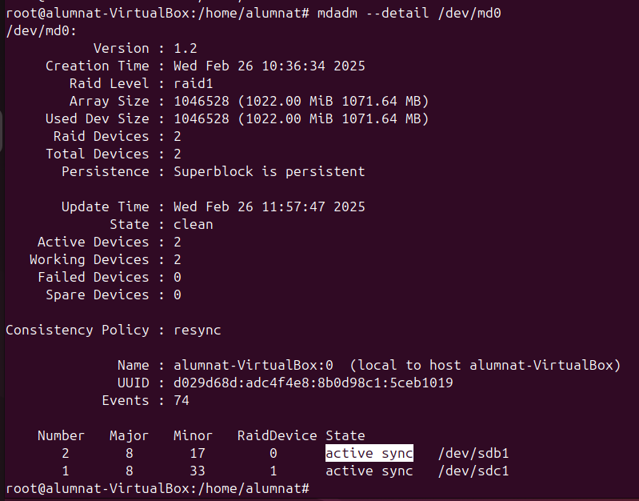

28. Una vegada afegit al raid revisarem el directori raid1, com podem observar tot està exactament igual. Reiniciarem la vm i tornarem a la carpeta per comprovar realment que funciona.
```
ls /mnt/raid1
```
```
reboot
```
```
ls /mnt/raid1
```
```
mdadm --detail /dev/md0
```
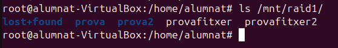
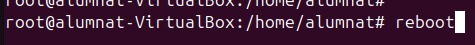
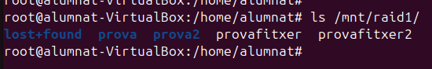
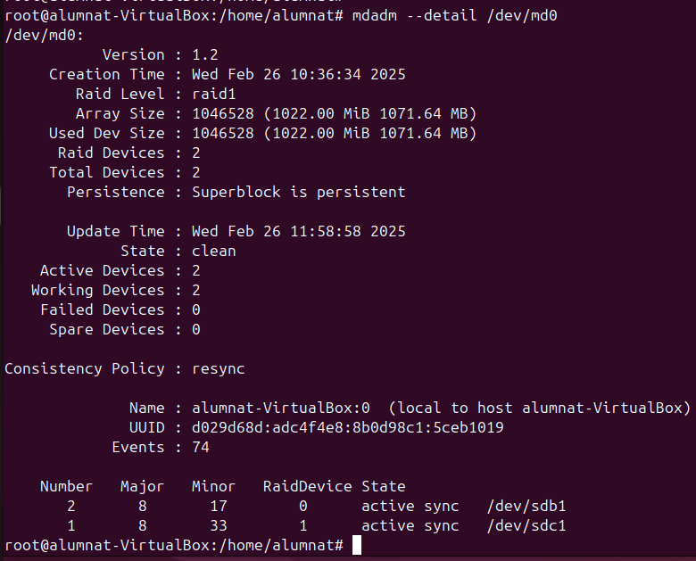

29. L'últim que farem és eliminar el raid definitivament. Per realitzar això, desmuntarem /dev/md0, pararem el raid, eliminarem la carpeta raid1 i comentarem la linia del fstab.
```
umount /dev/md0
```
```
mdadm --stop /dev/md0
```
```
mdadm --remove /dev/md0
```
```
rm -r /mnt/raid1
```
```
nano /etc/fstab
```
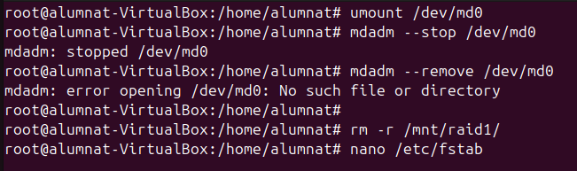
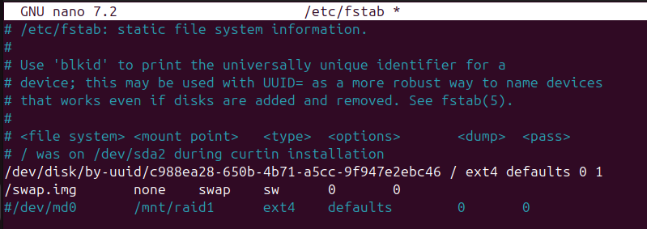

30. A més comentarem o eliminarem les linies del fitxer mdadm.conf, buidarem el contingut del raid, actualitzarem canvis i reinciarem la vm. En aquest pas també és molt important la comanda `mdadm --zero-superblock /dev/sdb1 /dev/sdc1`, ja que si ens la deixem el raid continuarà existint.            
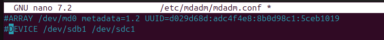


31. Finalment, revisarem l'estat del raid, com podem observar ja no existeix.
```
mdadm --detail /dev/md0
```


## RAID 5

1. El procès de creació del raid 5 és molt paregut al raid 1, per tant només explicaré en profuditat les noves característiques. En raid 5 és important tindre més de 3 discs, jo en aquest cas he afegit 4 per fer més comprovacions.


2. Realitzarem el mateix procès de preparació de discs que en l'apartat anterior.       


3. Crearem la carpeta raid5, el raid, muntarem el raid a la carpeta, etc.       
   


4. Una vegada fet tot això revisarem l'estat del raid, com podem comprovar està operatiu amb els 4 discs. Després anirem a la carpeta raid5 i crearem un fitxer i una carpeta.      


5. Ara iniciarem amb les comprovacions, per començar desactivarem un disc, farem un update o reboot i comprovarem que el raid continua funcionant amb tres discs.       


6. Després eliminarem el disc i comprovarem que el podem tornar ha afegir.


7. Seguidament des de virtualbox eliminarem un disc, comprovarem que l'estat del raid és inactive, realitzarem els mateixos passos que al raid1 per tornar a activar el raid i comprovarem que continuem tenint acces a les dades.


8. Ara si, quan treiem un altre disc des de virtualbox i el raid es que nomes amb 2 discs és quan deixa de funcionar i la informació de la carpeta raid5 ja no és accessible. Per tant com podem comprovar raid 5 necessita 3 o més discs per funcionar correctament.       


9. Tornarem a afegir un dels discs eliminats i comporvarem que tornar al seu estat funcional.


10. Per últim eliminarem el raid definitivament, com podem observar per les captures el procś és el mateix.


