# Monitoratge, auditories i programari client/servidor


Per a la documentació completa visita [mkdocs.org](https://www.mkdocs.org).


---
## Introducció
En aquest projecte, configuro un sistema Ubuntu Linux en una màquina virtual per assegurar-ne el bon funcionament i la seguretat. Instal·laré eines per monitoritzar l’ús de recursos com la CPU, la memòria i l’emmagatzematge, així com per revisar els registres del sistema i detectar possibles problemes.

També implemento un sistema d’auditories per registrar esdeveniments importants i generar informes de seguretat. A més, automatitzo la instal·lació de programari i configuro un servidor d’actualitzacions perquè totes les màquines estiguin sempre al dia.

Finalment, faré proves per assegurar-me que tot funciona correctament i documentaré cada pas perquè el procés sigui clar i fàcil de replicar. L’objectiu és tenir un sistema segur, eficient i ben administrat.


---

## Monitorització i rendiment

### INTERFÍCIE GRÀFICA

1. Una de les eines que podem fer servier per tindre controlat el rendiment, és el programa Estadístiques de l'energia. Aquesta serveix per tindre informació sobre el dispositiu, tipus, si és xarxa elèctrica i cada quan es refresca, entre altres caracteristiques.
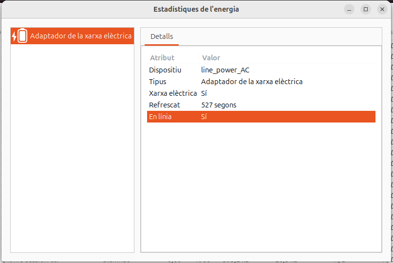

2. Seguidament, també tenim el programa Monitor de sistema, aquest té diferents apartats, per exemple en aquest que mostro a la captura podem observar tots els processos actius, quan consumeixen, usuari que el provoca, etc.
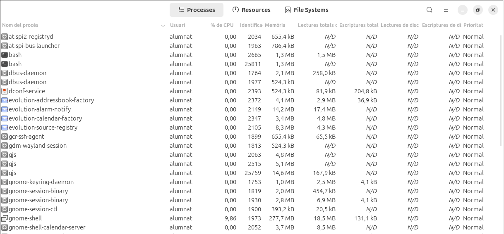

3. En el segon apartat podem veure en més detall el consum a temps real de la cpu, la xarxa i el disc.
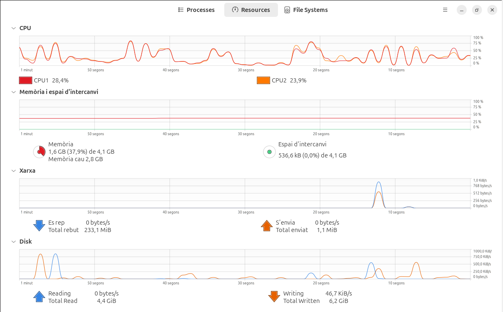

4. Per últim, tenim l'apartat File System, aquest mostra quant estem utilitzant al disc.
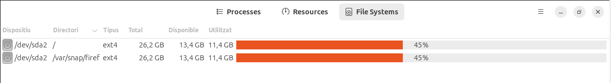

### TERMINAL

1. El primer que farem és observar el fitxers que conté el directori /var/log/. Seguidament explicaré la funció de cadascun:        
```
cd /var/log/
```
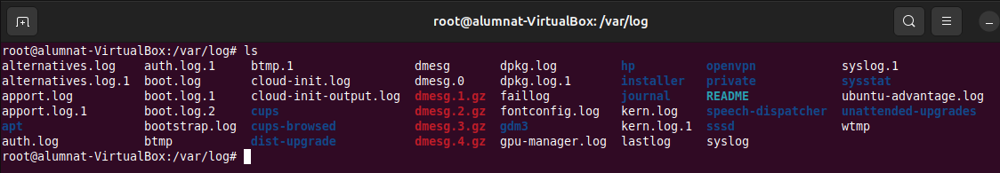
    * alternatives.log: Registra els canvis en el sistema d'alternatives d'Ubuntu, que gestiona enllaços simbòlics per diferents versions de programes.
    * apport.log: Guarda informació sobre fallades i errors en aplicacions, útil per depurar problemes.
    * apt/: Directori que conté els registres de les operacions de apt, com instal·lacions, actualitzacions i eliminacions de paquets.
    * auth.log: Guarda informació sobre autenticacions del sistema, inici de sessió d'usuaris i esdeveniments relacionats amb la seguretat.
    * boot.log: Conté els missatges generats durant l'inici del sistema.
    * bootstrap.log: Registra informació sobre la instal·lació inicial del sistema operatiu.
    * btmp: Registra intents de connexió fallits. Es pot llegir amb lastb.
    * cloud-init.log / cloud-init-output.log: Fitxers relacionats amb la configuració inicial en sistemes basats en el núvol (Cloud-init).
    * cups/: Directori amb registres del servei d'impressió CUPS.
    * cups-browsed: Fitxer de registre del servei de detecció d'impressores en la xarxa.
    * dist-upgrade: Conté informació sobre actualitzacions de distribució (do-release-upgrade).
    * dmesg: Registra missatges del nucli (kernel), útil per veure errors de hardware i dispositius durant l'arrencada.
    * dpkg.log: Registra totes les accions realitzades pel gestor de paquets dpkg (instal·lacions, eliminacions, actualitzacions).
    * faillog: Conté informació sobre intents de connexió fallits dels usuaris.
    * fontconfig.log: Relacionat amb la configuració i registre de fonts tipogràfiques en el sistema.
    * gdm3: Registre del gestor de sessió gràfica GDM3 (GNOME Display Manager).
    * gpu-manager.log: Conté informació sobre la gestió de la GPU en el sistema.
    * hp/: Directori amb registres de HPLIP, el programari per a impressores HP.
    * installer/: Registres relacionats amb la instal·lació inicial del sistema operatiu.
    * journal/: Conté els registres del systemd-journald, una alternativa a syslog per registrar esdeveniments del sistema.
    * kern.log: Guarda informació sobre el nucli de Linux, útil per detectar errors de maquinari o  * mòduls del nucli.
    * lastlog: Conté informació sobre la darrera connexió de cada usuari. Es pot consultar amb lastlog.
    * openvpn/: Directori amb registres del servei OpenVPN, si està instal·lat.
    * private/: Carpeta que pot contenir registres sensibles i restringits.
    * README: Normalment, un fitxer de text amb informació sobre el contingut del directori /var/log/.
    * speech-dispatcher: Registres del servei speech-dispatcher, utilitzat per a la síntesi de veu en  aplicacions d'accessibilitat.
    * sssd: Conté registres del System Security Services Daemon, que gestiona autenticacions i serveis relacionats amb usuaris.
    * syslog: Registre principal del sistema que conté missatges de diferents serveis i aplicacions.
    * sysstat: Registres de l'eina sysstat, que monitoritza el rendiment del sistema.
    * ubuntu-advantage.log: Registre relacionat amb Ubuntu Advantage, un servei empresarial d'Ubuntu.
    * unattended-upgrades: Conté registres de les actualitzacions automàtiques del sistema (unattended-upgrades).
    * wtmp: Manté un registre de les connexions dels usuaris. Es pot consultar amb last.

    

2. Seguidament entrarem dins del fitxer /etc/logrotate.conf aquest serveix per configurar la gestió automàtica dels fitxers de registre del sistema, definint cada quant temps es roten, es comprimeixen, s'eliminen o es conserven els registres antics per evitar que ocupin massa espai al disc.     
```
sudo nano /etc/logrotate.conf
```
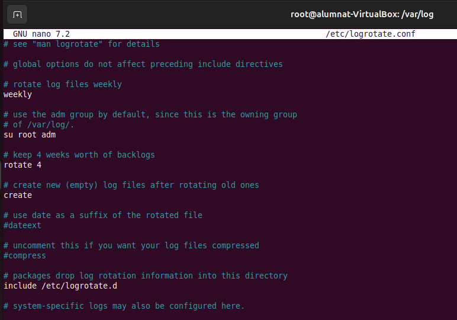

3. Després també tenim el directori /etc/logrotate.d/, aquest conté configuracions específiques de logrotate per a diferents serveis i aplicacions del sistema. Cada fitxer dins d'aquest directori defineix les regles de rotació de logs per un servei concret, permetent una gestió més detallada i personalitzada dels registres.       
```
cd /etc/logrotate.d/
```
```
sudo nano dpkg
```
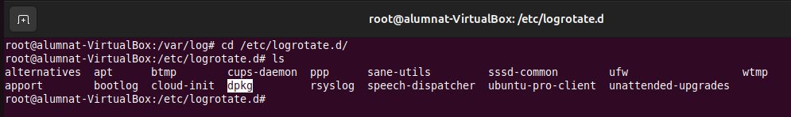
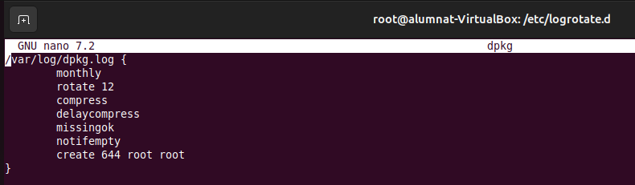

4. En versions anteriors el fitxer /etc/rsyslog.conf era el que administrava tot, ara si entrem dins el propi fitxer indica que la ruta correcta és /etc/rsyslog.d/*.conf.      
```
sudo nano /etc/rsyslog.conf
```
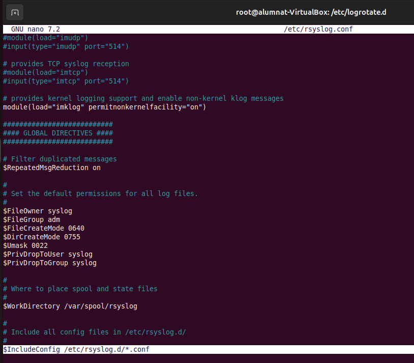

5. Entrarem dins del fitxer /etc/rsyslog.d/50-default.conf, aquest és el administra actualment.     
```
sudo nano /etc/rsyslog.d/50-default.conf
```
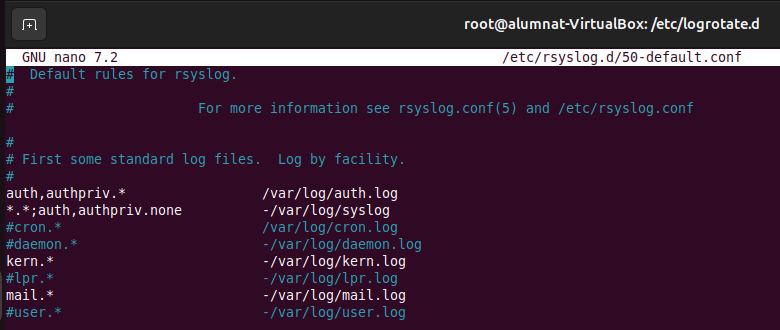

6. Farem un tail -f /var/log/syslog per revisar els logs a temps real.  
```
tail -f /var/log/syslog
```
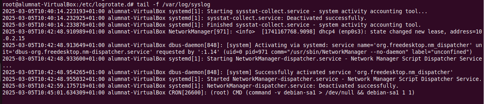

7. Seguidament, farem un parell de proves. Per exemple si amb el logger creem un log d'alter en mail amb un missatge al executar-ho apareixerà al tail.     
```
tail -f /var/log/syslog
```
```
logger -i -s -p mail.alert Alerta de mail!!!
```
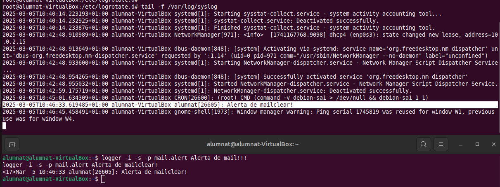

8. Si revisem el contingut dels fitxers mail.log i mail.err ens sortirà el resultat.
```
cat /var/log/mail.log
```
```
cat /var/log/mail.err
```        
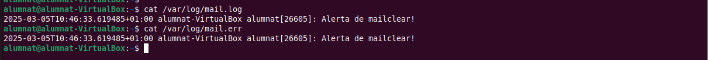

9. Tot seguit, realitzarem un parell de canvis. En el fitxer de configuració canviarem la linia de mail.err i li ficarem un "=".        
```
mail.=err /var/log/mail.err
```
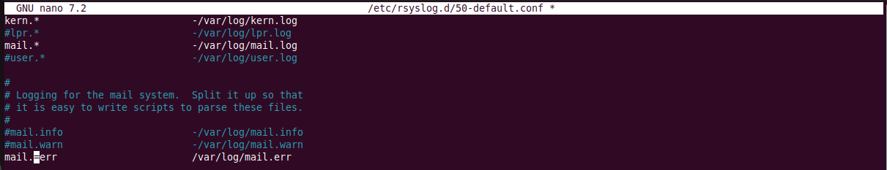

10. Cada vegada que modifiquem aquest fitxer haurem de reinciar el servei, ja que si no els canvis no s'aplicaran.      
```
systemctl restart rsyslog
```
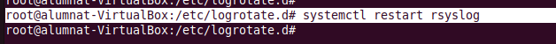

11. Després, farem un tail en el que quan creesem una alerta de mail ens sortirà al propi tail i als fitxers mail.log i mail.err.
```
tail -f /var/log/syslog
```
```
logger -i -s -p mail.alert Alerta de error mail
```
```
cat /var/log/mail.log
```
```
cat /var/log/mail.err
```
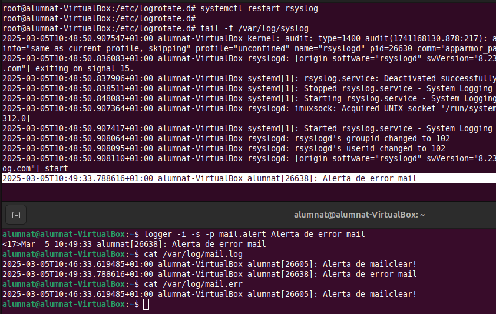

12. Seguidament, anirem al fitxer de configuració i que tots els fitxers crit vaigin al fitxer alumnat.log, aquest el creem per què alhora de revisar errors critics en el sistema diariament, ens ajuda a trovar-los més rapidament.
```
*.crit /var/log/alumnat.log
```
```
systemctl restart rsyslog
```
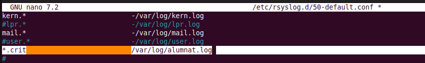
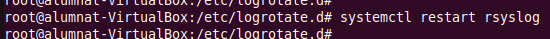

13. A continuació per que surten tots els errors a syslog ficarem asteriscs.
```
*.* -/var/log/syslog
```
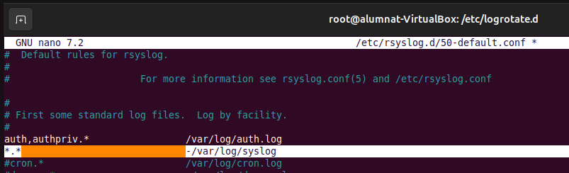

14. Com podem obeservar amb el tail veurem que els fitxers .crit surten.
```
tail -f /var/log/syslog
```
```
logger -i -s -p auth.crit Prova maria auth
```
```
logger -i -s -p cron.crit Prova maria cron
```
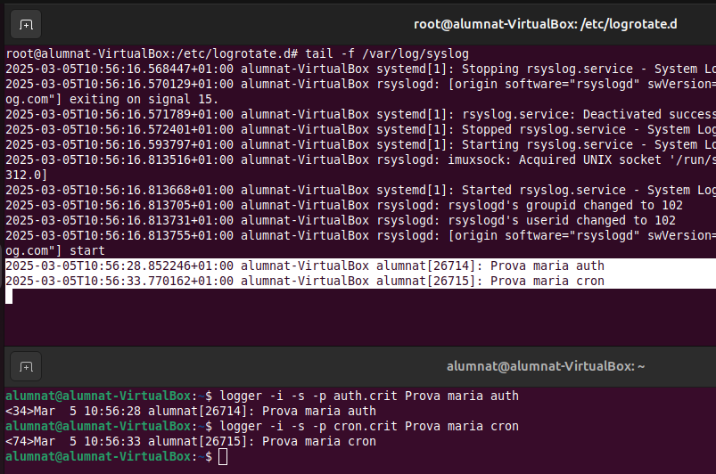

15. A continuació per filtrar procesos podem utilitzar grep o també podem utilitzar journalctl.   
```
cat /var/log/syslog | grep alumnat
```
```
journalctl -p crit
```
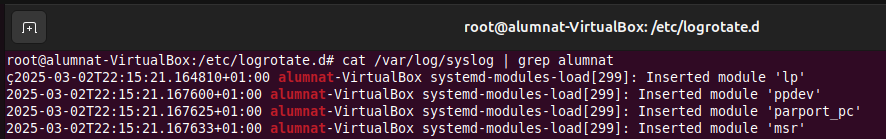
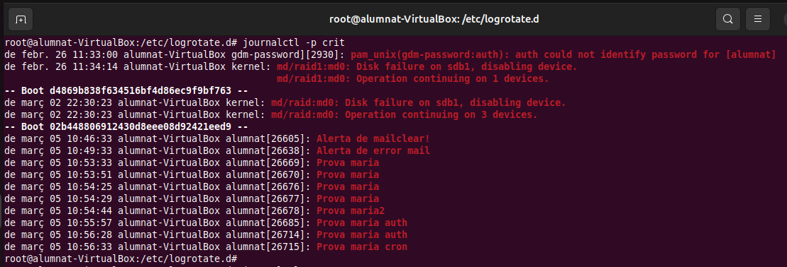

16. També podem filtrar a partir de serveis o a partir de noms.     
```
journalctl -u auth
```
```
journalctl -sdhhvg "" --until ""
```
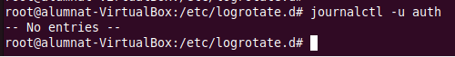
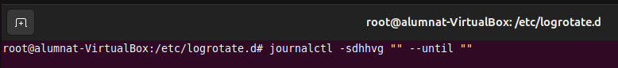

---
#### REMOT

1. El primer que haurem de fer és anar a la vm que rep el log remot i instal·lar rsyslog. Després anirem al fitxer /etc/rsyslog.conf i descomentarem les linies que indica la captura.
```
sudo apt update
```
```
sudo apt install rsyslog
```
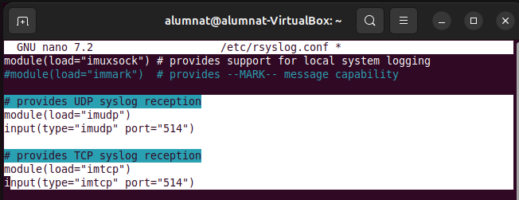

2. Seguidament al firewall acceptarem del port 514 udp i tcp. En acabar, haurem de fer un sudo systemctl restart rsyslog.
```
ufw allow 514/upd
```
```
ufw allow 514/tcp
```
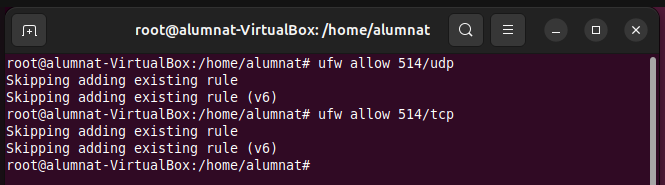

3. Ara anirem a la màquina que envia el log, en aquesta també instal·larem rsyslog i en la configuració afegirem la ip del receptor.
```
sudo apt update
```
```
sudo apt install rsyslog
```
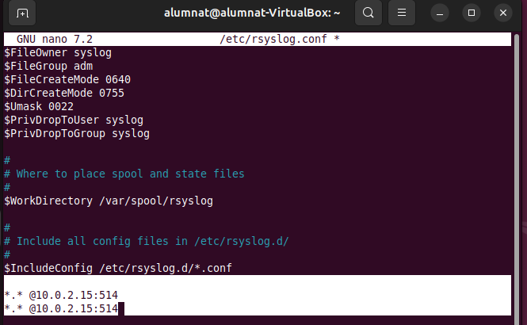

4. A continuació desde la vm receptora farem un tail de syslog per escoltar.
```
tail -f /var/log/syslog
```
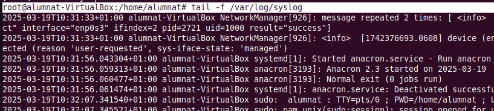

5. Després desde l'emissor, enviarem els següents logs.
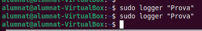

6. Per últim podrem observar desde la receptora que ha funcionat correctament el procès.
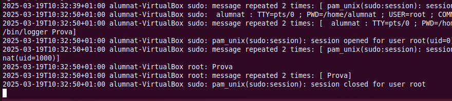


---

## Auditories

1. El primer que haurem de fer és instal·lar el programa.       
```
sudo apt update && sudo apt install lynis -y
```
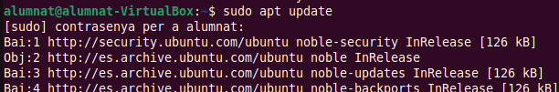
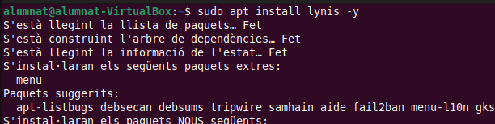
2. Seguidament, revisarem la versio amb:        
```
lynis --version
```
3. A continuació executarem el programa amb `sudo lynis audit system` per realitzar un escaneig complet del sistema i un `lynis -Q` per realitzar un escaneig ràpid.        
```
sudo lynis audit system
```
```
lynis -Q
```
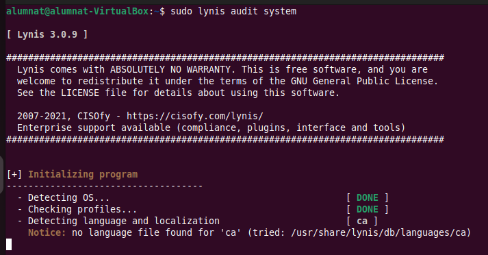
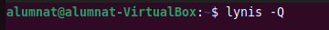

4. Com podem observar començar a fer l'escaneig.        
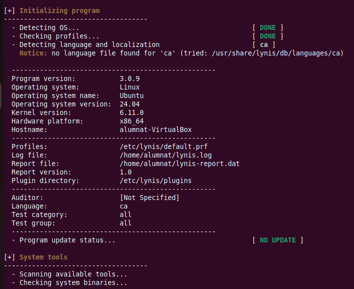


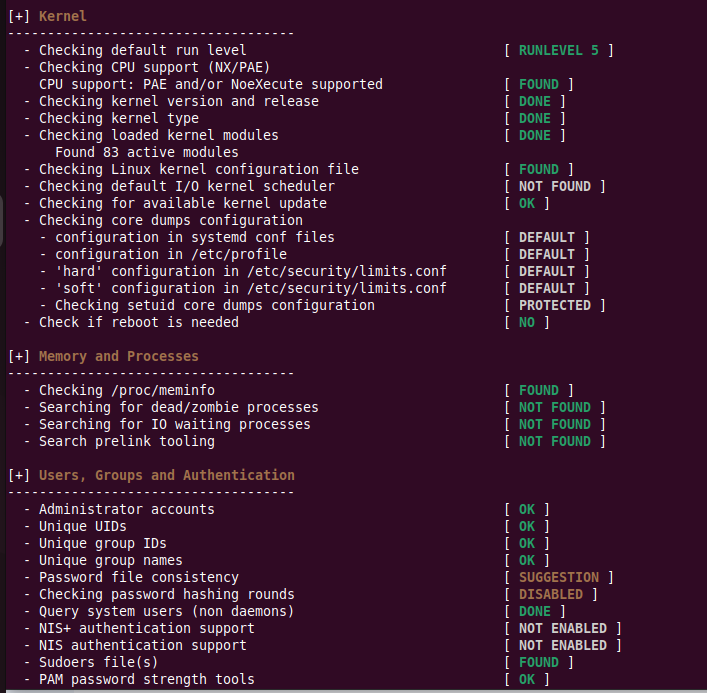
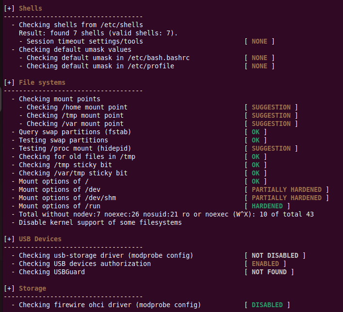
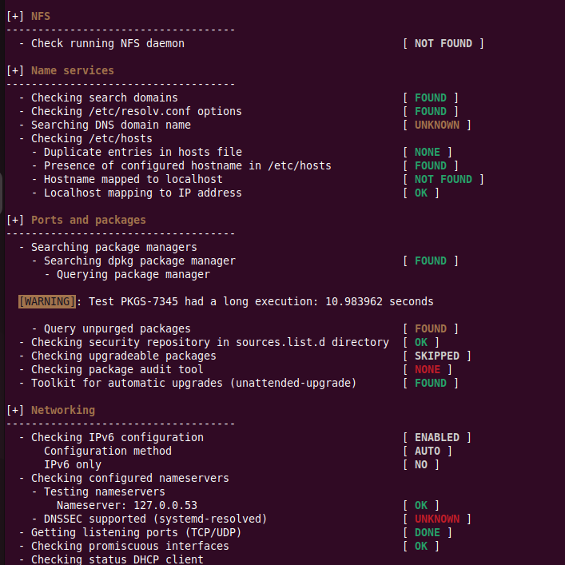
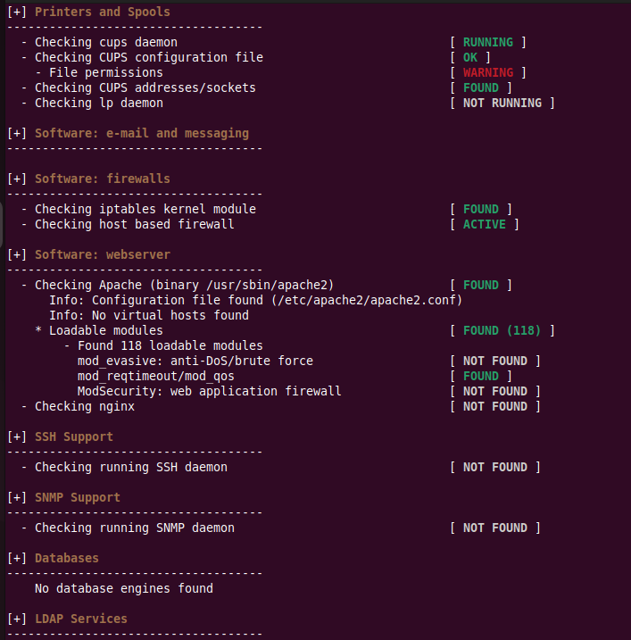
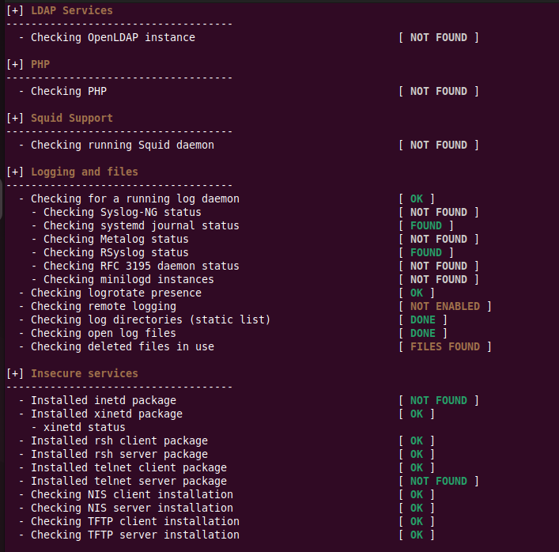
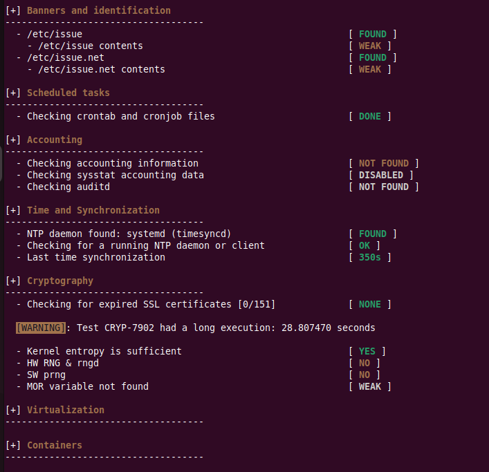
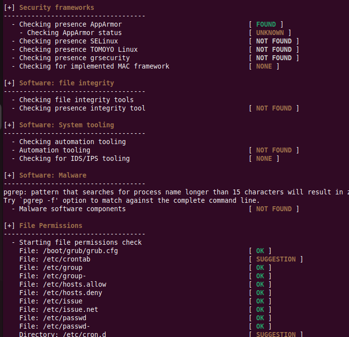
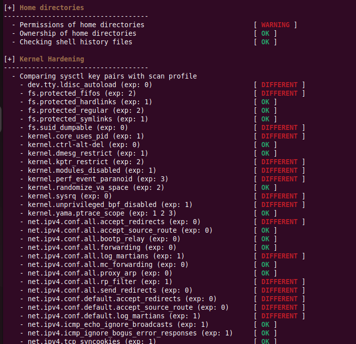

5. Al acabar al final ens dona un apartat amb les sugerencies per millorar la seguretat del sistema.        


6. Més abaix en dona un index amb el "percentatge" de seguretat en aquest cas és 61.        
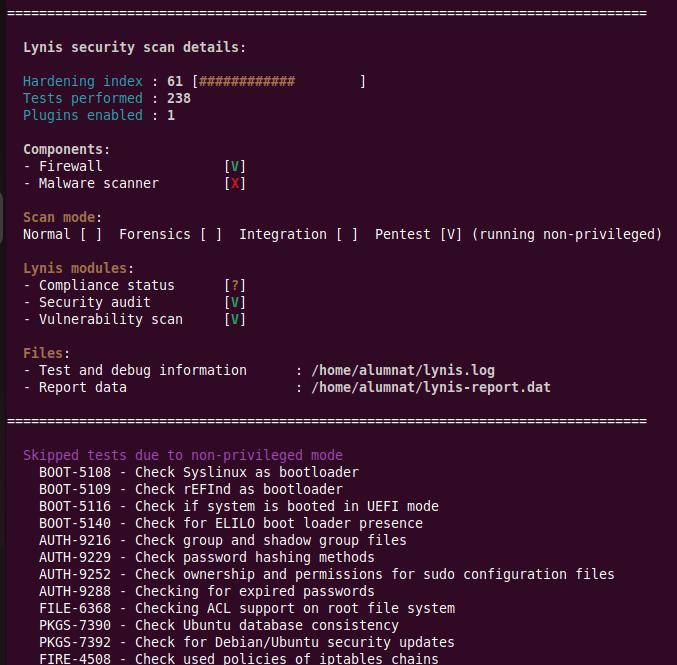

7. La primera millora que realitzarem serà actualitzar el sistema, si observem les sugerencies una d'elles és aquesta. Per fer això només haurem de fer un update i upgrade.        
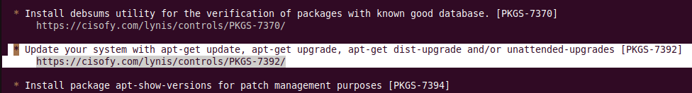
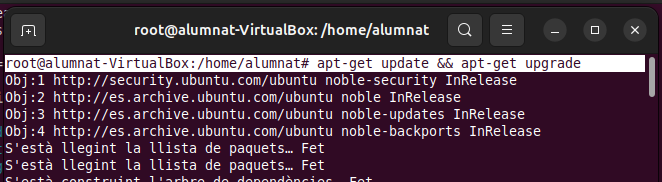
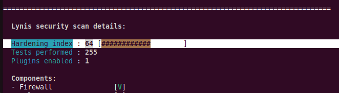

8. Seguidament, la sugerencia indica instal·lar apt-listbugs, però no està per a ubuntu 24, per tant l'alternativa que he trobat és el paquet apt-listchanges, aquest quan actualitzem en apt update ens mostra un resum final del canvis. A més, per millorar una mica més podem instal·lar unattended-upgrades, aquest serveix per realitzar actualitzacions automatiques.        
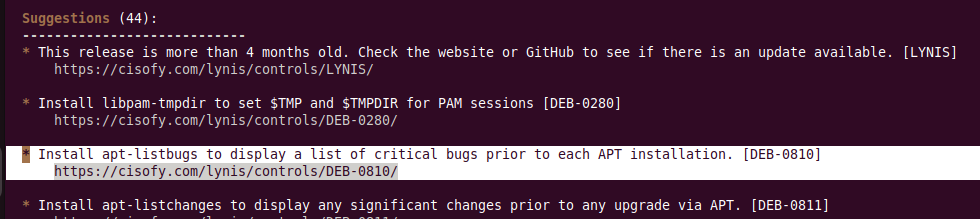
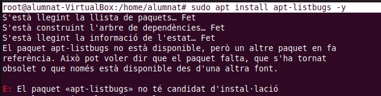
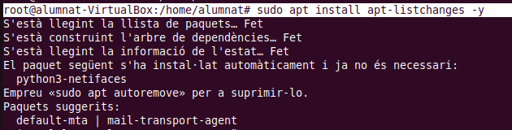


9. En aquesta millora purguem paquets antics, elimina configuracions residuals de paquets desinstal·lats. Com podem observar aquest no ha millorat el percentatge, aquestes coses poden pasar.       


10. Per últim, instal·larem el paquet debsum per verificar la integritat del paquets.       


---

## Instal·lacions desateses


---

## Servidor d'actualitzacions

Un servidor d’actualitzacions és un sistema que s’encarrega d’instal·lar i actualitzar programes en diversos ordinadors des d’un sol lloc. Això fa que tot sigui més ràpid, fàcil i segur, sense haver d’actualitzar cada ordinador per separat.

1. El primer pas serà instal·lar l'apache2 en el server, aquest servirà per establir connexió. A més també haurem de instal·lar, el paquet apt-mirror.      
```
apt install apache2
```
```
apt install apt-mirror
```


2. Seguidament, al fitxer mirror.list comentarem totes les linies de repositoris i afegirem una última linia només del repositori de chrome.        
```
sudo nano /etc/apt/mirror.list
```
```
deb [arch=amd64] http://dl.google.com/linux/chrome/deb stable main
```


3. A continuació executarem la comanda apt-mirror per afegir el repositori en local al server.    
```
apt-mirror
```  


4. Després anirem a la ruta que indica la captura i crearem un soft link en var/www/html        
```
cd /var/spool/apt-mirror/mirror/dl.google.com/linux/chrome/deb
```
```
ln -s /var/spool/apt-mirror/mirror/dl.google.com/ /var/www/html/
```
```
ls /var/wwww/html
```


5. En la part del client, el primer pas és descarregar i instal·lar la clau.  
```
wget  -q -O - https://dl-ssl.google.com/linux/linux_signing_key.pub | apt-key add -
```      


6. Després al fitxer sources.list afegirem la ruta del repositori del server. 
```
deb [arch=amd64] http://10.0.2.15/dl.google.com/linux/chrome/deb/ stable main
```


7. Seguidament, farem un update per afegir el repositori des del servidor, si ens fixem al executar ficar la ip del server.     
```
apt update
```
```
apt install google-chrome-stable
```


8. Per últim, si anem als programes ens sortirà Google Chrome instal·lat.


---
