## Part 1 - Preparar l'entorn

1. El primer que vaig fer va ser afegir l'usuari "hacker".   
    ```bash
    sudo adduser hacker
    ```
    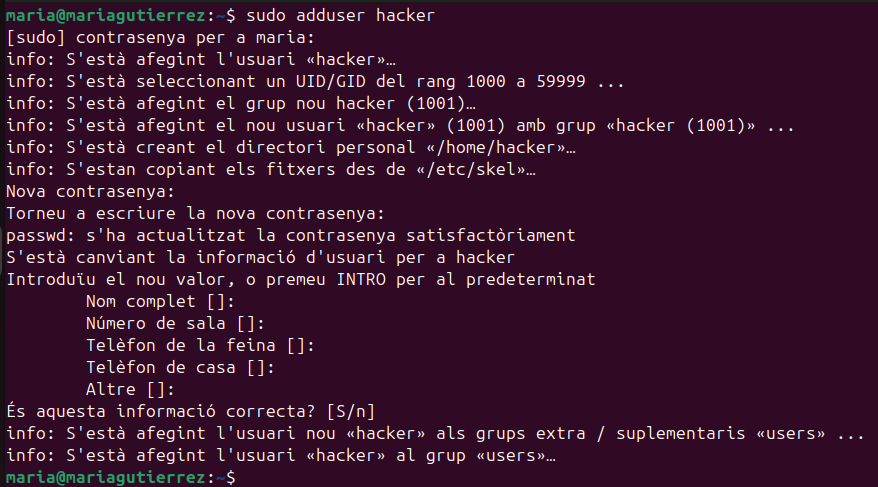

2. Seguidament, vaig entrar en mode administrador i vaig crear el grup "cryptshare". A més vaig afegir els usuaris "maria" i "hacker" al grup prèviament creat. També és important afegir a l'usuari "hacker" al grup sudo. En acabar comprovo el resultat al fitxer /etc/group.    
    ```bash
    groupadd cryptshare
    ```
    ```bash
    usermod -aG cryptshare maria && usermod -aG cryptshare hacker && usermod -aG sudo hacker
    ```
    ```bash
    cat /etc/group | grep sudo* && cat /etc/group | grep cryp*
    ```
    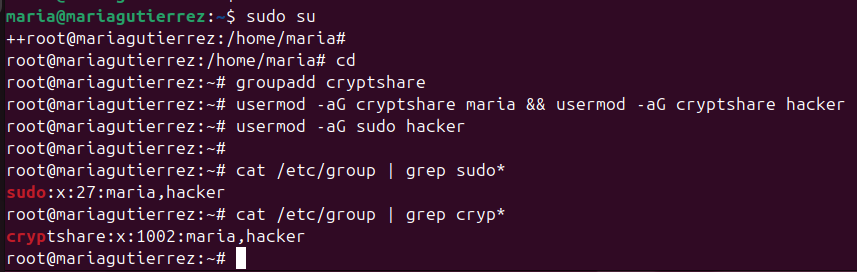

3. Tot seguit, vaig instal·lar el paquet gocryptfs. Aquest és important per encriptar les dades.    
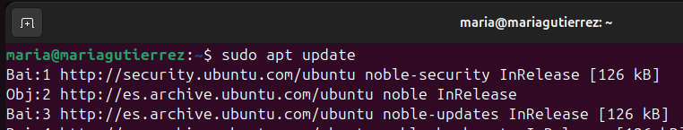
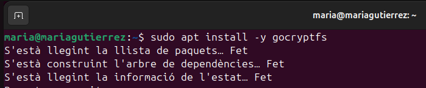

4. A l'usuari hacker vaig crear dues carpetes. La primera "dades_originals_backup" té la funció de fer una copia de les dades del usuari "maria". Les demés tenen la funció de guardar les dades de "maria" encriptades.    
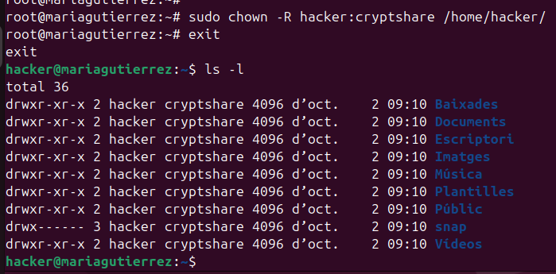
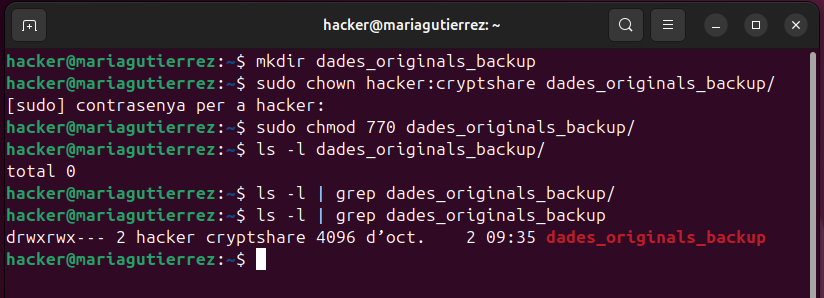

5. A continuació, crearem fitxers en multiples carpetes dins de l'usuari "maria". A més de canviar grup propietari a cryptshare i permisos 770.    
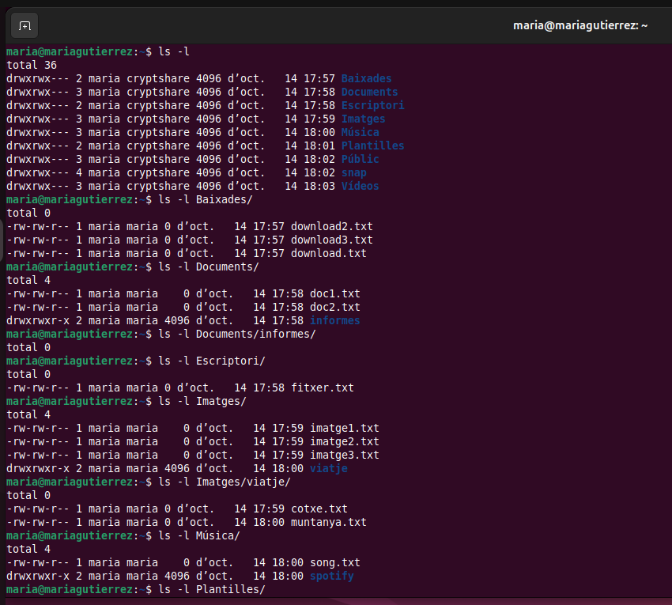
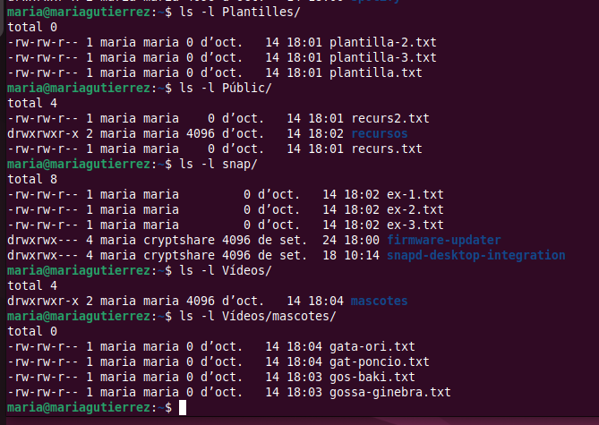

---

## Part 2 - Crear el target

1. El primer que vaig de fer és crear el arxiu a el directori /etc/systemd/system/.    
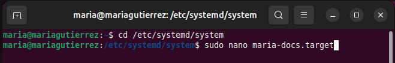

2. Aquí dins el que havia de fer és escriure les següent linies, que són molt paregudes a les del arxiu 'multi-user.target'.    
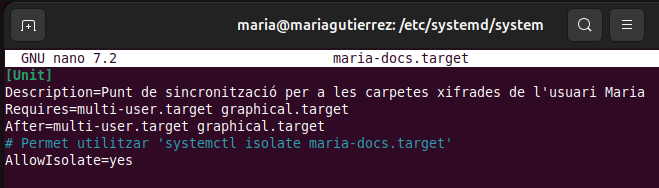

---

## Part 3 - Crear el script

1. Per començar, vaig crear el script al directori /usr/local/bin/. A més de afegir permisos per executar-lo i que l'usuari i grup propietari sigui root.    
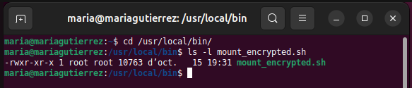

2. Aquest primer bloc configura el comportament del shell perquè pari si hi ha errors (errexit, nounset, pipefail) i assegura que la variable $USER tingui un valor (si no, la pren amb whoami). Això evita execucions inesperades i fa que les rutes que depenen de $USER funcionin correctament.       
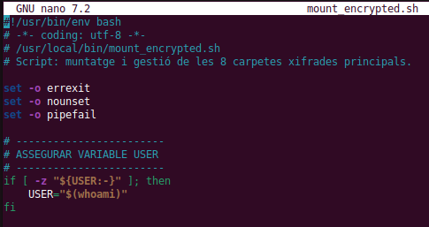

3. Aquí es defineixen totes les rutes i fitxers importants: on estan les versions xifrades (a l’usuari hacker), on són els punts de muntatge de maria, els fitxers de contrasenya i la carpeta de backup. L’array FOLDERS agrupa la informació per iterar-la fàcilment. Finalment assegura que el directori de backups existeixi.        
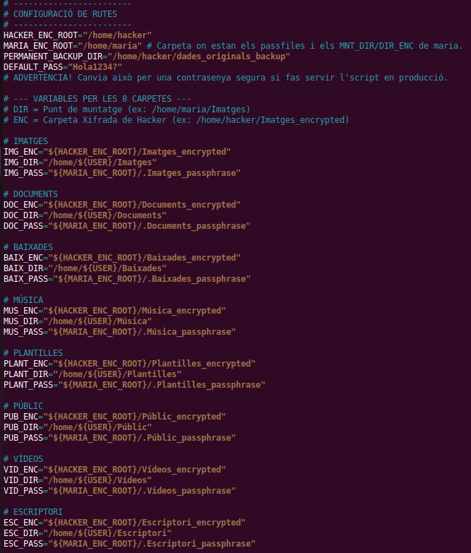


4. Aquesta funció fa tot el treball greu per a una carpeta: crea directoris i passfile si cal, inicialitza gocryptfs si no està inicialitzat, fa un backup si hi ha fitxers, buida el directori, munta la carpeta xifrada i, si cal, restaura els fitxers al punt muntat. Els echo serveixen per saber en quin pas està i per depurar.       
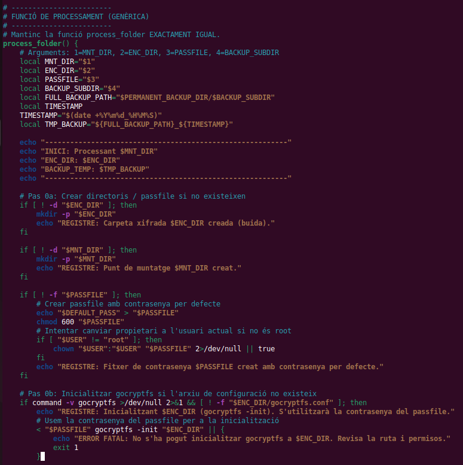
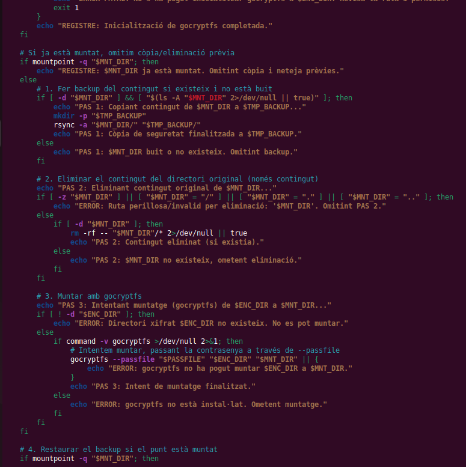
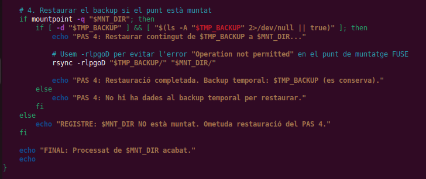

5. Aquesta funció desmunta la carpeta (si cal), buida el contingut en clar i copia els fitxers xifrats des de la carpeta _encrypted de hacker cap al directori de maria, excloent els fitxers interns de gocryptfs. És la sincronització final que deixa la carpeta de Maria amb la versió xifrada.      
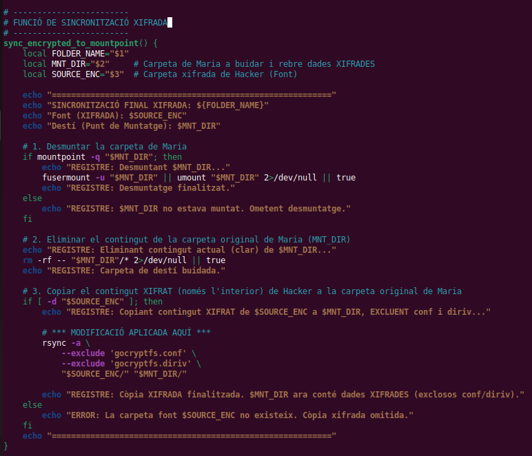

6. Aquí s’executa tot. El primer bucle crida process_folder() per a cada carpeta (fa backup, munta i restaura). El segon bucle crida sync_encrypted_to_mountpoint() per copiar la versió xifrada final a les carpetes de l’usuari. Els echo imprimen l’inici i final per tenir un registre clar.     
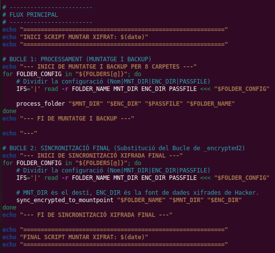

---

## Part 4 - Crear el servei

1. Per poder fer el servei havia de crear el fitxer al mateix directori que el target, però en la diferencia de ficar '.service' al final.    
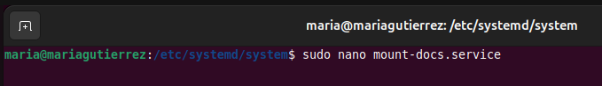

2. Una vegada dins és molt important configurar que funcioni a partir del target que havia creat prèviament. A més de la ruta al script, per a que l'executi.    
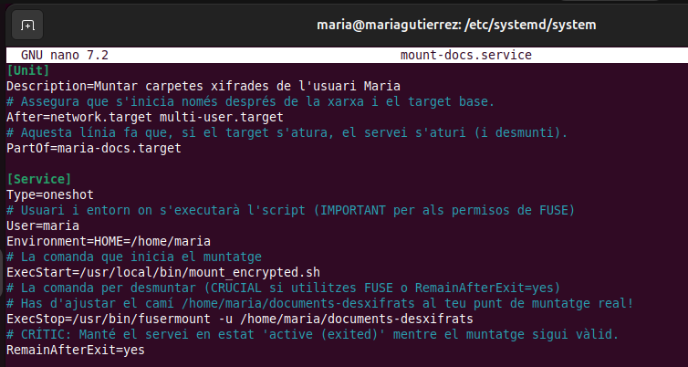

3. Per últim, haurem d'actualitzar el sistema, habilitar el service i fer un start del target.    
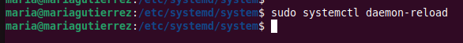
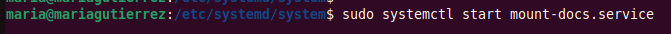
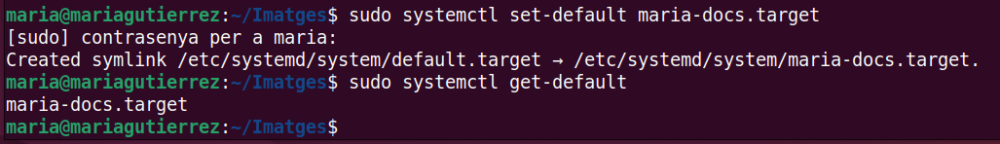

---

## Part 5 - Resultats

1. Una vegada ja hem reiniciat el sistema podrem observar que dins de cada carpeta del usuari maria les dades estan encriptades.    
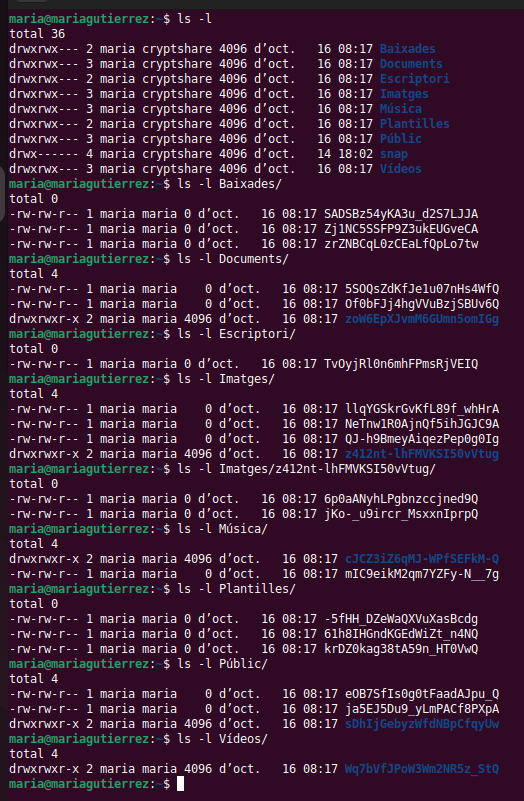

2. Seguidament, si entrem en l'usuari hacker, podrem observa que a la carpeta dades_originals_backup estan totes les dades en clar del usuari maria.     
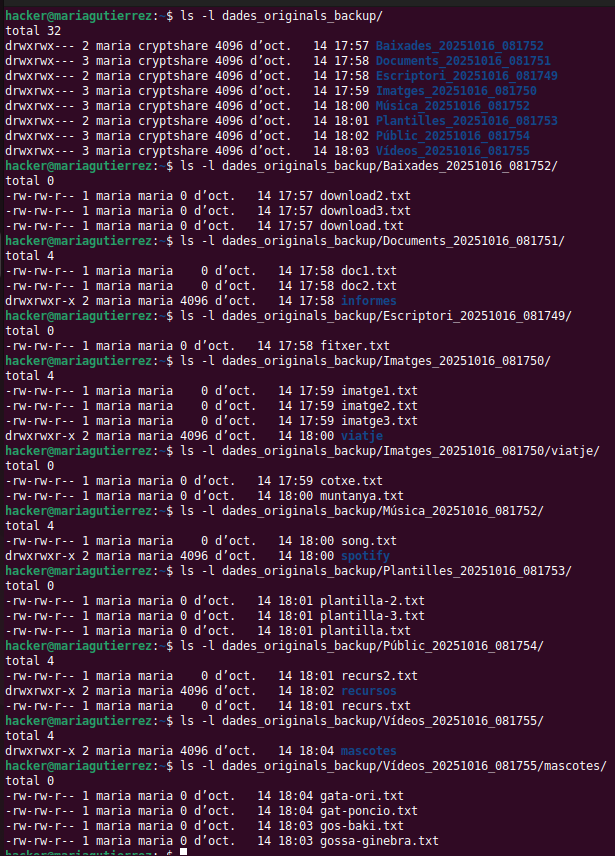

3. Per últim si observem els directoris *_encrypted podrem veure que les dades son exactament igual a les que estan actualment a maria, per tant la integritat de les dades encriptades es manté.        
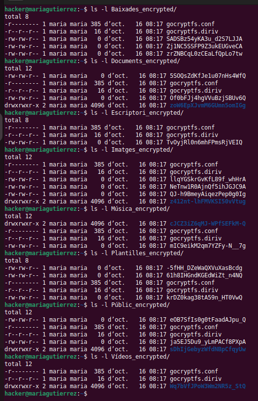

---
